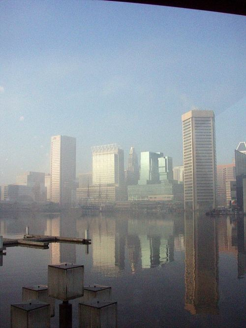
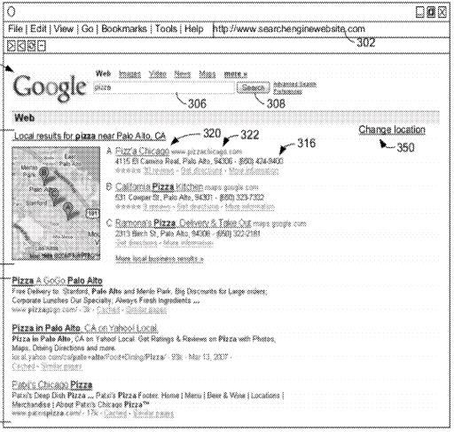

Google’s patents have provided a great number of hints over the past 10 years about local search and how Google treats businesses and landmarks in Maps and Web results and elsewhere. I’ve been fortunate enough to have uncovered some of these patents and written about many of the algorithms and approaches that Google has used, including concepts like [location prominence](https://www.seobythesea.com/2006/12/google-local-search-patent-application-on-ranking-businesses-at-a-location/), [location sensitivity](https://www.seobythesea.com/2006/12/location-sensitivity-in-google-local-search/), Maps in [Universal Search](https://www.seobythesea.com/2008/11/google-universal-search-patent-granted/), Google’s [Crowdsensus Algorithm](https://www.seobythesea.com/2011/11/trusted-by-google/), and more.

I am going to be the keynote speaker at Local U Advanced, Baltimore, starting Friday night, March 8 from 7:00 pm through Saturday at 5:00 pm on March 9 (There’s an early bird discount of $100 if you sign up before Feb. 8th). This Local University presentation will be taking place in Hunt Valley, MD. There’s an amazing group of speakers lined up for the event, covering local, mobile, and social aspects of local search.

Google’s been pretty active when it comes to filing patents and publishing papers about the intersection between mobile devices, local search, social signals, and the evolution of a search powered in part by a knowledge base. Predictive algorithms powering things like Google Now and parameterless searches, indoor mapping and wearable computers in Google’s Project Glass, and local/mobile/social apps and features will be powering the future of Google Maps, and Google’s efforts to tie together information from many sources as it maps and shares the world around us.

The different algorithms and methods that Google uses to map the Web are echoed by the methods they use to map the world, though the world can be challenging in its ways. On the plus side, land doesn’t move (at least thankfully not that frequently). On the minus side, instead of things like robots.txt files telling search engine crawling programs where they can and can’t crawl, street view cars have to be more careful of signs saying things like “Military Base,” or “Private Road,” and water features can bring a crawl to a standstill.

Speaking of local search-related patents, sometimes Google introduces something completely new when a patent application is published, or a patent is granted. That’s been happening a lot lately with the augmented reality heads-up displays that Google has been working on with Project Glass, which will be the focus of Project Glass hackathons at the end of January and beginning of February.

Sometimes Google is granted a patent that gives us a look back at something that we’ve been seeing for years, and it can fill in some gaps for us, give us some new terms to identify old behaviors that we recognize, and confirm some of the things that we’ve been observing. I like seeing those patents because they provide some of the backstories behind things we’ve seen before. For example:

We’ve all probably seen a set of search results from Google with maps results included within them on a search that doesn’t include any geographic information within the query itself. This is the first time I can recall seeing that in a screenshot from a Google patent, though.

As concisely as possible, the patent describes how Google might perform a search based on a query, and checks a whitelist of terms while searching, to tell whether or not it should perform a second search that’s more geographically aware, and understand the locations of businesses related to a query, and the location of the person performing the search.

The patent granted today is:

[System and method for displaying both localized search results and internet search results](http://patft.uspto.gov/netacgi/nph-Parser?Sect1=PTO1&Sect2=HITOFF&d=PALL&p=1&u=%2Fnetahtml%2FPTO%2Fsrchnum.htm&r=1&f=G&l=50&s1=8,359,300.PN.&OS=PN/8,359,300&RS=PN/8,359,300)
Invented by David D. Shin
Assigned to Google
US Patent 8,359,300
Granted January 22, 2013
Filed: April 3, 2007

Abstract

> A method of presenting search results includes sending to a server a search query, wherein the search query does not include any term that identifies a geographic location, and receiving a set of search results corresponding to a search query. The search results include the first results and second results. The first results match the search query. Each first result corresponds to one or more locations associated with a respective geographic location and includes links to additional information about the one or more locations.
>
> The respective geographic location is associated with a client or a user of the client. The second results correspond to Internet-accessible documents that satisfy the search query and include links to the Internet-accessible documents that satisfy the search query. The method further includes presenting the first results and second results in a single web browser window.

What we aren’t told about the whitelist of queries is how Google generated them, and how Google decided that they might signify some kind of local intent, without a searcher including location information within the query itself. It’s obvious that when someone searches for “Pizza” that they are likely looking for somewhere nearby to order something to eat. It might not be so obvious for other query terms.

It’s likely at this point that query terms and phrases that might be in such a whitelist are probably generated in part according to a statistical model that might involve experimentation on the part of the search engine to see if people select local results when they are presented with them within search results. The patent itself doesn’t tell us how those white lists of terms that might have a local intent come from.

We get a sense of the kind of predictive geographical model that Google might use to determine local intent for specific queries that don’t include location based data within them in places like Google’s patents that determine which data centers might be the best ones to route queries to:

- [How Google Data Centers may be Split between Regional and Global Data](https://www.seobythesea.com/2012/03/google-data-centers-split-regional-global-data/)
- [How Google Might Classify Queries Differently at Different Data Centers](https://www.seobythesea.com/2011/06/how-google-might-classify-queries-differently-at-different-data-centers/)

I’ll be looking at this patent filing and other recently granted and published documents from the patent office for other hints about Google’s local search, and sharing some of those at my Local U presentation in Baltimore. If you can make it, I’ll look forward to seeing you there.

I’m looking forward to visiting one of my favorite museums while I’m up that way, the [American Visionary Art Museum](http://www.avam.org/):

