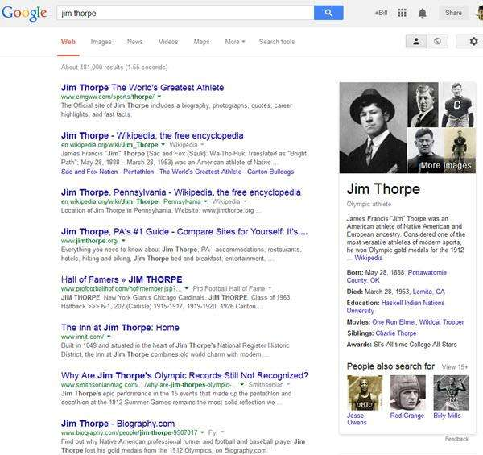
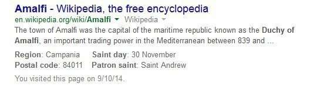
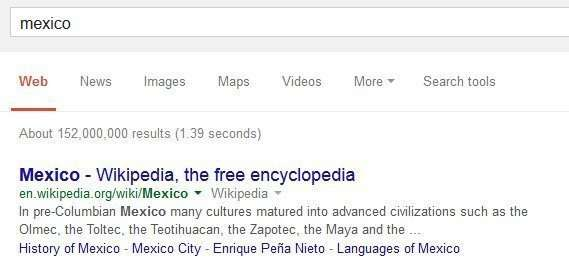
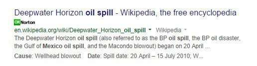
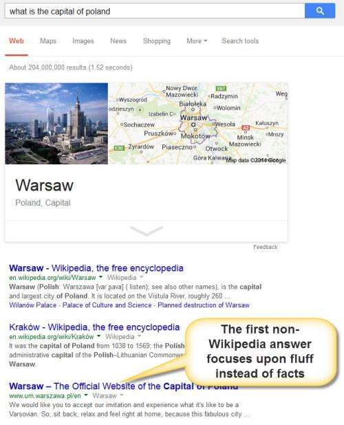
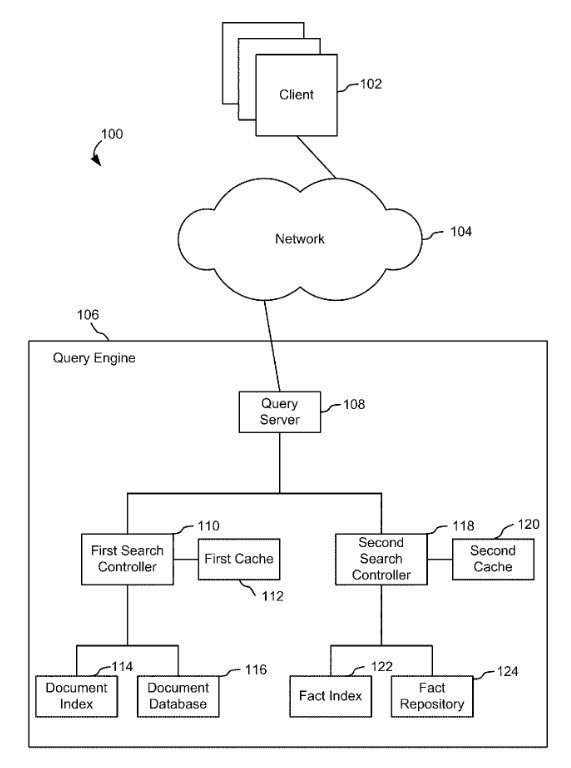

Google has been answering queries with its search engine for over 15 years, and has been showing us it can answer questions with facts from its [Browsable Fact Repository](https://www.seobythesea.com/2014/09/googles-browseable-fact-repository-early-knowledge-graph/) and/or the [Google Knowledge Graph](https://www.google.com/search/about/).

## Might Google at some point bring the two together?

To a degree, Google has been merging some results, showing a set of search results (from the search engine) and a knowledge panel (from the Knowledge Graph) on the same results page. But you could say that those are separate and unique entities on search results pages.

More recently, Google has been merging elements of both as a single bundle, as noticed by Alex Chitu at Google Operating System in [Inline Facts Next to Google Search Results](https://googlesystem.blogspot.com/2014/09/inline-facts-next-to-google-search.html#gsc.tab=0), published on September 7th, 2014.

In that post he shows a couple of search results, one for [[duchy of Amalfi](https://www.google.com/search?q=duchy+of+Amalfi&ie=utf-8&oe=utf-8&aq=t&rls=org.mozilla:en-US:official&client=firefox-a&channel=fflb)] and one for [[king of Rome](https://www.google.com/search?q=king+of+Rome&ie=utf-8&oe=utf-8&aq=t&rls=org.mozilla:en-US:official&client=firefox-a&channel=sb)]. In the search results is a query answering result from Wikipedia joined with a question-answering result, also from Wikipedia.

I tried some other queries that might reasonably be answered with a Wikipedia page in response to a search query, and with facts taken from the same Wikipedia page, or possibly even another one.

In response to a number of those, I received query results for some that didn’t have a set of facts after them, like the [Duchy of Amalfi] and the [king of Rome] Wikipedia results did.

But on a search for something such as [mexico], there were quicklinks to topics or categories from Wikipedia pages. For example, the [[mexico](https://www.google.com/search?num=100&client=firefox-a&hs=Owu&rls=org.mozilla%3Aen-US%3Aofficial&channel=sb&q=mexico&oq=mexico&gs_l=serp.3..0i7i30l7j0j0i7i30l2.87927.87927.0.88156.1.1.0.0.0.0.177.177.0j1.1.0....0...1c.1.53.serp..0.1.176.M4L3rPZPs-Y)] query had the following in those links: History of Mexico, ”ŽMexico City, ”ŽEnrique Peña Nieto, ”ŽLanguages of Mexico.

For a query such as [[oil spill gulf of mexico](https://www.google.com/search?q=oil+spill+gulf+of+mexico&ie=utf-8&oe=utf-8&aq=t&rls=org.mozilla:en-US:official&client=firefox-a&channel=sb)], the quicklinks shown include Deepwater Horizon explosion, toxic oil spill, “Timeline of the Deepwater.”
Each of those links to separate Wikipedia pages.

For a query such as [oil spills mexico], instead of links, I did get facts listed after the Wikipedia entry:

The difference between the pages that [Google Operating System](https://googlesystem.blogspot.com/#gsc.tab=0) pointed out, and most of the ones I found is that the “facts” or topics that Google associated with my searches were bigger topics, possibly served better by a link to a whole page from Wikipedia than just some fact that could fit under the search result from the Wikipedia page.

## A Matching Patent

The title to this Google patent, granted in 2011, seems to be a good fit for results snippets with both “query terms” and “answer terms”:

[User Interface for Facts Query Engine with Snippets from Information Sources that Include Query Terms and Answer Terms](http://appft.uspto.gov/netacgi/nph-Parser?Sect1=PTO1&Sect2=HITOFF&d=PG01&p=1&u=%2Fnetahtml%2FPTO%2Fsrchnum.html&r=1&f=G&l=50&s1=%2220110295888%22.PGNR.&OS=DN/20110295888&RS=DN/20110295888)
Invented by Andrew William Hogue
US Application 20110295888
Published December 1, 2011
Filed: August 9, 2011

Abstract

> A method and a system for providing snippets of source documents of an answer to a fact query are disclosed. Snippets of source documents may be provided in response to a user request for the source documents from which the fact answer to a fact query was extracted. The snippets include the terms of the fact query and terms of the answer. The snippets may be displayed along with Uniform Resource Locators (URLs) of the source documents.
>
> The disclosed embodiments relate generally to queries for facts, and more particularly, to a user interface for a factual query engine and snippets of sources with query terms and answer terms.

## Reasons to combine query answers with question answers

The patent starts with many reasons why it might be used:

**1. For a question such a “what is the capital of Poland”, a question-answering approach can provide a short succinct answer, likely to be correct. A search result is less likely to be short and focused.**

In the image below, the title of the search result answers the question, but the snippet that accompanies it is pure fluff. So, the question-answer OneBox and Wikipedia results answer the question quickly and well.

**2. A single entry from an encyclopedia site might “limit the kinds of questions answered.”**

The patent goes on to say:

> For instance, a search engine based on an encyclopedia is unlikely to be able to answer any questions concerning popular cultures, such as questions about movies, songs or the like, and is also unlikely to be able to answer any questions about products, services, retail and wholesale businesses and so on. If the set of sources used by such a search engine were to be expanded, however, such expansion might introduce the possibility of multiple possible answers to a factual query, some of which might be contradictory or ambiguous. Furthermore, as the universe of sources expands, information may be drawn from untrustworthy sources or sources of unknown reliability.

Right now, we are only seeing factual question results, or site links (see the result above for “Mexico”) from Wikipedia. The [knowledge panel](https://www.seobythesea.com/2013/05/google-knowledge-graph-results/) patent for Google tells us that it tries to use at least 2 different sources for knowledge panel results to keep from having answers that are too limited, or don’t cover other things.

**3. Is there is a benefit to having more than one source?**

Having multiple answers means that a search engine could choose the best of those to display, or show more than one. Providing links to their sources, like the quick links do, enables a searcher to verify the answers and their sources.

As shown in this image from the patent, the query answer and the question-answer could be kept separately, and each could be cached to help the search engine/knowledge graph answer questions quickly.

Is this a trend that we will be seeing more of, or just experimentation from Google?
