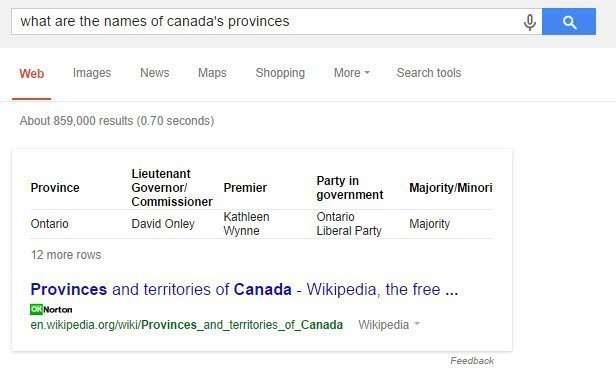

## Searchers Queries Teach Google About Entity Attributes

Millions of searches stream into Google every day as people try to meet their informational and situational needs. But those searches don’t disappear after the searches. They provide Google with some very interesting and useful information in return. For instance, they tell Google what people are interested in real-time – right at this moment.

*Those queries can also help Google populate its knowledge base with more information as well, about entity attributes*

When Google collects information about entities – people, places, and things, including products and brands, it might collect facts about those entities and information about entity attributes.

A couple of days ago, the Google Research Blog told us about how it might include that kind of factual information in search results, what they called [Structured Snippets](https://ai.googleblog.com/2014/09/introducing-structured-snippets-now.html). In that post, Google gave us the news that Google finds information like, such as entity attributes, like this from tables across the web.

I hadn’t purposefully set out to find a snippet that included a table in it, but I asked for “all” the provinces in Canada, and that’s what I got – a snippet that included an actual table.

Information about entities and entity attributes is all over the Web, and it also fills queries people perform when they search on the Web. Considering that these queries are representative of things people look for when they search, they seem like a good source of information to use to find out more about entity attributes – the entities and associated facts about them.

The patent describes how it might treat entity attributes in queries if they include proper names, or somewhat generic attributes (it might ignore them). But what I found interesting was how Google tried to use linguistic patterns to try to find, identify, and extract entities and entity attributes.

This process can be done without human oversight or intervention. It involves using search query logs to see what queries people searched for.

*Given the numbers of searches that people do at Google every day, there’s no shortage of queries to use.*

I took the following examples of linguistic patterns that Google might use to identify entities and entity attributes from the patent.

The entity attributes patent is:

[Inferring attributes from search queries](http://patft.uspto.gov/netacgi/nph-Parser?Sect1=PTO2&Sect2=HITOFF&p=1&u=%2Fnetahtml%2FPTO%2Fsearch-adv.htm&r=1&f=G&l=50&d=PALL&S1=08812509&OS=PN/08812509&RS=PN/08812509)
Invented by Alexandru Marius Pasca and Benjamin Van Durme
Assigned to Google
US Patent 8,812,509
Granted August 19, 2014
Filed November 2, 2012

Abstract

> Systems, techniques, and machine-readable instructions for inferring attributes from search queries. In one aspect, a method includes receiving a description of a collection of search queries, inferring attributes of entities from the description of the collection of search queries, associating the inferred attributes with identifiers of entities characterized by the attributes, and making the associations of the attributes and entities available.

Linguistic patterns can be used to infer entity attributes from search queries. This can be done for a log of search queries to identify attributes for entities.

One extract pattern can be used to scan keyword-based queries for the text that matches the format “what is the “attribute” of “entity.”

*Examples:*

- What is the capital of Brazil?
- What is the airspeed velocity of an unladen swallow?

Another extract pattern can be used to scan keyword-based queries for the text that matches the format “who is the <attribute> of <entity>.

*Examples:*

- Who is the mayor of Chicago
- Who is the CEO of Google

A third extraction pattern for entity attributes might look through queries for text that matches the format “the <attribute> of <entity>.”

*Examples:*

- the capital of France
- the manager of the Yankees

And, a different extraction pattern may try to find answers for “who is the <entity>’s <attribute>.”

*Examples:*

- who is the Yankees’ manager
- who is the airplane’s pilot

An extraction pattern can also scan keyword-based queries for text that matches the format “<entity>’s <attribute>.”

*Examples:*

- Rosemary’s baby
- Michelangelo’s David

This isn’t an exhaustive list of extraction patterns for entity attributes, but it should give you an idea of how effective it could potentially be.

It’s interesting that Google isn’t trying to extract this entity attributes information from pages published to the Web, with the kinds of patterns shown above, but instead from that vast stream of data from many searchers. It is as if Google is crowdsourcing entity attributes information from searchers because it appears to be what they are interested in.

A followup post to this one, on a very related topic, is [Search Engine Queries May be Used to Identify Entity Attributes](https://www.seobythesea.com/2018/03/3-ways-query-stream-ontologies-change-search/)

Last Updated July 14, 2019.
