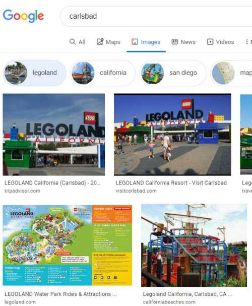
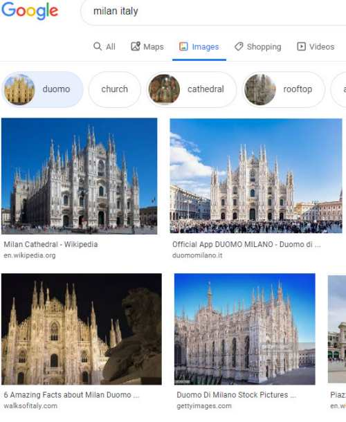
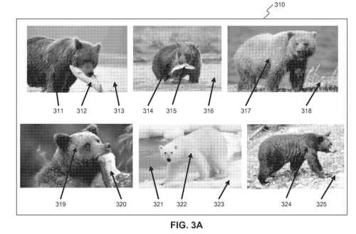
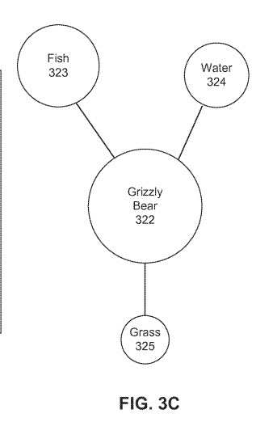
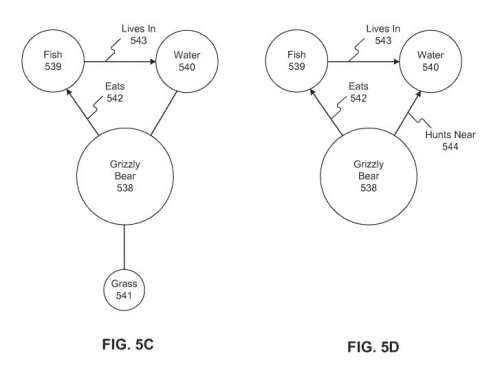

## How Might Google Improve on Information From Sources Such as Knowledge Bases to Help Them Annotate Images for Queries?

That information may be from or inferred from sources outside of those knowledge bases when Google may:

- Analyze and annotate images
- Consider other data sources

A recent Google patent on this topic defines knowledge bases for us. It looks at why those are important. It also points out examples of how Google looks at entities while it may annotate images:

> A knowledge base is an important repository of structured and unstructured data. The data stored in a knowledge base may include entities, facts about entities, and relationships between entities. This information can assist with or satisfy user search queries processed by a search engine.
>
> Examples of knowledge bases include Google Knowledge Graph and Knowledge Vault, Microsoft Satori Knowledge Base, DBpedia, Yahoo! Knowledge Base, and Wolfram Knowledgebase.

The focus of this patent is upon improving upon information found in knowledge bases:

> The data stored in a knowledge base may get enriched or expanded by harvesting information from a wide variety of sources. For example, entities and facts may crawl text included in Internet web pages. As another example, entities and facts may use machine learning algorithms while annotating images.
>
> All gathered information is in a knowledge base to enrich the information available for processing search queries.

## Analyzing Images to Enrich Knowledge Base Information

This approach may annotate images and select object entities contained in those images. It reminded me of a post I recently wrote about Google annotating images, [How Google May Map Image Queries](https://gofishdigital.com/mapping-image-queries/)

This is an effort to understand better and annotate images and explore related entities in images. This is so Google can focus on “relationships between the object entities and attribute entities, and store the relationships in a knowledge base.”

Google can learn from images of real-world objects. This is a phrase they used for entities when they started the Knowledge Graph in 2012.

I wrote another post about image search becoming more semantic in the labels they added to categories in Google image search results. I wrote about those in [Google Image Search Labels Becoming More Semantic?](https://www.searchenginejournal.com/google-image-search-labels-becoming-more-semantic/305157/)

When writing about mapping image queries, I couldn’t help but think about labels helping organize information usefully. I’ve suggested using those labels to better learn about entities when creating content or doing keyword research. Doing image searches and looking at those semantic labels can be worth the effort.

This new patent tells us how Google may annotate images to identify entities contained in those images. While labeling, they may select an object entity from the entities pictured and then choose at least one attribute entity from the annotated images that contain the object entity. They could also infer a relationship between the object entity and the attribute entity or entities and include that relationship in a knowledge base.

> Following one exemplary embodiment, a computer-implemented method exists for enriching a knowledge base for search queries. The method includes assigning annotations to images stored in a database. The annotations may identify entities contained in the images. An object entity among the entities may get chosen based on the annotations. At least one attribute entity gets determined using the annotated images containing the object entity. A relationship between the object entity and the attribute entity gets inferred and stored in a knowledge base.

## Google Image Search Uses Labels that Show Related Entities and an Ontology of Categories

For example, when I search for my hometown, Carlsbad, in Google image search, one of the category labels is Legoland. This is an amusement park located in Carlsbad, California. It is also one of the category labels for Carlsbad. Showing that as a label tells us that Legoland is in Carlsbad. The captions for the pictures of Legoland also tell us that it is in Carlsbad.

This patent is at:

[Computerized systems and methods for enriching a knowledge base for search queries](http://patft.uspto.gov/netacgi/nph-Parser?Sect1=PTO1&Sect2=HITOFF&d=PALL&p=1&u=%2Fnetahtml%2FPTO%2Fsrchnum.htm&r=1&f=G&l=50&s1=10,534,810.PN.&OS=PN/10,534,810&RS=PN/10,534,810)
Inventors: Ran El Manor and Yaniv Leviathan
Assignee: Google LLC
US Patent: 10,534,810
Granted: January 14, 2020
Filed: February 29, 2016

Abstract

Systems and methods get found for enriching a knowledge base for search queries. According to certain embodiments, images get assigned annotations that identify entities contained in the images. An object entity gets selected among the entities based on the annotations, and at least one attribute entity gets chosen using annotated images containing the object entity. A relationship between the object entity and the attribute entity gets inferred and stored in the knowledge base. In some embodiments, you can calculate confidence for the entities. The confidence scores may collect across a plurality of images to identify an object entity.

## Confidence Scores While Labeling of Entities in Images

One of the first phrases to jump out at me when I scanned this patent to decide that I wanted to write about it was the phrase, “confidence scores.” That reminded me of association scores which I wrote about discussing Google trying to extract information about entities and relationships with other entities. Also, confidence scores about the relationships between those entities and about attributes involving the entities. I mentioned association scores in the post [Entity Extractions for Knowledge Graphs at Google](https://gofishdigital.com/entity-extractions-knowledge-graphs/), because those scores are in the patent [Computerized systems and methods for extracting and storing information regarding entities](http://patft.uspto.gov/netacgi/nph-Parser?Sect1=PTO1&Sect2=HITOFF&d=PALL&p=1&u=%2Fnetahtml%2FPTO%2Fsrchnum.htm&r=1&f=G&l=50&s1=10,198,491.PN.&OS=PN/10,198,491&RS=PN/10,198,491).

I also referred to these confidence scores when I wrote about [Answering Questions Using Knowledge Graphs](https://gofishdigital.com/answering-questions-using-knowledge-graphs/) because association scores or confidence scores can lead to better answers to questions about entities in search results, which is an aim of this patent, and how it attempts to analyze and label images and understand the relationships between entities shown in those images.

The patent lays out the purpose it serves when it may analyze and annotate images like this:

> Embodiments of the present disclosure provide improved systems and methods for enriching a knowledge base for search queries. The information used to enrich a knowledge base may be from or inferred from analyzing images and other data sources.
>
> Per some embodiments, object recognition technology can annotate images stored in databases or harvested from Internet web pages. For example, the annotations may identify who and/or what is in the images.
>
> The disclosed embodiments can learn which annotations are good indicators for facts by aggregating annotations over object entities and facts that are already known to be true. Grouping annotated images by the object entity help identify the top annotations for the object entity.
>
> Top annotations can be attributes for the object entities. Relationships can be between the object entities and the attributes.
>
> As used herein, the term “inferring” refers to operations where an entity-relationship gets inferred from or determined using indirect factors such as image context. It can also refer to known entity relationships and data stored in a knowledge base to draw an entity relationship conclusion instead of learning the entity-relationship from an explicit statement of the relationship, such as in text on an Internet web page.
>
> The inferred relationships may be in a knowledge base and subsequently used to assist with or respond to user search queries processed by a search engine.

## Confidence Scores are Used for Image Annotation When it comes to Category Labels for Images

The patent then tells us about how confidence scores work. It also sees that they calculate confidence scores for annotations assigned to images. Those “confidence scores may reflect the likelihood that an entity identified by an annotation is in an image.”

If you look back up at the pictures for Legoland above, it is an attribute entity of the Object Entity Carlsbad because Legoland is in Carlsbad. The label annotations indicate what the images portray and infer a relationship between the entities.

An image search for Milan, Italy, shows a category label for Duomo, a Cathedral located in the City. Therefore, the Duomo is an attribute entity of the Object Entity of Milan because it is in Milan, Italy.

In those examples, we infer from Legoland getting included under pictures of Carlsbad that it is an attribute entity of Carlsbad. The Duomo is an attribute entity of Milan because it results from a search for Milan.

A search engine may learn from label annotations and because of confidence scores about images because the search engine (or indexing engine thereof) may index:

- Image annotations
- Object entities
- Attribute entities
- Relationships between object entities and attribute entities
- Facts learned about object entities

The Illustrations from the patent show us images of a Bear eating a Fish to tell us that the Bear is an Object Entity, and the Fish is an Attribute Entity, and that Bears eat Fish.

## The Analysis of Images Provides Information about Entities Shown in those Images

We are also shown that Bears, as object Entities, have other Attribute Entities associated with them. They will go into the water to hunt fish, and they roam around on the grass.

Annotations may cover objects within photos or images. An example was the bear eating the fish above. For example, the patent points out a range of entities that might appear in a single image by telling us about a photo from a baseball game:

> An annotation may identify an entity contained in an image. An entity may be a person, place, thing, or concept. For example, an image taken at a baseball game may contain entities such as “baseball fan,” “grass,” “baseball player,” “baseball stadium,” etc.
>
> An entity may also be a specific person, place, thing, or concept. For example, the image taken at the baseball game may contain entities such as “Nationals Park” and “Ryan Zimmerman.”

## Defining an Object Entity When Google May Annotate Images

The patent provides more insights into what object entities are and how they might get selected:

> An object entity may be an entity selected among the entities contained in a plurality of annotated images. Object entities may group images to learn facts about those object entities. In some embodiments, a server may select a plurality of images and assign annotations to those images.
>
> A server may select an object entity based on the entity in the greatest number of annotated images identified by the annotations.
>
> For example, a group of 50 images may get annotations that identify George Washington in 30 of those images. Accordingly, a server may select George Washington as the object entity if 30 out of 50 annotated images are the greatest number for any identified entity.

Confidence scores could exist for annotations. Confidence scores tell us that entities identified by an annotation are in an image. It “quantifies a level of confidence in an annotation being accurate.” That confidence score could come from a template matching algorithm. Compare the annotated image with a template image.

## Defining Attribute Entities When Google May Annotate Images

An attribute entity may be an entity among the entities contained in images that contain the object entity. They are entities other than the object entity.

Annotated images that may group the object entity. In addition, an attribute entity may work based on what entity might be in the greatest number of grouped images identified by the annotations.

So, a group of 30 annotated images containing the object entity “George Washington” may also include 20 images that contain “Martha Washington.”

In that case, “Martha Washington” may be an attribute entity.

(Of Course, “Martha Washington Could be an object Entity, and “George Washington, appearing in many of the “Martha Washington” labeled images, could be attribute entity.)

## Infering Relationships between Entities by Analyzing Images

If more than a threshold of images of “Michael Jordon” contains a basketball in his hand, a relationship between “Michael Jordan” and basketball might occur. That Michael Jordan is a basketball player.

From analyzing images of bears hunting for fish in water, and roaming around on grassy fields, some relationships between bears and fish and water and grass can happen also:

By analyzing images of Michael Jordan with a basketball in his hand wearing a Chicago Bulls jersey, a search query asking a question such as “What basketball team does Michael Jordan play for?” may like the answer “Chicago Bulls.”

Google may be asked a query such as “What team did Michael Jordan play basketball for?” Google could perform an image search for “Michael Jordan playing basketball.” Having those images containing the object entity of interest can allow the images to be analyzed and provided. For example, see the picture at the top of this post, showing Michael Jordan in a Bulls jersey.

## Take Aways

This process to collect and annotate images can be done using any images found on the Web and isn’t limited to images found in places like Wikipedia.

Google can analyze images online in a way that scales on a web-wide basis. By analyzing images, it may provide insights that a knowledge graph might not. Such as answering the question, “where do Grizzly Bears hunt?” with an analysis of photos that reveals that they like to hunt near water so that they can eat fish.

The confidence scores in this patent aren’t like the association scores in the other patents about entities that I wrote about. They are trying to gauge how likely it is that what is in a photo or image is the entity it might get labeled with.

I wrote about the association scores trying to gauge how likely relationships between entities and attributes might be more likely to be true. This would be based on the reliability and popularity of the sources of that information.

So, Google is trying to learn about real-world objects (entities) by analyzing pictures of those entities. It does this when it may annotate images (ones that it has confidence in) as an alternative way of learning about the world and its things.
