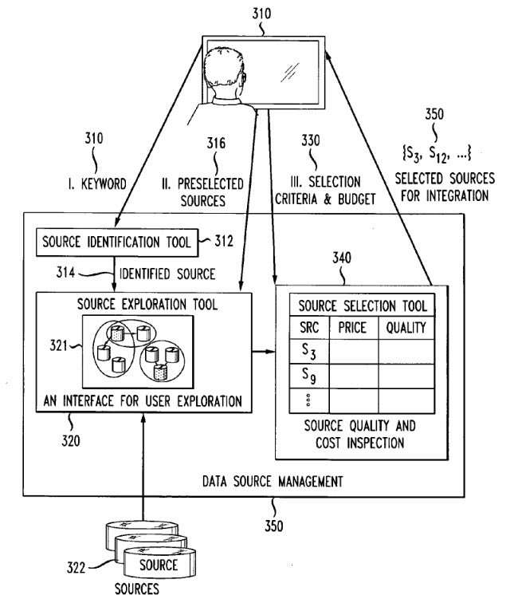
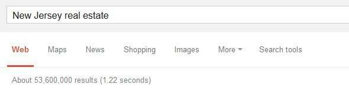

## Choosing the Right Data Repository Sources Can Make a Difference

When I was in law school, I was a teaching assistant for an environmental law professor. One of the tasks he had me working upon was reviewing and analyzing electronic databases that could be used to assess natural resource damages when some environmental harm took place, such as the Exxon Valdez oil spill.

How do you determine the cost of the spill to the environment, to wildlife, to people who live in the area, to people who rely upon the area for their jobs and welfare? In short, you look at things such as other decisions in other courts where such things may have been litigated.

At the time, the World Wide Web was still a year away, and many of these electronic databases we were looking at were beneficial sources of information. My task was to review those and see how much value and help they might hold.

Move forward several years, and I find some Google search engineers engaging in a similar task and using some interesting tools to perform their analysis of data repository sources. Of course, I would have never thought of looking at keywords from those data repository sources to gauge their effectiveness. But looking at a coverage of specific topics was much more likely.

It’s rare to run across a patent filing from one of the search engines that discusses the economic costs of data collection and the value of making wise decisions when such information is collected.

A patent application from Google explores how it might identify data repository sources and consider the costs of using those sources and the potential benefits of using the information they yield.

## Redundancy – Too Much Information On The Web?

When we think about data at Google, it’s easy to believe that the focus of the search engine is to crawl pages and provide as much information as possible that it finds at websites.

But indexing just the web of pages means that the search engine is likely to miss out on many facts, and we see knowledge base data repository sources like Wikipedia showing up well in a lot of searches.

Google does more than just index commerce sites and product offerings.

The patent filing provides an example of a query that might be a little disappointing in some ways.

Imagine someone looking for “New Jersey real estate” on the Web. The patent used this example with 27 million Web pages showing in the search results. At the time I wrote this post, there were 53 million results for that query.

There may be that many homes for sale in New Jersey. Maybe.

## Too Much Missing Information?

In the homebuyer example, the top 50 returned Web pages for the query “New Jersey real estate” included no information about:

- School district
- Crime rate
- Transportation
- Pollution situation
- etc.

More information could be helpful, including something I heard about recently called [walk scores](https://www.redfin.com/how-walk-score-works).

The patent tells us that additional information comes with its own costs:

> Paradoxically, returning such information in addition to the many home search websites as search results can add extra burden on the users and aggravate the problem of information overload.

## Finding Data Repository Sources

The patent is:

[Method and apparatus for exploring and selecting data sources](https://patents.google.com/patent/US20130138480)
Invented by Xin Luna Dong and Divesh Srivastava
US Patent Application 20130138480
Published May 30, 2013
Filed: November 30, 2011

Abstract

> A system and method for choosing data sources for use in a data repository first choose an initial selection of data sources based on keywords. An exploration tool is provided to organize the sources according to content and other attributes. The tool is used to pre-select data sources. The sources to include in the data repository are then selected based on a marginalism economic theory that considers both costs and quality of data.

The patent relies upon techniques discussed in the paper by X. L. Dong, L. Berti-Equille, and D. Srivastava, in [Integrating conflicting data: the role of source dependence](https://www.norc.org/PDFs/May%202011%20Personal%20Validation%20and%20Entity%20Resolution%20Conference/Integrating%20Conflicting%20Data%20paper_PVERConf_May2011.pdf)

The abstract from that paper provides some insights behind selecting data repository sources:

> Many data management applications, such as setting up Web portals, managing enterprise data, managing community data, and sharing scientific data, require integrating data from multiple sources. Each of these sources provides a set of values, and different sources can often provide conflicting values. To present quality data to users, data integration systems can resolve conflicts and discover true values. Typically, we expect a true value to be provided by more sources than any particular false one to take the value provided by the majority of the sources as the truth. Unfortunately, a false value can be spread through copying, and that makes truth discovery extremely tricky. In this paper, we consider how to find true values from conflicting information when there are many sources, among which some may copy from others.

## The process pf Data Selection and Exploration

These are steps described in the patent aiming to make it more likely that a search engine’s data repository sources are good ones.

(A) Relevant Data Repository Sources are identified with the use of keyword queries.

(B) A source exploration dashboard tool is used to show the big picture of available sources and highlight identified relevant sources.

This enables them to

- (1) Understand the domain and contents of the identified sources and discover related sources that may be of interest, and

- (2) Understand the quality (e.g., coverage, accuracy, timeliness) of the sources and the relationships (e.g., data overlap, copying relationship) between them. Data aggregators can use this tool to refine their information needs (e.g., collecting precise data for computer science books) and pre-select the sources of particular interest.

(C) Following specified criteria and budget and a set of preselected data repository sources, the best sources are determined based upon “data purchase, integration, and cleaning cost.”

## Takeaways

Google isn’t just indexing everything; it can find out on the web. It’s very serious about what it includes and doesn’t include from the Web. It’s not a utility but rather a business, and part of its mission is to find and gather and serve knowledge.

This kind of economic analysis of data repository sources and how they may impact searchers go far beyond broad indexing of businesses on the Web to providing important information that people rely on that includes information from knowledge bases and sources that show off knowledge panels, that offer query refinements that anticipate future queries.

There’s a lot of information on the Web and a lot of misinformation as well. Ideally, Google wants the useful information they present to outweigh the misinformation.

Hopefully, when someone searches about New Jersey Real Estate, they will find a page that has information on it that a searcher will want to see.

It will tell people about how good the nearby schools are, whether or not the neighborhood it is located in is a safe one, and that the people who live nearby are happy with nearby parks and stores and their walk scores.

Last Updated June 6, 2019.
