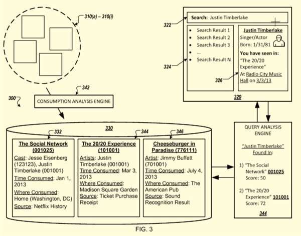

## What is a Media Consumption History

Google published a foreign patent at WIPO today that has an interesting perspective to it. When someone performs a search that involves a specific entity, their search may be influenced by the search engine’s knowledge of their past interactions with content involving that entity, or their media consumption history.

For example, someone searches for “Justin Timberlake” and the search system may have collected information about the searcher’s past consumption of content related to that entity, like having attended a concert featuring him, or a movie that he was in:

> In some applications, the server-based system additionally receives and stores information describing the user’s consumption of the content. For example, the system can determine that the user viewed the movie “The Social Network” featuring “Justin Timberlake” on a particular date and at a particular location. The system can store the information at the media consumption history that identifies the particular date and the particular location where the user viewed the movie “The Social Network,” and can subsequently receive a request that identifies the user and “Justin Timberlake.” The system can provide a response to the request that includes information about “Justin Timberlake” and can also indicate that the user viewed the movie “The Social Network” that features “Justin Timberlake” on the particular date and at the particular location.

The media consumption history patent application is:

[Query Response Using Media Consumption History](https://patents.google.com/patent/WO2015023878A1/en) (WO2015023878)
Publication Date: 19.02.2015
International Filing Date: 14.08.2014
Applicant: Google

The patent discusses collecting a media consumption history including time and location of where someone might have watched a movie or listened to an album in the past. This might be done using an application like Search Sound for Google Play, which can listen to a song to identify it. That kind of identification capability might enable the collection of a media consumption history for an individual who owns a device capable of performing such searches. According to this article, [Google Now can Identify songs](https://gizmodo.com/identify-songs-using-google-now-1681772603) presently, too.

The patent tells us that information about which movies a searcher may have watched could also be collected as well. There is an app for Android that can identify movies and TV shows, called IntoNow that is the kind of thing that could be used to capture that kind of information for movies.

This type of search that is concerned about a media consumption history would recognize and remember information about entities associated with songs of movies. As the patent tells us:

> For example, a user can input a natural language query at a device, such as the spoken query, “When have I seen this actor before?” while viewing particular content, such as the movie “The Social Network.”

_An example of a search for an entity thst might be in a pesron’s media consumption history_

That searcher’s previous media consumption history could be searched to identify other movies that the actor asked about may have performed in.

## Take Aways

This is interesting because there are apps that can look up and identify media like this patent describes, and the idea behind Google collecting a media consumption history sounds like what Google has been doing for years collecting a [browsing history](https://www.seobythesea.com/2010/04/web-browsing-history-better-search-engine-ranking-signal-than-pagerank/) to personalize search results for searchers.

When I wrote last year about [Google Granted Patent on Using What You Watch on TV as a Ranking Signal](https://www.seobythesea.com/2014/09/google-patent-watch-tv-as-ranking-signal/), a few people asked me if that process involved Google listening to what you might be watching at the time on TV. It wasn’t, but rather involved Google having an idea of what shows were on television at the time you were searching, and whether or not your query seemed like a good fit for a TV show that was being broadcast at the time.

In this patent, Google is listening to what you are in terms of songs and movies, and keeping track of it, so that if you have any questions about entities that appear in those things, it can answer them for you. How do you feel about Google tracking your media consumption history?

Last Updated June 6, 2019.
