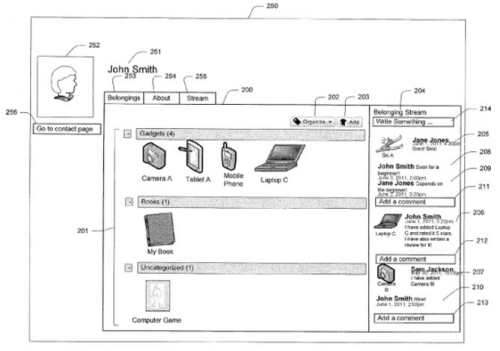
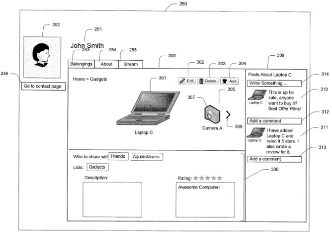

Will Google Plus morph into a social version of eBay, where people can post things for sale, write reviews of their belongings and show them off to their circles?

A few days ago, the Google File System Blog [reported upon a new application from Google](https://googlesystem.blogspot.com/2013/06/google-mine.html), which it referred to by the name Google Mine (as in, “it’s mine,” rather than as in Google mining more information about your life). The post also mentions a version for Android on Google’s internal Play store. The post tells us that the app allows you to be pretty active about posting your belongings.

> As you can see, the service lets you enter a lot of information about your objects. For example, you can change the status of an object to “lent”, “given away”, “got it back”, “lost it”, “had in the past”. You can post videos about the object, write reviews, add it to a wishlist and maybe others can buy it using Google Shopping. You can also check popular items and the items others have shared.

A number of seemingly very related patent applications were published by Google earlier this year about showing off your belongings to people in your social circles, to offer them for sale, to provide reviews of them, to start discussions about them, and more. While I thought this was really interesting, I didn’t see how it might be related to search, and I questioned the wisdom of putting information about your belongings online. Now that I’ve heard about Google Mine, it makes a lot more sense.

In turning Google Plus into a social version of eBay and a review site all in one, it provides an interesting use of Google Plus that takes away some attention from Google Plus as a social network that a lot of tech blogs question the social nature of, or a site that might be framed as an “identity service” (as Google’s Eric Schmidt has referred to it in the past). The following interface from one of the patents shows how easy it would be to add one of your belongings, rate it, and share it:

There’s only one inventor listed on the seven patent applications I’ve found that describe something very much like Google Mine, Zaheed Md Shahjahan Sabur. LinkedIn refers to him as a Senior Software Engineer at Google, working in Zürich, Switzerland.

When I first read through the patent applications a few months ago, I had some serious doubts about whether or not I would use it, or even consider the idea. But it has grown on me, and I can see adding a wishlist through Google Mine, writing reviews of products I like or dislike, and even putting some of the “treasures” I’ve found at garage sales and rummage sales up for sale.

I’m listing those (and their abstracts here), in case anyone wants to dig deeper into them. Since they don’t appear to potentially impact search directly, I’m not going to drill down deeper into them. If Google Mine takes off though, it could transform the way many people might think about Google Plus.

[User Graphical Interface for Displaying a Belonging-Related Stream](http://appft.uspto.gov/netacgi/nph-Parser?Sect1=PTO1&Sect2=HITOFF&d=PG01&p=1&u=%2Fnetahtml%2FPTO%2Fsrchnum.html&r=1&f=G&l=50&s1=%2220130055154%22.PGNR.&OS=DN/20130055154&RS=DN/20130055154) (20130055154)

Abstract

> A system and machine-implemented method for providing a user profile associated with a first user for display including a stream area displaying one or more belonging-related posts including a user link to a user associated with the post and a belonging link to a belonging associated with the post, receiving an indication of a user selection of the user link associated with a post, providing a contact profile of a user associated with the post for display upon receiving the indication of the user selection of the user link, receiving an indication of a user selection of the belonging link to the belonging associated with a post and providing a belonging profile of the belonging associated with the post for display upon receiving the indication of the user selection of the belonging link by the first user.

[System and Method for Tagging Belongings in Photos and Posts](http://appft.uspto.gov/netacgi/nph-Parser?Sect1=PTO2&Sect2=HITOFF&u=%2Fnetahtml%2FPTO%2Fsearch-adv.html&r=1&f=G&l=50&d=PG01&p=1&S1=20130055101.PGNR.&OS=DN/20130055101&RS=DN/20130055101) (20130055101)

Abstract

> A system and machine-implemented method is provided for tagging of belongings maintained within a social graph of belongings in photos and posts including receiving a request to tag a belonging within a selected area of a display from a user of a system, providing, in response to the request, a list of belongings including the one or more belongings associated with the user within the social graph of belongings, wherein the social graph of belongings defines an association between each of the one or more users and one or more belongings, receiving an indication of a user selection of a first belonging from the list of belongings, generating a link corresponding to the first belonging in response to receiving the indication of the user selection and associating the link with the selected area.

[System and Method for Searching Belongings Using Social Graph Information](http://appft.uspto.gov/netacgi/nph-Parser?Sect1=PTO2&Sect2=HITOFF&u=%2Fnetahtml%2FPTO%2Fsearch-adv.html&r=1&f=G&l=50&d=PG01&p=1&S1=20130055056.PGNR.&OS=DN/20130055056&RS=DN/20130055056) (20130055056)

Abstract

> A system and machine-implemented method for providing a user with a representation of a belonging according to search criteria, the method including receiving a request from a user of one or more users of a system to search a social graph of belongings according to a search criteria, wherein the social graph of belongings defines an association between each of the one or more users and one or more belongings, each of the belongings corresponding to an item, comparing the one or more belongings associated with each of the one or more users with the search criteria, wherein the search criteria comprises at least one belonging attribute, identifying a belonging based on the comparison, the belonging having the at least one belonging attribute and providing a representation of the belonging for display to the user including providing the user with access to the belonging profile associated with the belonging.

[System and Method for Displaying a Belonging-Related Stream](http://appft.uspto.gov/netacgi/nph-Parser?Sect1=PTO2&Sect2=HITOFF&u=%2Fnetahtml%2FPTO%2Fsearch-adv.html&r=1&f=G&l=50&d=PG01&p=1&S1=20130054709.PGNR.&OS=DN/20130054709&RS=DN/20130054709) (20130054709)

Abstract

> A system and machine-implemented method for displaying a belonging-related stream of posts relating to belongings, including receiving a user request from a first user of one or more users of a system, the system maintaining a social graph of belongings, wherein the social graph of belongings defines an association between each of the one or more users and one or more belongings, retrieving a plurality of posts provided by the one or more users, the plurality of posts concerning the one or more belongings, identifying one or more of the plurality of posts associated with the first user and displaying a selected number of the one or more posts to the first user.

[Organizing and Tracking Belongings Using Social Graph Information](http://appft.uspto.gov/netacgi/nph-Parser?Sect1=PTO2&Sect2=HITOFF&u=%2Fnetahtml%2FPTO%2Fsearch-adv.html&r=1&f=G&l=50&d=PG01&p=1&S1=20130054692.PGNR.&OS=DN/20130054692&RS=DN/20130054692) (20130054692)

Abstract

> A system and machine-implemented method is provided for creating a new association of a belonging with a user within a social graph of belongings including receiving an input of a belonging from a first user of one or more users, generating a belonging profile associated with the belonging, associating the belonging profile with the first user within a social graph of belongings, generating a post and transmitting the post to be displayed to one or more contacts of the first user on a remote social networking site. Furthermore, a system and machine-implemented method is provided for retrieving and modifying a post including receiving a request to modify the post associated with a belonging, the post being displayed at a remote social networking site, retrieving the post from the remote social networking site, detecting one or more modifications of the at least one post and generating a modified post.

[System and Method for Recommending Items to Users Based on Social Graph Information](http://appft.uspto.gov/netacgi/nph-Parser?Sect1=PTO2&Sect2=HITOFF&u=%2Fnetahtml%2FPTO%2Fsearch-adv.html&r=1&f=G&l=50&d=PG01&p=1&S1=20130054407.PGNR.&OS=DN/20130054407&RS=DN/20130054407) (20130054407)

Abstract

> A system and machine-implemented method is provided for providing a first user with an item recommendation by referencing a social graph of belongings, including identifying a first belonging of one or more belongings associated with a first user of one or more users of a system, identifying a second user of the one or more users, the user being associated with a second belonging within a social graph of belongings corresponding to the first item, wherein the social graph of belongings defines an association between each of the one or more users and one or more belongings, each of the one or more belongings being specific to a respective user and representing an item, wherein the first belonging corresponds to a first item, identifying a third belonging of the second user, the third belonging corresponding to a second item and recommending the second item to the first user.

[Enhancing User Shopping Experience Using Social Graph Information](http://appft.uspto.gov/netacgi/nph-Parser?Sect1=PTO2&Sect2=HITOFF&u=%2Fnetahtml%2FPTO%2Fsearch-adv.html&r=1&f=G&l=50&d=PG01&p=1&S1=20130054365.PGNR.&OS=DN/20130054365&RS=DN/20130054365) (20130054365)

Abstract

> A system and machine-implemented method is provided for providing information regarding belongings within a social graph of belongings corresponding to a first item, the method including receiving an indication of interest for the first item from a first user of one or more users of a system, identifying at least one belonging maintained within a social graph of belongings, the at least one belonging corresponding to the first item, wherein the social graph of belongings defines an association between each of the one or more users and one or more belongings, each of the one or more belongings corresponding to an item, generating a list including the at least one belonging and at least one of a link to the user associated with the at least one belonging and a link to the at least one belonging and providing the list for display to the first user.
