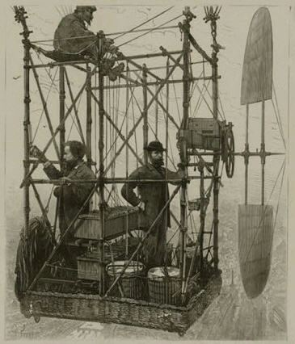
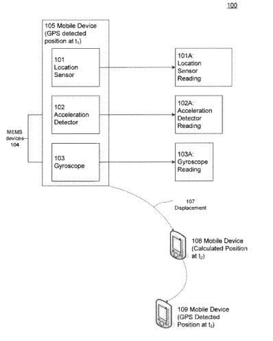

## Google Wants to know where you are

Google has a lot invested in knowing where you are located. The future of search and many of the services that Google offers will rely upon it being accurate, too. It can’t be off by 30 meters like it might be with cell tower triangulation. It can’t rely upon a GPS initially built for aircraft with multiple antennas. It needs to be able to work indoors as well as outdoors. Unlike the electronic navigation device below, it also needs to be small. How will Google do Mobile Location Detection?

The purpose behind a Global Positioning System, or GPS, is a satellite-based navigation system helping to overcome problems with previous navigation systems. We know that Google has used GPS in mobile devices to make it possible for many location-based services to function.

Another approach that Google has used to find someone’s location is cell phone tower triangulation, which looks at the distance between a cell phone and more than one tower to estimate location. GPS doesn’t always work well when someone is near a building, or inside a building, and its use can consume a fair amount of power. Cell Tower signals are also limited in how accurate they might be.

## Google Location Based Services

Google’s future relies in part upon [Location Based Services](https://support.google.com/maps/answer/1725632?hl=en&rd=2&visit_id=1-636189177911229945-448465231), such as:

1. Google Latitude
2. Google Now
3. Google Field Trip
4. Targeted Advertising
5. Traffic Time Estimates
6. Traffic Gridlock Warnings
7. In car (and walking, and biking) Navigation
8. Google Goggles visual queries that might identify locations/landmarks
9. Checking on my location when I tell Google Maps that the place I wanted to visit is closed for business

Mobile devices such as Google Glass, Android phones, and Android tablets will challenge and likely surpass Google services on a desktop computer.

Google was granted a Mobile Location Detection patent on using both GPS and MEMS (Microelectromechanical Systems) sensors from electrical devices such as acceleration detector reading and a gyroscope reading, along with algorithms based upon such readings, to get a much more accurate indication of where someone is located. The cost of electrical consumption is a lot lower, which is a good thing for battery-operated devices.

The Mobile Location Detection patent provides an extremely detailed look at the formulas for those algorithms, which will do things such as ignore the impact of gravity upon the MEMS sensors.

The patent is:

[GPS and MEMS hybrid location-detection architecture](http://patft.uspto.gov/netacgi/nph-Parser?Sect1=PTO2&Sect2=HITOFF&p=1&u=%2Fnetahtml%2FPTO%2Fsearch-adv.htm&r=1&f=G&l=50&d=PALL&S1=08362949&OS=PN/08362949&RS=PN/08362949)
Invented by Qingxuan Yang, Edward Chang, and Guanfeng Li
Assigned to Google
US Patent 8,362,949
Granted January 29, 2013
Filed: June 27, 2011

Abstract

> The present application describes a computer-implemented method and system for obtaining position information for a moving mobile device with increased accuracy and reduced power consumption.
>
> The subject of the present application combines information from a GPS location sensor with information from MEMS devices such as an acceleration detector and a gyroscope using statistical analysis techniques such as a Kalman filter to estimate the location of the device with greater accuracy while using numerical methods such as the Newton-Raphson Method to minimize power consumption.
>
> Minimizing power consumption is possible because GPS signals sampled at a lower rate can conserve power. In comparison, GPS sampled at a lower rate and working together with MEMS devices can achieve the same level of location prediction accuracy as a GPS alone sampled at a higher rate.

**Mobile Location Detection Take Aways**

The value of such better measurement by Google can mean:

1) Google will stop trying to get me to check in at a restaurant 2 blocks down the street when I stop at a local bakery.

2) Google won’t give me a map of the auto repair shop, and tell me that it will take less than a minute to drive there, when I’m walking to pick my car up, and the walk is going to take longer.

3) Alerts for historical places will only trigger when I’m actually near them, instead of going off every few seconds when visiting a place like New York City.

It’s easy to say that something like this Mobile Location Detection invention is obvious, especially when patent filings that describe location-based services from Google, including Google Glass implementations (indoor mapping, geo-tagging of photos, etc.) mention how such sensors might be used. One of the Google Glass patents also mentions using MEMS sensors to tell whether a wearer is standing still, walking, running, or driving, and changing the device’s user interface based upon the level of activity of the person using Glass.

But if you’ve seen the warning on your phone about how much power it takes to turn GPS on to run something like navigation might involve, the process described in this patent can’t happen fast enough.

It does have me wondering what other kinds of sensors might be built into phones in the future, though. Blood pressure and other health-related sensors? Humidity and air pressure sensors to more evenly build models for weather reports? Air filter sensors to detect pollen and pollutants.

What might Google do with Mobile Location Detection? I wrote about some other patents that use location history. These are about patents from Google that use location history:

- [Google’s Mobile Location History](https://www.seobythesea.com/2018/01/googles-mobile-location-history/)
- [Google Tracking How Busy Places are by Looking at Location History](https://www.seobythesea.com/2016/12/google-tracking-how-busy/)
- [Google Lifestreaming?](https://www.seobythesea.com/2013/02/google-searchable-life-experiences/)
- [Google Patents Identifying User Location Spam](https://www.seobythesea.com/2013/02/google-patents-identifying-user-location-spam/)
- [Google Patent Granted on Mobile Location Detection](https://www.seobythesea.com/2013/02/google-mobile-location-detection/)
- [Location Extensions Augmented Advertisements](https://www.seobythesea.com/2019/06/location-extensions-augmented-advertisements/)

Last Updated June 25, 2019.
