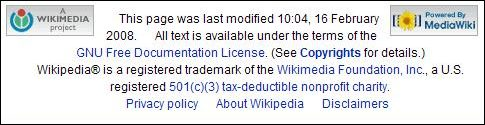

Computer programmers will sometimes use the term “boilerplate” code to refer to standard stock code that they often insert into programs. Lawyers use legal boilerplate in contracts – often the small print on the back of a contract that doesn’t change regardless of what a contract is about.

A lot of web pages and documents reuse the same text in sidebars and in footers at the bottoms of pages, like copyright notices and navigation sidebars.

It might be a good step for a search engine to ignore the boilerplate text when indexing pages, or using the content of pages to create query suggestions for someone using a desktop personalized search. Ignoring this similar text in the same documents could be helpful when using those documents to rerank search results in personalized search.

New York Times Boilerplate

Is Google ignoring boilerplate on pages when it indexes those pages and tries to understand what the pages are about? Does it disregard the words in your copyright notice, or the use of “home” in your link to your homepage?

Do the words appearing as anchor text in links to other blogs in your blogroll get ignored when the search engine tries to understand what one of your blog posts is about?

Wikipedia Boilerplate

It’s difficult to tell how much attention Google might pay to your copyright notice, or an introductory blurb or disclaimer that might appear on all of your pages. If Google is paying attention to those words now, it might not pay as much attention to them in the future.

**Google’s Next Generation Search Engine?**

Google’s next generation search engine may look a little like a hybrid between their present Web search as well as their desktop and intranet search, with a number of additional features. I wrote about two patent applications that seem to be part of that search in [Google on Desktop Search and Personal Information Management](https://www.seobythesea.com/2007/12/google-on-desktop-search-and-personal-information-management/).

I also noted in that post that there are at least 50 patent applications in total that may be part of that future search engine, which are listed as “related applications” in a patent application published at WIPO titled [Methods and Systems for Information Capture and Retrieval](https://patentscope.wipo.int/search/en/detail.jsf?docId=WO2005098594).

Many of those patent applications were originally filed with the US Patent and Trademark office in 2003 and 2004, and the direction that Google may follow in the future could include them, or it could go in another direction completely. But many of the ideas behind them may make their way into whatever path Google may follow.

**Google and Boilerplate**

I’m keeping an eye open for the publication of those 50 patent applications. One of them came out this week, focusing on ignoring boilerplate, which could be something useful for today’s Google. The patent filing is:

[Systems and methods for analyzing boilerplate](http://appft1.uspto.gov/netacgi/nph-Parser?Sect1=PTO2&Sect2=HITOFF&u=%2Fnetahtml%2FPTO%2Fsearch-adv.html&r=1&p=1&f=G&l=50&d=PG01&S1=20080040316.PGNR.&OS=dn/20080040316&RS=DN/20080040316)
Invented by Stephen R. Lawrence
US Patent Application 20080040316
Published February 14, 2008
Filed March 31, 2004

Abstract

> Systems and methods for analyzing boilerplate are described. In one described system, an indexer identifies a common element in a plurality of related articles. The indexer then classifies the common element as boilerplate. For example, the indexer may identify a copyright notice appearing in a plurality of related articles. The copyright notice in these articles is considered boilerplate.

Text in documents (web pages, word documents, PDFs, and so on) on your hard drive, or browser cache, or in your web surfing history or favorites might be used to create queries based upon what you’ve been doing recently with those documents. Those queries might be shown in a sidebox on your computer screen, as an information resource that you can use if you want to find out more on the topic that you are writing about, or reading, or browsing.

Or that document information might be used to rerank search results, when you perform a search, to find stuff related to what you were doing on your computer recently if it might be helpful.

Boilerplate language could be identified by the search engine in a few different ways when it looks at the text or other elements on a page. An example from the patent application is that “any text following the word ‘copyright’ is boilerplate.”

Other types of boilerplate might include navigational text, disclaimers, and text that appears on every page of a web site.

**Important Terms and Concepts**

There are two different types of queries that may be used by this search system, looking at recently used and viewed pages to grab keywords for searches:

***Implicit queries*** – the indexing program looks for boilerplate elements on pages, and content elements, and creates an implicit search query comprising a search term from a term found in the content area.

***Explicit queries*** – the query system might remove or weigh down boilerplate when someone performs a search.

With both implicit and explicit queries, the relative importance of actual content is given higher weight than the boilerplate language. An article might not be indexed after the boilerplate has been removed, which would mean that only the non-boilerplate language is used to influence those queries.

***Boilerplate*** – examples include headers, footers, and navigational elements that may occur on multiple articles. This kind of language could be identified by analyzing a number of related articles, such as multiple web pages within a web site. Boilerplate might also be identified by analyzing a single article.

***Identifying boilerplate*** – the indexer may identify a boilerplate element in a few different ways. One might be to analyze the frequency of terms and phrases in a number of related articles to identify common element. The indexer could then classify the common elements as boilerplate. For example, a phrase like “Copyright 2004,” appearing in a number of related articles could be seen as boilerplate.

***Spatial location of terms or phrases*** – common terms or phrases often occur at a particular positions in articles, and might be boilerplate. For example, a common term often found at the bottom of an article might be a copyright notice.

***Navigational elements as boilerplate*** – common phrases occurring at the same place at the top, left, and right of an article could be navigational elements. On a web site, navigational elements are links letting visitors go to certain sections of the site; such as links to the home page, or a help page, and other pages on a site.

***Article markup indicating boilerplate*** – HTML markup code for common terms on pages might indicate that those terms are boilerplate. One example is javascript used in navigational links to change the appearance of those links when someone moves a mouse pointer over the links. A score might be determined for common terms that have markup near them. Different weights might be assigned based upon different kinds of markup – so words in javascript links might be given a higher boilerplate weight than words in bold or italic HTML elements.

Some markup could reliably identify boilerplate when you are even just looking at one article, instead of seeing if the boilerplate appears on more than one page of the same site. For example, links are markup code, and links going to the home page of a site or a page ending in “help.html” or “copyright.html” could be considered boilerplate.

***Predetermined terms and phrases as boilerplate*** – could be identified based on a predetermined list of terms and phrases. For example, common navigational or legal terms, such as “Home”, “Help”, “Terms of Service”, and “Copyright” may be used on a page, and the sections of the page where those appear might be considered boilerplate. The sections may be sentences or paragraphs. The text appearing in those areas might not be considered boilerplate on other pages when they appear without the predetermined terms.

***Frequently indexed terms as boilerplate*** – terms that appear often in many different articles might be more likely to be considered boilerplate than terms that rarely appear. Examples of terms like that are “home” and “contact us.” These terms appear very frequently as hyperlinks on many pages available on the Web.

***Common terms and phrases are sometimes not boilerplate*** – even though some phrases may occur on multiple related pages, that frequency of use may not be an indication that the phrase is boilerplate. For example, a site about astronomy may include the term “astronomy” in many or all pages, and that term is relevant and important.

**Some Conclusions**

1. Keep in mind that a search engine may ignore the text on pages that it may think is boilerplate.

2. If you want a search engine to pay attention to text upon pages, pay attention to where that text appears on a page, and how frequently the same text appears on more than one page.

3. Global navigation and site wide links appearing on pages might be viewed as boilerplate when it comes to the content of the pages those links appear upon, but the anchor text within them may still tell the search engine something about the pages that they point towards.

4. Google may or may not be using something like this now, but if they aren’t, they could be in the future.
