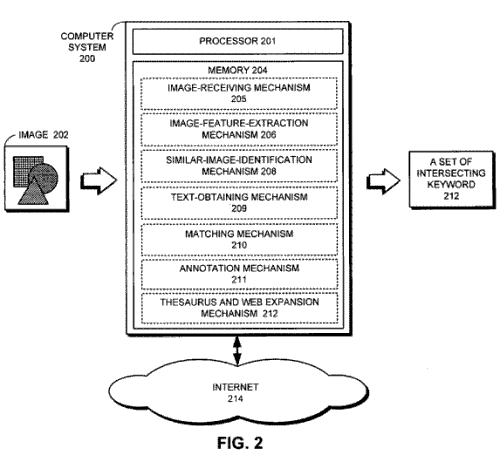

Added 6/20/2020 – This image annotation patent application was granted as a patent to Google on November 22. 2011 –[Method and apparatus for automatically annotating images](http://patft.uspto.gov/netacgi/nph-Parser?Sect1=PTO1&Sect2=HITOFF&d=PALL&p=1&u=%2Fnetahtml%2FPTO%2Fsrchnum.htm&r=1&f=G&l=50&s1=8,065,313.PN.&OS=PN/8,065,313&RS=PN/8,065,313)

How effectively can a search engine automatically create annotations for images and videos, so that they can be good responses to searcher’s queries? How much of that image annotation can be done without human intervention and review?

A newly published Google patent application explores the topic and comes up with a method of image annotation by comparison to similar images found on the Web, and the text surrounding those similar images.

[Method and apparatus for automatically annotating images](http://appft1.uspto.gov/netacgi/nph-Parser?Sect1=PTO2&Sect2=HITOFF&u=%2Fnetahtml%2FPTO%2Fsearch-adv.html&r=1&p=1&f=G&l=50&d=PG01&S1=20080021928.PGNR.&OS=dn/20080021928&RS=DN/20080021928)
Invented by Jay N. Yagnik
US Patent Application 20080021928
Published January 24, 2008
Filed July 24, 2006

Abstract

> One embodiment of the present invention provides a system that automatically performs Image annotation. During operation, the system receives the image. Next, the system extracts image features from the image.
>
> The system then identifies other images that have similar image features. The system next obtains text associated with the other images and identifies intersecting keywords in the obtained text. Finally, the system annotates the image with the intersecting keywords.

## Problems with Image Annotation

Connections to the Web have become faster and faster, with many higher bandwidth options available to people. This has led to a large increase in the use of pictures and videos on web pages.

Many of those images don’t have accompanying text-based information, such as labels, captions, or titles, that can help describe the content of the images.

Search is predominantly text-based, with keyword searches being the common way for someone to look for something – even pictures. It can be difficult to search for images through a search engine. The creation of annotations for images such as a set of keywords or a caption can make those searches easier for people.

Traditional methods of annotating images tend to be manual, expensive, and labor-intensive.

There have been some other approaches to the automatic annotation of images, like the one described in [Formulating Semantic Image Annotation as a Supervised Learning Problem](http://www.svcl.ucsd.edu/publications/conference/2005/cvpr05/cvpr05_carneiro.pdf) (pdf). While that kind of approach can make it much easier to remove manual efforts in annotation, they still require some human interaction and review.

## An Approach to Automate Annotation of Images

The annotation system in a nutshell would go as follows:

1. An image is received
2. Image features are extracted
3. Other Images which have similar features are identified
4. Text associated with the other images is obtained
5. Keywords from that text is identified
6. The image annotation is made with those keywords

A more technical approach might call for:

1. Generating color histograms
2. Generating orientation histograms
3. Using a direct cosine transform (DCT) technique
4. Using a principal component analysis (PCA) technique; or,
5. Using a Gabor wavelet technique.

Some other variations include:

- Identifying image features in terms of: shapes, colors, and textures
- Identifying the other images by searching through images on the Internet
- Finding other images with similar image features by using probability models
- Expansion of keywords in the obtained text by adding synonyms for the keywords
- Using images from videos

**Using this Process with Videos**

Videos without titles or descriptions can benefit from the use of the same approach.

They may be partitioned into a “set of representative frames,” and each of those can be processed as images, using the process described above. After those images are annotated with keywords, they can be analyzed to create a set of common annotations for the whole video.
