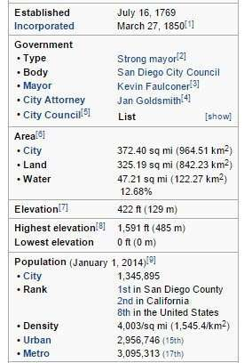
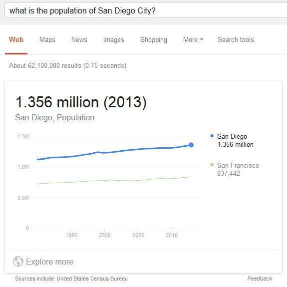

A patent granted to Google this past fall explores how the search engine looks for Web pages’ patterns to find facts on the Web to fill up Google’s data repository (Knowledge Base).

I recently wrote a series of posts about Google collecting data to enable them to answer Direct answers. starting with one titled [Direct Answers – Natural Language Search Results for Intent Queries](https://www.seobythesea.com/2014/12/direct-answers-natural-language-search-results-intent-queries/).

In one of those posts, I write about [a paper](http://static.googleusercontent.com/media/research.google.com/en/us/pubs/archive/34460.pdf) (pdf) that the inventors of that patent co-authored which describes ways that Google was finding and extracting facts from pages to include in a repository of facts.

That post is [Direct Answers: How Answers are Extracted from Web Pages](https://www.seobythesea.com/2015/01/direct-answers-answers-extracted-web-pages/). Since then, I came across a patent granted to Google which describes this pattern-matching and extraction process.

In Google’s Financial Statement [10-K Filing for 2014](https://www.sec.gov/Archives/edgar/data/1288776/000128877615000008/goog2014123110-k.htm) Google explained why they were adding more direct answers to their search results, telling us:

> Imagining the ways things could be — without constraint — is the process we use to look for better answers to some of life’s everyday problems. It’s about starting with the “What if?” and then working relentlessly to see if we can find the answer.
>
> It’s been that way from the beginning; providing ways to access knowledge and information has been core to Google, and our products have come a long way in the last decade. We used to show just ten blue links in our results. You had to click through to different websites to get your answers, which took time. Now we are increasingly able to provide direct answers — even if you’re speaking your question using Voice Search — which makes it quicker, easier, and more natural to find what you’re looking for.

The patent shows one path to collecting a fact database of the kind that can provide direct answers to pages and focuses upon extracting facts from documents. That patent is:

[Unsupervised extraction of facts](http://patft.uspto.gov/netacgi/nph-Parser?Sect1=PTO2&Sect2=HITOFF&p=1&u=%2Fnetahtml%2FPTO%2Fsearch-adv.htm&r=1&f=G&l=50&d=PALL&S1=08825471&OS=PN/08825471&RS=PN/08825471)
Invented by Jonathan T. Betz and Shubin Zhao
Assigned to Google
United States Patent 8,825,471
Granted September 2, 2014
Filed: March 31, 2006

Abstract

> A system and method for extracting facts from documents. A fact is extracted from a first document. The attribute and value of the fact extracted from the first document are used as a seed attribute-value pair. A second document containing the seed attribute-value pair is analyzed to determine a contextual pattern used in the second document. The contextual pattern is used to extract other attribute-value pairs from the second document. The extracted attributes and values are stored as facts.

The idea behind looking for patterns to find facts at Google dates back to what may be their second patent – [one filed by Sergey Brin in 1999](https://www.seobythesea.com/2014/09/google-first-semantic-search-invention-patented-1999/) which involved looking for pages on the web that contained information about specific books and the patterns that information might be contained within – being able to find similar patterns on other pages on the Web allowed for the collection of a fact repository that contains many pages on the web where that data is collected.

Being able to find lots of pages on the Web where that data is the same on those pages allows the facts about that [data to be corroborated](https://www.seobythesea.com/2015/02/google-corroborating-facts-direct-answers/).

Here’s an example of a pattern that this patent is looking for, a colon-delimited pair of an attribute name followed by a value:

> According to one embodiment of the present invention, the importer identifies a predefined pattern in the document and applies the predefined pattern to extract attribute-value pairs. The extracted attribute-value pairs are then stored as facts. A predefined pattern defines specific, predetermined sections of the document which are expected to contain attributes and values.
>
> 
>
> _when items on a page are separated by colons like this, they are often related._
>
> For example, in an HTML document, the presence of a text block such as “ *:* ” (where `*` can be any string) may indicate that the document contains an attribute-value pair organized according to the pattern “ (attribute text):(value text) ”.
>
> Such a pattern is predefined because it is one of a known list of patterns to be identified and applied for extraction in documents. Of course, not every predefined pattern will necessarily be found in every document;
>
> Identifying the patterns contained in a document determines which (if any) of the predefined patterns may be used for extraction on that document with a reasonable expectation of producing valid attribute-value pairs. The extracted attribute-value pairs are stored in the facts.

Patterns identified on pages like this might be collected as Google crawls web pages and collects data about facts. The programs that check upon and extract facts from pages are known as [Data Janitors](https://www.seobythesea.com/2007/06/google-janitors-clean-up-facts-on-the-web/) at Google.

In addition to colon-delimited lists, Google might also look for attribute-value pairs set up in 2 column tables, like infoboxes you might see at Wikipedia. They tell us in the patent:

> FIG. 4 is an example of a document containing attribute-value pairs organized according to a predefined pattern. According to one embodiment of the present invention, a document may be analogous to the document described herein concerning FIG. 3.
>
> The document includes information about Britney Spears organized according to a two-column table. According to one embodiment of the present invention, the two-column table is a predefined pattern recognizable by the unsupervised fact extractor.
>
> The pattern specifies that attributes will be in the left column and that corresponding values will be in the right column. Thus the unsupervised fact extractor may extract from the document the following attribute-value pairs using the predefined pattern: (name; Britney Spears), (profession; actress, singer), (date of birth; Dec. 2, 1981), (place of birth; Kentwood, La.), (sign; Sagittarius), (eye color; brown), and (hair color; brown). These attribute-value pairs can then be stored as facts, associated with an object, used as seed attribute-value pairs, and so on.

This Wikipedia infobox for San Diego shows the kind of pattern being talked about above as part of a two-column table with attributes and values that could be pulled into a fact repository:

_Attributes and values about San Diego can be extracted from an infobox like this one._

## Take-Aways

This type of pattern-matching and extraction of facts is part of how Google uses the Web as a database of information. Extracting facts and storing them in a data repository, like Google’s knowledge graph, makes those facts available as direct answers.

