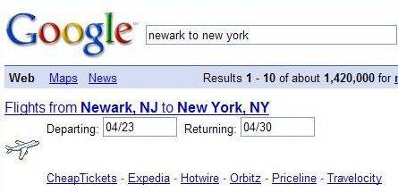

One of the features found at Google is the ability to receive driving, flight, or other transit information, to help you get from one location to another.

Driving directions from Google Maps is one example, and Google has been working on providing [public transit](https://support.google.com/maps/answer/144339?hl=en&rd=3) information in [selected](http://www.google.com/intl/en/landing/transit/) areas.

You can also gain access to some transportation information directly from search results, by typing something like “New York to Tokyo” which will give you a form at the top of the search results where you can look for flight information.

Sometimes that doesn’t work so well, like when you search for “Newark to New York,” which gives you a form for flight information from Newark, New Jersey to New York City:

It’s pretty unlikely that most people would fly from Newark, New Jersey to New York City. But the interesting thing going on there isn’t the mistake. It’s that “New York” is understood by Google to mean New York City, and “Newark” is understood by Google to mean Newark, New Jersey.

Why does Google choose New York City over New York State, or Newark, New Jersey, over many other Newarks located in the United States?

A patent application from Google discusses how routing information is provided to searchers when the search terms used are ambiguous.

While this isn’t an earth-shattering process, it’s interesting in that it provides a nice look at some of the assumptions that the search engine might make when providing information to searchers.

**Ambiguous Locations**

When someone is looking for directions, they provide a starting location and an ending location, and routing information between the two points can be returned to them, often with additional information such as maps and estimated travel times.

People will often provide only partial addresses, which may cause problems, especially if it involves more than one place with the same name. Someone looking for driving directions from Salem, Ind. to Chicago, Ill. might type in a starting location in Google Maps of “Salem” and an ending location of “Chicago.”

The patent application tells us that there are at least 10 cities in the US with the name “Salem” and at least two cities named “Chicago.”

Most web mapping services proving routing information would ask for more information, perhaps with a list of possible locations asking the searcher to refine their request. If the person looking is searching from a slow computer or a mobile device, that can be a painful step.

This patent application aims at providing routing information for the highest-ranked potentially-matching location, with the possibility that the searcher can choose other locations if the one presented wasn’t correct.

[Providing Routing Information Based on Ambiguous Locations](http://appft1.uspto.gov/netacgi/nph-Parser?Sect1=PTO2&Sect2=HITOFF&u=%2Fnetahtml%2FPTO%2Fsearch-adv.html&r=1&p=1&f=G&l=50&d=PG01&S1=20080082256.PGNR.&OS=dn/20080082256&RS=DN/20080082256)
Invented by Hiroyuki Komatsu
US Patent Application 20080082256
Published April 3, 2008
Filed: August 18, 2006

Abstract

> A routing server receives a request for routing information. The request specifies one or more locations. A specified location may be ambiguous. For an ambiguous location, the routing server identifies a set of potentially-matching locations and ranks the locations according to a metric.
>
> The routing server returns routing information for the highest-ranked location that potentially matches an ambiguous location. If a request for routing information specifies two locations, and at least one location is ambiguous, the routing server pairs combinations of potentially-matching locations based on the query and calculates a metric for each pair.
>
> In one case, the metric is the distance between the locations in the pair. The routing server ranks the pairs based on the metric and returns routing information for the highest-ranked pair.

A routing request is received from a searcher and may specify two or more locations between which routing information is requested. Other information might be shown, such as whether something like driving directions or train schedules are requested, the time/date for the journey, whether to use highways, express trains, or planes for the routes, etc.

The locations may be specified by name or address or both, or by other means, such as geographic coordinates. More free form requests can also be made, like “driving directions between Tokyo and Kamakura.” In those free form requests, techniques are used to extract information about the locations.

People will sometimes request routing information without being precise about the starting or endpoint of their trip. A location lookup program may attempt to identify a location, like when a bus station (“Ebisu Station”) is entered, but the name of the city where the station is located isn’t.

That lookup database can include more than just routes between locations. It might include data for “trains, planes, buses, ferries, and other transit lines.” Additional related information, such as real-time or historical street traffic information, transit schedules, and fee tables, etc.. may also be included.

Other information can be calculated from the location database, such as a way to identify distances between locations, or populations of locations, or surface areas of locations and regions.

The popularity of locations may also be tracked, based upon “the frequency that the locations appear in routing requests, end-user rankings, the volume of traffic passing through the location (e.g., number of passengers transiting a train station) and/or other criteria.”

**Ambiguous Locations**

When someone provides a clear and unambiguous starting point, and an ambiguous ending point, one metric that the search engine might use to identify the ending point is the distance between those points. A closer destination might be a better choice than one further away.

The search engine may also look at popularity information. If most people looking for driving information to an ending point like “Chicago” means Chicago, Il., instead of Chicago, Wi., then the search engine may choose to use the Chicago in Illinois instead of the one in Wisconsin.

Population data is also kept in the system, and the destination with the larger population may be chosen.

Distance, popularity, and population data may be used together to determine which ending point to choose to display. Other metrics may also be involved in that decision.

**Conclusion**

The patent filing provides some other examples and details on how Google might choose routing information to searchers when facing ambiguous locations.

As search patent filings go, this one attempts to solve a relatively simple search problem, when compared to delivering search results to a searcher in a Web search when the intent behind the search isn’t well known.

But it provides a nice illustration of how different assumptions can be used to deliver results to a searcher – when someone is asking for routing information to an ambiguous destination, chances are that they want the closest likely destination, or the most popular, or the one with the highest population.
