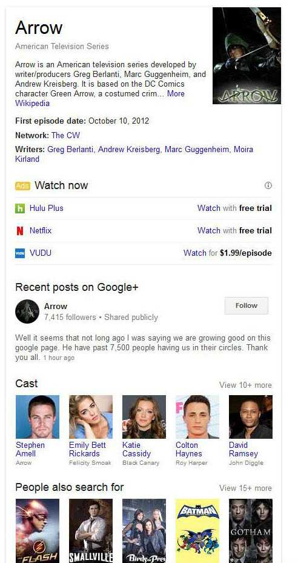
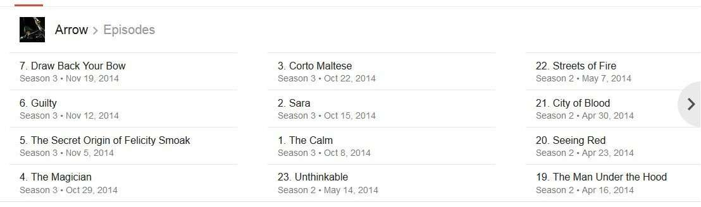
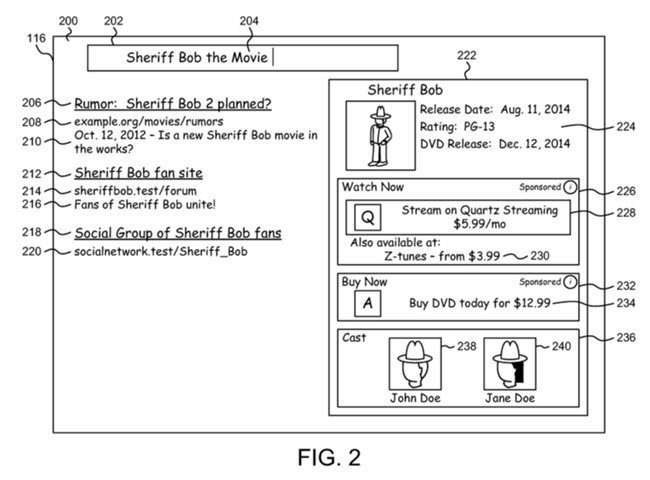

## Knowledge Panel Ads Involve Entity Action Pairings

In the start of a patent granted at Google from this past September, [Entity-based searching with content selection](https://patents.google.com/patent/WO2014138185A1), we’re told that:

> Implementations of the systems and methods for entity-based searching with content selection are described herein.

The phrase “content selection,” when it appears in Google patents, doesn’t often refer to site owners creating content on their web sites, but usually to the creation of advertisements and landing pages that people might create to show as search results or pages on their sites that are associated with those ads.

This is one of the first few patents I’ve seen from Google that ties together the Semantic Web and Paid Search, including one described in Barbara Starr’s article on Search Engine Land from last week, where she points to Google’s patent for Product Search and how queries and attributes related to products within those queries can be used by Google to help identify the appropriate pages to which searchers may be delivered.

That article is titled [Understanding Question/Query Answering In Search & How It Relates To Your Website](https://searchengineland.com/understanding-questionquery-answering-relates-website-digital-assets-207193). If you didn’t get a chance to read it, you should.

This patent looks at some of the newer features on Web pages that Google has been showing off, such as knowledge panels, to deliver what might be considered smarter advertisements on search results pages. Yes, Knowledge panel ads.

For example, look at this knowledge panel on a query for [arrow episodes].

_Notice the streaming downloads available in this knowledge panel._

See the “Watch Now” in the middle, with three offers, including the top two providing “free trials” and the third offering the show at $1.99/episode. Those look like ads, don’t they?

They have the “Ads” label that Google started showing for advertisements a few months ago. Think this new advertisement placement is related? (I do.)

## Determining, using one or more keywords, that the search query corresponds to a search entity

When someone searches, one of the early steps that Google might take is determining whether or not their query contains a search entity. It might also decide whether that query includes some kind of online activities associated with the search entity. As the patent tells us:

> The method includes receiving a search query with one or more keywords and determining that the search query corresponds to a search entity using one or more keywords. The search entity represents a named entity in the physical world.

The patent also asks for something that transforms paid search because it no longer cares about bidding on specific keywords. Instead, it asks for a related online action for the search entity in knowledge panel ads.

> The method also includes retrieving search results based in part on the search query and identifying an entity-action pair that includes the named entity and an online action associated with the entity. The method further includes conducting a content auction for the entity-action pair based on auction bids received for the entity-action pairs. The method also includes selecting third-party content based on a result of the content auction. The third-party content is configured to perform the online action in response to input from a user interface device. The method also includes providing the search results, the search entity, and the selected third-party content for presentation as part of a search result screen.

In my query above for “Arrow Episodes, ” Google returned a listing of episodes of the TV show at the top of my monitor, like this:

_A listing at the top of Google Search Results that shows off names of specific episodes of the current TV show_

It also assumed that I was interested in watching streamed episodes of the show and offered me a way to watch those without those ads being at the top of a set of search results or to the right side of those results. The [arrow episodes] knowledge panel showing knowledge panel ads aren’t from a patent but are from actual search results that I performed earlier today.

There are other kinds of actions that might be associated with a search entity, such as:

- Purchasing a hardcopy of a show (e.g., DVD, Blu-Ray, etc.)
- Watching a show via streaming
- Making reservations to watch a show in person
- Purchasing tickets for a show, or
- Any other form of online action

This is a fairly new type of advertising that Google could be offering, and it may still be in its experimental stages. Interesting to see the knowledge panel offered as a place to advertise things like streaming video, though.

Here’s an example of some different kinds of knowledge panel ads:

_An example of knowledge panel ads, from the patent._
