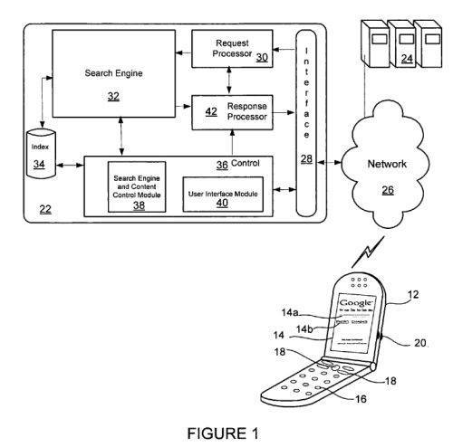
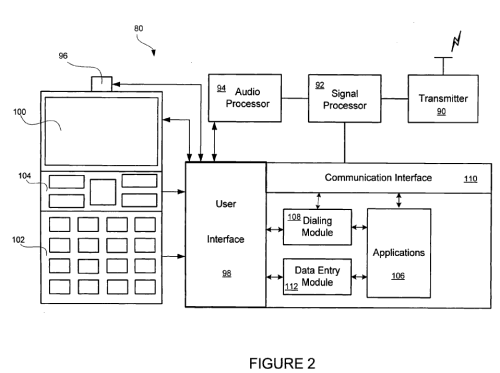

After lots of speculation about a Google Phone, or an operating system from Google, we see a patent application published at the US Patent and Trademark Office, and assigned to Google, that primarily focuses upon a user interface for displaying search results on the small screens of handheld devices, and which suggests the use of special shortcuts using the limited keyboards of many phones.

Some of the screenshots from the application appear to infer that this user interface may do more than provide search results, and the description from the application also hints that this user interface may interact with other other software from Google, such as a data processing system that “may be supplied by Google.”

But, the claims listed in the patent filing are limited to describing a user interface that focuses upon search.

This second image hints at more, but the actual claims within the patent filing don’t go that far.

[User interface for mobile devices](http://appft1.uspto.gov/netacgi/nph-Parser?Sect1=PTO2&Sect2=HITOFF&u=%2Fnetahtml%2FPTO%2Fsearch-adv.html&r=1&p=1&f=G&l=50&d=PG01&S1=20080005668.PGNR.&OS=dn/20080005668&RS=DN/20080005668)
Invented by Sanjay Mavinkurve, Shumeet Baluja, and Maryam Kamvar
US Patent Application 20080005668
Published January 3, 2008
Filed June 30, 2006

Abstract

> A computer-implemented method of displaying information on a mobile device is discussed.
>
> The method includes displaying on the mobile device a first view having a first search result element in an expanded format and a plurality of additional search result elements in a collapsed format, receiving a user input that identifies a selected search result element from the plurality of additional search result elements, and in response to the user input, displaying on the mobile device a second view having one of the plurality of additional search result elements in an expanded format, and the remainder of the plurality of additional search result elements in a collapsed format.
