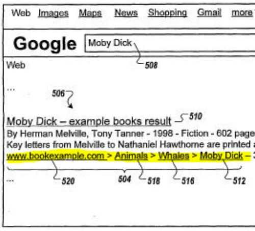

Once upon a time, when you searched the Web at Google, the results displayed were limited to a list of 10 pages with page title, snippet of text from meta description or page content, and URL to that page. We’ve been seeing the search engines diversifying what they might display for certain pages, with special formats for things like forum posts, Q&A listings, pages that include events, and sometimes sitelinks or quicklinks to other pages as well.

The URL shown for some pages might have hinted at the structure of sites and locations of pages within a site hierarchy if they showed directories and subdirectories within paths to pages. Some websites include breadcrumb navigation on their pages to show you more explicitly where you might be at within a site and provide an easy way to visit higher categories. Google has started showing those breadcrumb listings for some pages, to make those listings more useful for searchers, and to make it more clear where those pages are within the hierarchy of a site.

A decision by Google as to whether or not to include breadcrumb navigation within an augmented search result might depend upon an analysis that looks at the structure of a site, the structure of links within a site, navigational menus, a sitemap associated with the site, user behavior related to navigating through a site, category trees and terms that might be associated with the site, and webmaster or user classification associated with the site.

While the process described in this patent might also look at breadcrumb navigation that might appear upon a page that shows up in search results, and breadcrumb navigation on a page might be used to generate breadcrumb links within that result, a page doesn’t need to have breadcrumb navigation upon it for Google to display such navigation in a search result.

In addition to breadcrumb-like displays in results, the patent also notes that it might display instead a dropdown that can point to other pages on the site or a navigational menu tree could be used.

[Visualizing Site Structure and Enabling Site Navigation for a Search Result or Linked Page](http://appft.uspto.gov/netacgi/nph-Parser?Sect1=PTO1&Sect2=HITOFF&d=PG01&p=1&u=%2Fnetahtml%2FPTO%2Fsrchnum.html&r=1&f=G&l=50&s1=%2220110276562%22.PGNR.&OS=DN/20110276562&RS=DN/20110276562)
Invented by Beckett Madden-Woods, Jeremy Silber, and Jian Zhou
US Patent Application 20110276562
Published November 10, 2011
Filed: January 16, 2009

Abstract

> Methods, systems, and apparatus, including computer program products, for attaching a visual representation of hierarchical data associated with a resource identified by a search system to the resource. The resource and hierarchical data can be presented to a user as a search result. In some implementations, breadcrumbs that describe a traversal path toward a starting or entry page associated with the resource can represent the hierarchical data.

The breadcrumb path or navigation structure that might be shown within results could use the homepage of a domain as a starting point, but it’s also possible that it may use an entry page that could be associated with the page. For example, if the page is within a blog that might be in a subdirectory of a domain (“http://www.example.com/blog/”), that blog main page could be considered the starting point for breadcrumb navigation as easily as the homepage for that domain.

If breadcrumb navigation is found on a site, a hierarchical data extractor might try to extract that information and use it to determine a hierarchical structure for that site.

Some sites do use breadcrumb navigation in a static manner where each page only has one pathway via breadcrumbs to arrive at a page, while others may use a parallel approach so that for example, a pair of sneakers might be found at the end of navigation that comes from different categories, such as Home > Shoes > Men > Sneakers or Home > Sales > Shoes >Sneakers. Other sites sometimes use a dynamic breadcrumb approach that shows someone the path that they’ve been taking through a site to arrive at the page that they are presently upon.

We aren’t told in the patent how the search engine might decide between different breadcrumb possibilities when there might be more than one that could be displayed upon a page if a parallel approach or dynamic approach is used by the site.

**Conclusion**

Google announced that they were going to start displaying site hierarchy through breadcrumb navigation in augmented search results like this back in 2009, in an Official Google Blog post, [New site hierarchies display in search results](https://googleblog.blogspot.com/2009/11/new-site-hierarchies-display-in-search.html).

The Google blog post shows a number of examples of when Google might decide to display breadcrumbs as well as some of the reasons why they may. For instance, even if a URL does show off directories that might make the structure of a site more clear, the URL might be so long that Google may not show all of it. Or directory names might be somewhat obscure, and not very helpful in understanding the structure of a site.

I’ve assumed after reading that blog post a few years ago that it was more likely that Google may only show those types of breadcrumbs when the site itself uses them. It appears that including breadcrumb navigation on your site may make it easier for the search engine to analyze your site structure and include breadcrumbs (with links in them) to additional pages within your site such as a home page or category pages.

The patent though seems to point to the possibility that Google could include search result breadcrumbs even in some cases when a site doesn’t use breadcrumbs.

Why might you want these additional navigational breadcrumb elements to pages within your site appearing in Google’s search results?

A searcher makes decisions as to which pages it might visit when looking at the results for a query based upon a number of factors, such as how persuasive and engaging it might find the title and snippet displayed for a page, and how relevant, trustworthy and credible those might appear to be.

Searchers may also be drawn to certain results when those stand out in different ways, such as the inclusion of an image like Google Authorship profile images, or a Google Maps pins, or photos associated with a news story.

A search result that Google appears to be treating differently than other results, by adding more detailed elements regarding the structure of a site might seem to imply some special treatment of that site as well as drawing searchers attention to those results.

As I noted, the patent seems to imply that you don’t need to have breadcrumb navigation on your pages to have breadcrumbs show up in your search results, but also explains how such navigation could make it easier for the search engine to understand the structure of a site and to include that kind of navigation within search results.

