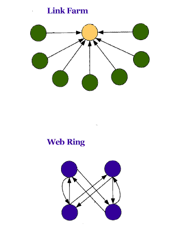

## Looking for Web Link Spam

When searching engine indexes pages and other documents on the web, hoping to provide meaningful and relevant results to searchers, it doesn’t just rely upon the content found on web pages but also considers the quality and quantity of links pointing to those pages.

A search engine like Google might determine that a page is relevant to a specific query based upon the content found on that page and the anchor text found in links pointing to the page.

It might also look at what it considers “relationships” between pages by looking at how pages are linked to each other. PageRank is one method of viewing those links that Google states that it uses and assigning a measure of importance to pages linked to from other pages. This measure or rank might be simplified as a probability that someone might arrive at a certain page if they are arbitrarily and randomly clicking on links on pages they’ve surfed.

This combination of relevance in content and anchor text and importance based upon link relationships helps determine the order that pages show up in response to queries from searchers. While Google might rerank a certain number of those top search results based upon other signals, this method of determining the top results can influence whether or not searchers might see a page.

However, there’s a problem with link-based ranking methods such as PageRank. It’s possible that the structure of links between pages can be deliberately manipulated to inflate the ranks of some pages artificially. That can be known as web link spam.

A patent granted to Google today describes how the search engine might use to identify two different methods of spamming pages and take action against artificially inflated importance (or PageRanks) for pages.

This method of identifying web link spam involves looking at a sampling of links to a page to see if the search engine can identify certain characteristics that appear in a couple of different types of manipulative linking.

**Web Link Spam – Link Farms and Clique Attacks**

A search engine might explore many links to a page to see if certain characteristics are shared by those links that might differ from an authentic page. Those would be Pages that don’t engage in manipulative linking.

The description in the Google patent specifically picks out two types of link spam, link farms, and clique attacks. The patent explains how links involved in those behaviors might be different than links to authentic pages.

***Web Link Spam – Link Farms*** – A link farm is usually a large set of pages that were created primarily to point to a single page to falsely give the impression that the page pointed to is important.

An example might be the home page of an eCommerce site artificially increasing in rank by creating many “dummy” web pages that all have links to the home page. Those links might cause the site to appear higher in search results if the search engine considers the links from the link farm.

In a link farm, all of the pages pointing to the central page will have shallow importance scores (or PageRanks). Authentically important pages will be more likely to have links from some high-ranked pages pointing to them in addition to links from low-ranked pages.

***Web Link Spam – Clique Attacks*** – Another type of Web link spam is the clique attack, or webring, which is a set of pages that predominantly point at each other to present a false appearance of authority or importance.

The pages in this kind of clique attack, or webring, don’t link much outside of the other pages in the ring, and their links to each other might cause each site to appear higher in search results if the search engine considers the links from the webring. Many of these will tend to not link out to other pages outside of the webring, like authentically important pages might.

**Taking Action on Artificially Inflated Importance From Web Link Spam**

When pages that are likely to be spam links have been located, Google accounts for the “artificially inflated importance” of those pages under this patent.

As a first step, a human review or another algorithm might be used to examine whether or not those pages are used as a link spam scheme.

If a page is determined to be link spam or a candidate link spam, the following measures might be taken:

1. Links from the page might not be considered to determine the link importance of other pages.
2. The impact of links from the page might be reduced in importance.
3. A predetermined penalty might be applied to the importance of links from the page.
4. The page’s importance might be reduced in a way that doesn’t rely upon links.
5. The page’s importance might be reduced in a way that doesn’t rely upon links while also reducing the importance of links from the page.

The patent does go into depth on some of the math behind the identification of link spam in link farms and clique attacks and is worth spending time with if you want to delve deeper into how Google might use the methods described in the patent:

[Method for detecting link spam in hyperlinked databases](http://patft.uspto.gov/netacgi/nph-Parser?Sect1=PTO2&Sect2=HITOFF&u=%2Fnetahtml%2FPTO%2Fsearch-adv.htm&r=1&p=1&f=G&l=50&d=PTXT&S1=7,509,344.PN.&OS=pn/7,509,344&RS=PN/7,509,344)
Invented by Sepandar D. Kamvar, Taher H. Haveliwala, and Glen M. Jeh
Assigned to Google
US Patent 7,509,344
Granted March 24, 2009
Filed August 18, 2004
