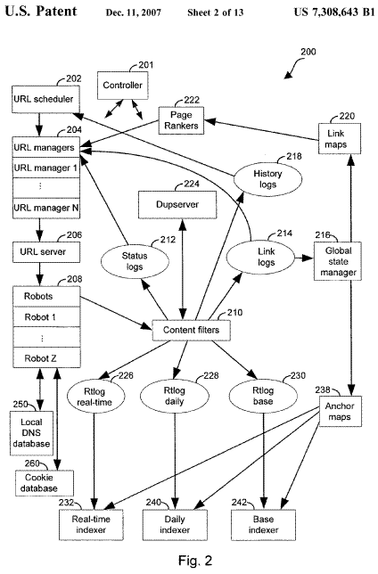
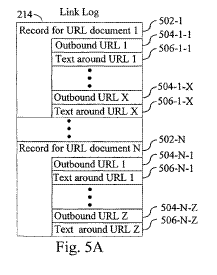

## How Does Anchor Text Indexing Work?

How does a search engine use information from anchor text in the links pointing to pages?

Why do some pages have more frequent crawling rates than other pages?

How might links that use permanent and temporary redirects be treated differently by a search engine?

A newly granted patent from Google, originally filed in 2003, explores these topics such as anchor text indexing and crawling rates and redirects and provides some interesting and even surprising answers.

Of course, this is a patent. It may not necessarily describe the actual processes in use by Google. It is possible that they are being used or were at one point in time, but there has been plenty of time since the patent was filed for changes to be made to the processes described.

It has long been observed and understood that different pages on the web have different crawling rates and get indexed more quickly or slowly. Anchor text indexing with hyperlinks pointing to pages can influence what a page may rank for in search results.

## Why Use Anchor Text Indexing to Determine Relevancy?

When you search, you expect a shortlist of highly relevant web pages to be returned. However, the authors of this anchor text indexing patent authors tell us that previous search engine systems only associated the web page’s contents with the web page when indexing that page.

They also tell us that valuable information about pages can be found outside the web page’s contents in hyperlinks that point to those pages. This information can be precious when the page being pointed towards contains little or no textual information.

For image files, videos, programs, and other documents, the textual information on pages linking to those documents may be the only source of textual information about them.

Using anchor text indexing and looking at the information associated with those links can also make it possible to index a web page before the web page has been crawled.

## Creating Link Logs and Anchor Maps

***Link Log*** – A large part of the process involved in this patent includes the creation of a link log during the crawling and indexing process, which contains many link records, identifying source documents, including URLs, and the identity of pages targeted by those links.

Information about text associated with links ends up in a sorted anchor map. These include several anchor records indicating the source URL of anchor text and the URL of targeted pages. The anchor information is sorted by the documents that they target. The anchor records may also include some annotation information.

A page ranker process may be used to determine a PageRank, or some other query-independent relevance metric, for particular pages in creating a link log and anchor map. This page ranking may help determine crawling rates and crawling priorities.

The anchor text indexing patent is:

[Anchor tag indexing in a web crawler system](http://patft.uspto.gov/netacgi/nph-Parser?Sect1=PTO2&Sect2=HITOFF&u=%2Fnetahtml%2FPTO%2Fsearch-adv.htm&r=1&p=1&f=G&l=50&d=PTXT&S1=7,308,643.PN.&OS=pn/7,308,643&RS=PN/7,308,643)
Invented by Huican Zhu, Jeffrey Dean, Sanjay Ghemawat, Bwolen Po-Jen Yang, and Anurag Acharya
Assigned to Google
US Patent 7,308,643
Granted December 11, 2007
Filed July 3, 2003

Abstract

> Provided is a method and system for indexing documents in a collection of linked documents. First, a link log, including one or more pairings of source documents and target documents, is accessed.
>
> A sorted anchor map containing one or more target documents to source document pairings is made. The pairings in the sorted anchor map are ordered based on target document identifiers.

## Different Layers and Different Crawling Rates

***Base Layer***

The base layer of this data structure is made up of a sequence of segments. Each of those might cover more than two hundred million uniform resource locations (URLs). That number may have changed since this patent was written. Together, segments represent a substantial percentage of the addressable URLs on the entire Internet. In addition, periodically (e.g., daily), one of the segments may be crawled.

***Daily Crawl Layer***

In addition to segments, there exists a daily crawl layer. In one version of this process, the daily crawl layer might cover more than fifty million URLs. The URLs in this daily crawl layer are crawled more frequently than the URLs in segments. These can also include high-priority URLs that are discovered by the system during a current crawling period.

## Optional Real-Time Layer

Another layer might be an optional real-time layer that could be comprised of more than five million URLs. The URLs in a real-time layer are URLs that get crawled many times during a given epoch (e.g., many times per day). Some URLs in an optional real-time layer are crawled every few minutes. The real-time layer also comprises newly discovered URLs that have not been crawled but should be crawled as soon as possible. It does make sense that the crawling rates of real-time pages are widespread so that the search index returns updated information.

## Same Robots for All Layers

The URLs in the different layers are all crawled by the same robots but at different crawling rates, and the results of the crawl are placed in indexes that correspond to those different layers. A scheduling program bases the crawling rates for those layers based on the historical (or expected) frequency of change of the content of the web pages at the URLs and on a measure of URL importance.

## URL Discovery in Anchor Text Indexing

The sources for URLs used to populate this data structure include:

- Direct submission of URLs by users to the search engine system
- Discovery of outgoing links on crawled pages
- Submissions from third parties who have agreed to provide content, and can give links as they are published, updated, or changed – from sources like RSS feeds

It’s not unusual to see blog posts in the web index these days that indicate they are only a few hours old. Those posts may be in the real-time layer. They may even be entered into the index through an RSS feed submission.

## Processing of URLs and Content

Before this information is stored in a data structure, a URL (and the content of the corresponding page) is processed by programs designed to ensure content uniformity and prevent the indexing of duplicate pages.

The syntax of specific URLs might be looked at. A host duplicate detection program might determine which hosts are complete duplicates of each other by examining their incoming URLs.

## Parts of the Anchor Text Indexing Process

Rather than describing this process step-by-step, I’m pointing out some of the key terms and some of the processes that it covers. In addition, I’ve skipped over a few aspects of the patent that increase the speed and efficiency of the process. Those cover partitioning and the incremental addition of data through a few processes.

It’s recommended that you read the full text of the patent if you want to see more of the technical aspects involved in this patent.

***Epochs*** – a predetermined period of time, such as a day, in which events in this process take place.

***Active Segment*** – the segment from the base layer that gets crawled during a specific epoch. A different segment is selected for each epoch so that throughout several epochs, all the segments are selected for crawling in a round-robin style.

***Movement between Daily Layer and Optional Real-Time Layer*** – Some URLs might move from one layer to another based upon information in history logs that was indicating how frequently the content associated with the URLs is changing, as well as individual URL page ranks that are set by page rankers.

## Determining What URLs are Placed in Which Layers

Determining what URLs are placed in those layers could be made by computing a daily score like this – daily score=[page rank].sup.2*URL change frequency

***URL Change Frequency Data*** – When a robot accesses a URL, the information is passed through content filters, which may determine whether the content at a URL has changed and when that URL was last accessed by a robot. This information is placed in history logs and then goes to the URL scheduler.

To decide upon crawling rates, a frequency of change may then be calculated, and supplemental information about a URL may also be reviewed, such as a record of sites whose content changes often.

***PageRank*** – a query-independent score (also called a document score) is computed for each URL by URL page rankers, which compute a page rank for a given URL by looking at the number of URLs that reference a given URL and the page rank of those referencing URLs. This PageRank data can be obtained from URL managers. Pages that have a higher PageRank may be updated at higher crawling rates as well.

***URL History Log*** – can contain URLs not found in a data structure, such as within log records for URL’s that no longer exist or which will no longer be scheduled for crawling because of such things as requests by a site owner that the URL not be crawled.

***Placement into Base Layer*** – When the URL scheduler determines that a URL should be placed in a segment of the base layer, an effort is made to ensure that the placement of the URL into a given a segment of a base layer is random (or pseudo-random), so that the URLs are evenly distributed (or approximately evenly distributed) over the segments.

Processing rules might distribute URLs randomly into the appropriate base, daily, and real-time layers.

***When All URLs Cannot Be Crawled During a Given Epoch*** – This could be addressed using two different approaches:

1. A crawl score could be computed for each URL inactive segment, daily layer, and real-time layer, and only URLs with high crawl scores are passed on to the URL managers.
2. In the second, the URL scheduler decides upon an optimum crawl frequency for each such URL and passes the crawl frequency information to URL managers – which URL managers use to decide which URLs to crawl. These approaches could be used by themselves or in a combined approach to prioritizing the URLs to crawl.

***Factors Determining a Crawl Score*** — where a crawl score is computed, URLs receiving a high crawl score are passed on to the next stage, and URLs with a low crawl score are not passed on to the next stage during the given epoch. Factors that could be used to compute a crawl score might include:

- The current location of the URL (active segment, daily segment or real-time segment),
- URL page rank, and;
- URL crawl history – can be: crawl score=[page rank].sup.2*(change frequency)*(time since last crawl).

## How the Crawling Score Might be Affected

Other modifications may impact the crawl score. For example, the crawl score of URLs that have not been crawled in a relatively long period can be up-weighted so that the minimum refresh time for a URL is a predetermined time, such as two months.

***Where Crawl Frequency is Used*** – The URL scheduler may set and refine a URL crawl frequency for each URL in the data structure. This frequency represents a selected or computed crawl frequency for each URL. Crawl frequencies for URLs in a daily layer and real-time layer will tend to be shorter than the crawl frequency of URLs in the base layer.

The range of crawl frequencies for any given URL can range from a minute or less to a period that can take months. Crawling rates determining the crawl frequency for URLs are computed based on the historical change frequency of the URL and the page rank of the URL.

***Dropping URLs*** – The URL scheduler determines which URLs get deleted from data structure and dropped from system. URLs might be removed to make room for new URLs. A “keep score” might be computed for each URL, and the URLs could then be sorted by the “keep score.”

URLs with a low “keep score” could be taken away as newly discovered URLs are added. The “keep score” could be the *page rank* of a URL determined by page rankers.

***Crawl Interval*** – A target frequency that a URL should be crawled. For a URL with a crawl interval of two hours, the URL manager will attempt to crawl the URL every two hours. Many criteria can rank which URLs will be delivered to the URL server, including “URL characteristics” such as the URL category.

***Representative URL Categories*** – include, but are not limited to news URLs, international URLs, language categories (e.g., French, German, Japanese, etc.), and file type categories (e.g., postscript, powerpoint, pdf, html).

***Url Server Requests*** – there are times when the URL server requests URLs from URL managers. The URL server may sometimes request specific types of URLs from the URL managers based upon some policy, such as eighty percent foreign URLs/twenty percent news URLs.

***Robots*** – Programs which visit a document at a URL, and recursively retrieve all documents referenced by the retrieved document. Each robot crawls the documents assigned to it by the URL server and passes them to content filters, which process the links in the downloaded pages.

## Crawling Pages Following the URL Scheduler

The URL scheduler determines which pages to crawl as instructed by the URL server, which takes the URLs from the content filters. Robots differ from normal web browsers – a robot will not automatically retrieve content such as images embedded in the document. They are not necessarily configured to follow “permanent redirects.”

***Host Load Server*** – used to keep from overloading any particular target server accessed by robots.

***Avoiding DNS Bottleneck Problems*** – a dedicated local DNS database may resolve IP addresses with domain names so that domain names for IP addresses that have been crawled before don’t have to be looked up every time that a robot goes to visit a URL.

***Handling Permanent and Temporary Redirects*** – Robots do not follow permanent redirects that are found at URLs that they have been requested to crawl but instead send the source and target (redirected) URLs of the redirect to the content filters.

The content filters take the redirect URLs and place them in link logs, where they are passed back to URL managers. The URL managers determine when and if such redirect URLs will be assigned to a robot for crawling. Robots are set to follow temporary redirects and obtain page information from the temporary redirects.

***Content Filters*** – robots send the content of pages to a number of content filters. Those content filter sends information about each page to a DupServer to uncover duplicate pages, including:

- The URL fingerprint of the page,
- The content fingerprint of the page,
- The page’s page rank, and;
- An indicator as to whether the page is source for a temporary or permanent redirect.

## Rankings of Duplicate Pages

***Handling Duplicates*** – when found, the page rankings of the duplicate pages at different URLs are compared, and the “canonical” page for the set of duplicate pages is identified. If the page sent to the DupServer is not the canonical page, it is not forwarded for indexing.

Instead, an entry might be made for the page in the history log. The content filter may then cease to work on the page. The DupServer also assists in the handling of both temporary and permanent redirects encountered by the robots.

***Link Records and Text Surrounding Links*** – a link log contains one link record per URL document. A URL document is obtained from a URL by a robot and passed to the content filter. Each link record lists the URL fingerprints of all the links (URLs) that are found in the URL document associated with a record and the text surrounding the link.

For example, a link pointing to a picture of Mount Everest might read, “to see a picture of Mount Everest, click here.” The anchor text might be the “click here,” but the additional text “to see a picture of Mount Everest” could be in the link record. This expands anchor text indexing to text surrounding links.

***RTlog Matching Document PageRanks with Source URLs*** – an RTlog stores the documents obtained by robots, and each document is coupled with the page rank assigned to the source URL of the document to form a pair. For example, a document obtained from URL “XYZ” is paired with the page rank assigned to the URL “XYZ,” and this pair is part of an RTlog.

There are three RTlogs, one for the active segment of the base layer, one for the daily layer, and one for the real-time layer.

## The Creation of Link Maps

***Creation of Link Maps*** – the global state manager reads the link logs and uses the information from the log files to create link maps and anchor maps. The records in the link map are like the records in the link log, except that the text is stripped. Page rankers use the link maps to adjust the page rank of URLs within the data structure. These page rankings persist between epochs.

***Creation of Anchor Maps*** – The global state manager also creates anchor maps. The indexers use anchor maps at the different layers to ease anchor text indexing and help the indexing of URLs that do not contain words.

***Text Passages*** – Each record in the link log includes a list of annotations, such as the text from an anchor tag pointing to a target page. The text included in an annotation can be a continuous block of text from the source document, in which case it is referred to as a text passage.

Annotations may also include text outside the anchor tag in the document referred to by a URL. That text could be within a predetermined distance of an anchor tag in a source document. The predetermined distance might be chosen after looking at:

- A number of characters in the HTML code of the source document,
- The placement of other anchor tags in the source document, or;
- Other predefined criteria, referred to as anchor text identification criteria.

***Other Annotations*** – annotations may also include a list of attributes of the text they include. For example, when the text in an annotation is HTML, examples of attributes may include:

- Emphasized text – <em>
- Citations – <cite>
- Variable names – <var>
- Strongly Emphasized – <strong>
- Source Code – <CODE>
- Text position,
- Number of characters in the text passage,
- Number of words in the text passage, and;
- Others.

***Annotations as Delete Entries*** – Sometimes an annotation is a delete entry, which is from the global state manager when it determines that a link no longer exists.

## Anchor Text Indexing from Duplicates

– sometimes anchor text pointed to duplicates indexes the canonical version of the page. This can be useful when links to the non-canonical pages have anchor text in a different language than the anchor text of the links to the canonical page.

## Anchor Text Indexing Conclusion

This crawling rate patent illustrates how anchor text may be used to add relevancy to pages pointed at by links that use that anchor text. Many observations and assumptions about links that people who watch search engines have made within the patent in one way or another.

The information about crawlers handling permanent and temporary redirects is interesting. So is the annotation information that a search engine might use. However, I’m not sure that I’ve seen mention or hint of the use of anchor text pointing to duplicates to provide relevance to the canonical versions of pages before.

The information about crawling rates, and the possible role of PageRank, along with the frequency of changes in content, could influence the crawling rates of pages. It is also the most detailed on this topic that I can recall seeing in a patent from Google.

Don’t take any of the information from this patent as gospel. Keep in mind that it is a document created by people from Google if the processes described within it aren’t used. They were serious enough about them to protect them as intellectual property of the search engine.

This patent was a continuation patent, and I wrote about it in [Add to Your Style Guide Annotation Text: A New Anchor Text Approach](https://gofishdigital.com/annotation-text-new-anchor-text-approach/)

I’ve written a few posts about links. These were ones that I found interesting:

5/30/2006 – [Web Decay and Broken Links Can be Bad for Your Site](https://www.seobythesea.com/2006/05/web-decay-and-dead-links-can-be-bad-for-your-site/)
12/11/2007 – [Google Patent on Anchor Text Indexing and Crawl Rates](https://www.seobythesea.com/2007/12/google-patent-on-anchor-text-and-different-crawling-rates/)
1/10/2009 – [What is a Reciprocal Link?](https://www.seobythesea.com/2009/01/what-are-reciprocal-links-and-what-do-search-engines-think-of-them/)
5/11/2010 – [Google’s Reasonable Surfer: How the Value of a Link May Differ Based upon Link and Document Features and User Data](https://www.seobythesea.com/2010/05/googles-reasonable-surfer-how-the-value-of-a-link-may-differ-based-upon-link-and-document-features-and-user-data/)
8/24/2010 – [Google’s Affiliated Page Link Patent](https://www.seobythesea.com/2010/08/googles-affiliated-page-link-patent/)
7/13/2011 – [Google Patent Granted on PageRank Sculpting and Opinion Passing Links](https://www.seobythesea.com/2011/07/google-patent-granted-on-pagerank-sculpting-and-opinion-passing-links/)
11/12/2013 – [How Google Might Use the Context of Links to Identify Link Spam](https://www.seobythesea.com/2013/11/google-context-of-links-identify-link-spam/)
12-10-2014 – [A Replacement for PageRank?](https://www.seobythesea.com/2014/12/replacement-pagerank/)
4/24/2018 – [PageRank Update](https://www.seobythesea.com/2018/04/pagerank-updated/)

Last Updated July 1, 2019
