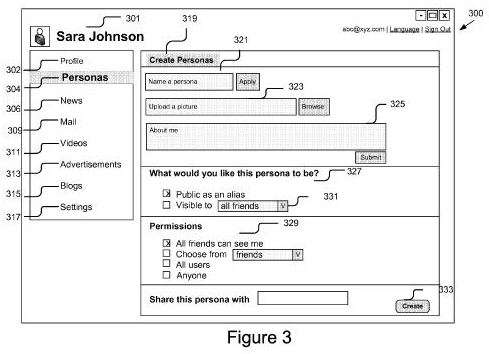
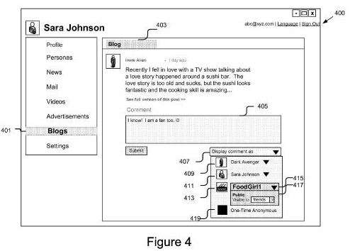

Google was granted a patent this week on the use of personas or pseudonyms in social networks today, with the patent originally filed a little less than a year ago. The patent explicitly points at Google Plus as an example of a social network that processes in the patent could be applied to. The patent doesn’t grant Google the ability to let people use pseudonyms in social networks, but rather that a pseudonym could be presented as someone’s name based upon their choices of who would see that name or their “real” name.

_User Interface to Create a Persona for a Social Network_

When Google first launched Google Plus, one of the policies in place was that people were required to use their [commonly used names](https://support.google.com/accounts/answer/27442?rd=3&visit_id=1-636189177911229945-448465231) to join. After some very intense debate and discussion across the Web, Google started [backtracking on their common names policy](https://mashable.com/2012/01/23/google-plus-allows-pseudonyms-nicknames/#kRw9fzROMkqS), and offered an alternative approach this summer.

Under the patent, someone could select a visibility level for their persona so that only their pseudonym would be visible to everyone else on the network, to just some people, or possibly just displayed alongside their common name.

_User Interface to Select a Persona for a Social Network_

The debate over use of a pseudonym on Google Plus raised issues that appear to be mentioned in the patent, including the fact that online social activities can become part of a permanent record that some people don’t feel comfortable sharing. Use of your identity on the Web could leave people vulnerable to things like identity theft, stalking, and harassment. In discussions about Google’s common name polisy, there were even a few people who noted that the pseudonym they like to use is their commonly used name, even if it doesn’t appear in places like their birth certificate or driver’s license.

The patent tells us that one approach that could have been followed would be to allow people to use multiple accounts with different names, but that could possibly be a burden on someone with multiple accounts, multiple passwords, and a need to keep track of which account they might use while performing different activities.

The patent is:

[Social computing personas for protecting identity in online social interactions](http://patft.uspto.gov/netacgi/nph-Parser?Sect1=PTO1&Sect2=HITOFF&d=PALL&p=1&u=%2Fnetahtml%2FPTO%2Fsrchnum.htm&r=1&f=G&l=50&s1=8,271,894.PN.&OS=PN/8,271,894&RS=PN/8,271,894)
Invented by Eric Mayers
Assigned to Google
US Patent 8,271,894
Granted September 18, 2012
Filed: September 27, 2011

Abstract

> A system and method for generating a plurality of personas for an account of a user is disclosed. The present invention uses an account engine to receive information for the plurality of personas and to associate the information for the plurality of personas to the account.
>
> The information for each of the plurality of personas includes a visibility level. A persona engine receives a selection from the user and transmits the selected persona to the user based on the selection. An authority engine determines an appearance of the selected persona based on the visibility level.

Under the patent, a person could also use their “real identity” at times, and at other times use a choice of personas instead:

> For example, for a user that wants to upload a picture revealing the environment pollution of a city, the persona engine identifies the persona EarthSecurer with a description about being an environmentalist as the suggested persona for the user. The prediction is also based on the usage history of the personas. For example, if the persona Dark Avenger is often used to comment on posts related to anime, then the persona Dark Avenger is arranged before other personas when the user visits an anime blog.

Another alternative might enable a sharing option that would associate a single persona with more than one user. That might be used by a company that wishes to maintain a persona for posts about their company on a social network, or in leaving comments on a blog.

As for possible reputation scores that might be associated with a person in a social network, different reputation scores might be created for each persona.

> For example, Sara Johnson has two personas, e.g., Dark Avenger and FoodGirl1. If FoodGirl1 is used to submit a lot of posts, comments, pictures and videos that receive many views, comments and approval indications, then FoodGirl1 is assigned a correspondingly high reputation.
>
> Conversely, if Dark Avenger is used to leave nasty comments and mock bloggers, the authority engine assigned Dark Avenger a low reputation. Neither Dark Avenger nor Sara Johnson is associated with the reputation assigned to FoodGirl1. By treating each persona separately, the user is able to act as independent personas with different personalities. Likewise, if a persona’s content was generated by several individuals its reputation reflects the aggregate contributions of the persona.

I’m going to assume that such reputation scoring could possibly be used on some social networks and not others. With Google Plus, there’s a very real possibility that Google might be assigning reputation scores to users of the network that might potentially impact things such as how highly the content they create might rank in social search results, and possibly even in Web search results possibly in the future. Because of that, we might never learn what our own actual reputation scores (if any) might be on Google Plus.

Inventor Eric Mayers lists YouTube as the place he’s worked the past couple of years on LinkedIn, and I could see how this might potentially be used on YouTube as well as Google Plus. The granting of the patent isn’t an indication by itself that Google might allow us to start creating pseudonyms to post different things in different places. But it’s definitely a sign that Google recognized there were some potential issues with the common name approach that they started out with on Google Plus.
