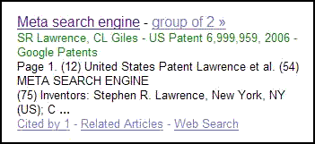

## Google Patent Search Results Are Appearing in Google Scholar SERPs

Probably shouldn’t be a surprise to many, but I started noticing results from [Google Patent Search](https://www.google.com/?tbm=pts) appearing in [Google Scholar](https://scholar.google.com/) last night. Here’s one I came across today from Google Scholar:

Nothing in the original [Official Google Blog announcement](https://googleblog.blogspot.com/2006/12/now-you-can-search-for-us-patents.html) about Google Patent search implies an integration into Google Scholar. Oddly, [December’s Google Librarian Newsletter](http://web.archive.org/web/20110928133114/http://www.google.com:80/librariancenter/newsletter/0612.html), which spotlights Google Scholar doesn’t provide any hints about this development.

There is an interesting [interview with Anurag Acharya](http://web.archive.org/web/20100301092347/http://www.google.com:80/librariancenter/articles/0612_01.html), one of Google Scholar’s lead engineers, in the newsletter, though. He states there that he would like to see Google Scholar develop into “a place that you can go to find all scholarly literature — across all areas, all languages, all the way back in time.”

I see some snippets from other patent search sites, but I’m unsure when those started appearing. The patents are a nice addition to the articles from scholarly journals and book citations. It is sometimes possible finding white papers from the inventors of patents about the same topic. This means that adding Google patent search results into Google Scholar can make it a place to discover when that happens.

I have seen white papers from Microsoft Search Engineers accompanying patents more often than Google employees, with Google patent search results.
