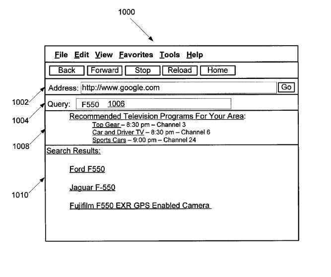

*I’m going to have to turn up the sound on my TV, and decide what to watch, and test this. It would be very interesting if it works. Is Google clued into what you are watching on TV? If so, is that through a set-top box, or an internet-enabled television?*

If true, will this change the way that I do keyword research? Will it alter how I create content for the web, or decide upon page titles or meta descriptions? I’m not sure, but I am surprised.

The patent says that it might watch what’s on TV in your area, and look for queries related to that information. If someone searches for “Eagles” and there’s a documentary about the band, the “Eagles” playing on TV in your area, that signal that may influence the search results you receive.

[System and method for enhancing user search results by determining a television program currently being displayed in proximity to an electronic device](http://patft.uspto.gov/netacgi/nph-Parser?Sect1=PTO2&Sect2=HITOFF&p=1&u=%2Fnetahtml%2FPTO%2Fsearch-adv.htm&r=1&f=G&l=50&d=PALL&S1=08839303&OS=PN/08839303&RS=PN/08839303)
Invented by Kyle Maddison and Roman Kirillov
Assigned to Google
United States Patent 8,839,303
Granted September 16, 2014
Filed: June 30, 2011

Abstract

> A computer-implemented method for using search queries related to television programs. A server receives a user’s search query from an electronic device.
>
> The server then determines, under the search query and television program-related information for television programs available at a location associated with the electronic device during a specific time window, a television program currently being displayed in proximity to the electronic device, wherein the television program-related information includes program descriptions for a plurality of television programs being broadcast for the associated location.

We do know that Google Now can listen to TV and identify shows that are presently on:

The Patent does tell us that sometimes people perform queries based upon what they are watching on TV, and it might use information about what TV shows are playing in the location of the viewer to see if they can personalize their query results for that viewer based upon that information. Here’s an example from the patent:

…when the user executes a query for “Porsche” during the same time window a TV program is airing that includes a segment about a particular Porsche model), the search engine returns enhanced search results based on the presumption that the user in question was watching that particular TV program–or that the user in question would be interested in watching that particular TV program.

> For example, given that the Porsche model in question is a “911 Turbo,” and that the user executed a search query for “Porsche,” the server can return information about one or more of :
>
> 1. The “911 Turbo” model (e.g., a link to information on the Porsche.com website about the “911 Turbo”),
> 2. Information about the TV program that is currently airing with that segment, and
> 3. Suggestions of similar programming that is currently airing or airing in the future and that is available to the user.
>
> In this way, implementations provide enhanced search results to viewers of live TV that are relevant to the content of TV programs that they are watching or are likely to be interested in watching.

This could make watching TV a very different experience if you could ask Google questions about the shows you might be watching on TV, and it could give you reasonably good answers.

If Google could give you recommendations about what to watch on TV…

