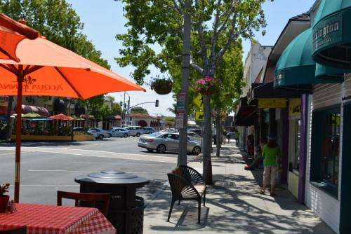

## Google Suggesting Photo Location Recommendations

A recently granted Google patent explains how Google may find photo location recommendations. It describes how it might use something like Google Now to recommend “photogenic locations to visit.”

_Downtown Carlsbad, Ca._

The patent tells us:

> The present disclosure relates generally to systems and methods for recommending photogenic locations to visit. More particularly, the present disclosure relates to prompting a mobile device user that a photogenic location is nearby based on clusters of photographs.
>
> When vacationing or visiting an unfamiliar location or a familiar location at an unfamiliar time, a person may desire advice regarding popular sites to visit or landmarks to see. In particular, a person may desire advice regarding an interesting view to see or phenomenon to experience.

It tells us that Tour guide books miss out on places that people like taking photos at because they focus on “tourist-style” landmarks, and that Online Recommendation systems that might identify such spots tend to focus mostly upon businesses such as restaurants, and the patent tells us:

> While such systems can be useful for selecting a restaurant in an unfamiliar location, they fail to provide additional, non-commercial knowledge concerning photogenic locations.

.
The invention described in this patent involves prompting a client device when it’s near a photogenic location, that has been identified as a place where people like to take pictures, or “Each of the plurality of photogenic locations can have been identified by clustering a plurality of photographs based on geographic proximity.”

The patent is:

[Systems and methods for recommending photogenic locations to visit](https://patents.google.com/patent/US9014726)
Publication number US9014726 B1
Publication date: Apr 21, 2015
Filing date: May 3, 2013
Priority date: May 3, 2013
Inventors: Andrew Foster
Original Assignee: Google Inc.

Abstract:

> Systems and methods for recommending photogenic locations to visit are provided. One aspect of the present disclosure is directed to a computer-implemented method for recommending photogenic locations.
>
> The method includes receiving a signal indicative of a geographic location at which a client device is located. The method further includes determining whether the geographic location is within a threshold distance from at least one of a plurality of photogenic locations. Each of the plurality of photogenic locations can have been identified by clustering a plurality of photographs based on geographic proximity. The method includes transmitting a prompt to the client device when the geographic location is within the threshold distance from at least one of the plurality of photogenic locations.
>
> The prompt can indicate the existence of at least one photogenic location that is within the threshold distance from the geographic location.

There are a few different ways that such locations can be identified.

Someone might participate in having their mobile device report their location when they take photos, and it can create a location history profile for them.

Also, photos might be geotagged, and a database of geotagged photos could be analyzed to determine the locations where those images were shot. Geotagged photos “can include EXIF data indicating latitude, longitude, date of capture, and a time of capture.”

Such a recommendation system might make recommendations as to good places to take photos of sunrises and sunsets, based upon the time they were taken and a comparison to the actual time of those events.

If Google makes such a recommendation, and the person being recommended the location may show that they stopped and took the advice of the recommendation, through something like Google’s Auto-backup photo service. If they do, this recommendation system may continue to make recommendations about Photogenic Locations.

In addition to clustering the geographic locations where photos where taken, a clustering algorithm might look at other information, such as “metatags, keywords, text annotations, or comments provided in the context of a sharing or social media platform.”

The patent also discusses the possible use of “visual feature matching”, to help identity what is being photographed, such as a historic courthouse versus a popular artistic sculpture.

Google might also attempt to see what is located at these geographic clusters using its knowledge of the locations of landmarks. at those clusters.

The photo location recommendations patent also tells us about a “global interestingness score” that can be determined for each photogenic cluster. This score might be “determined for each of the plurality of photographs included in a cluster based on one or more signals indicative of online activity associated with such photograph.” So, if a photo is shared from the location on Instagram and it gets positive feedback at Twitter, Facebook, and Instagram as a result, that could help increase that interestingness score. That score could play into whether a recommendation for a spot to take a photo might be made.
