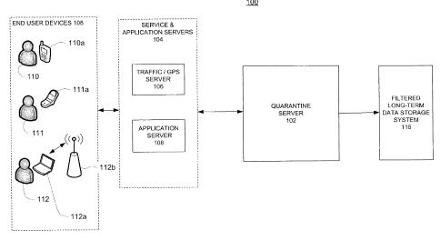
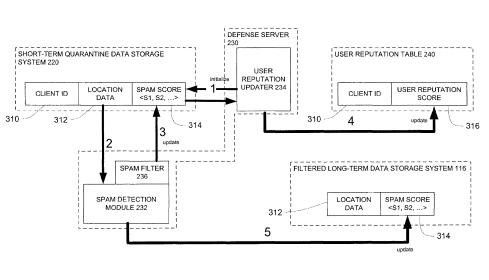

Google collects information about where you compute from and provides location-based services based upon where you travel. To protect this information, and to use it to protect people from spam and scrapers, Google might follow processes to protect that information and to analyze it, to find user location spam.

Post a review from Germany about a restaurant, and then 15 minutes later from Hawaii about another restaurant, it’s user location spam. Drive down a highway where the cell towers collecting information about your journey are located in the middle of Lake Michigan, it’s likely user location spam. If GPS says you’re in NYC, and you then connect via Wifi in Wisconsin a few minutes later, user location spam. This information may not even come from you, but rather from others that might impersonate you.

Google was granted a patent last week which explores how they could use location-based data to identify spammers and scrapers. It would also put user location information in quarantine, and possibly hide starting and/or ending points for journeys from mobile devices to protect privacy for users, and to explore whether or not the information is spam. The location information could be used by the search engine, and that detailed information about locations to keep some information from being used in location-based services, or other services that Google might offer.

In my last post, [Google Patent Granted on Mobile Location Detection](https://www.seobythesea.com/2013/02/google-mobile-location-detection/), I described how Google might use a combination of GPS, mechanical electronic devices such as gyroscopes and accelerometers, and algorithms to pinpoint locations more accurately and at a lower cost than just GPS alone. I also described many of the location-based services that Google uses which relies upon such services.

Google’s [Mobile Maps](https://www.google.com/maps/about/) page describes some of those. The patent tells us that it also might rely upon location for desktop services as well and that it might consider desktop location information when collecting location information for purposes of the processes described in this patent.

I’ve written a lot of posts about [Web spam](https://www.seobythesea.com/category/web-spam/) in the past, but this is the first patent from Google that I can recall using the recorded locations of people to Google to help the search engine check upon that information, and analyze whether or not the information is real, legitimate, and trustworthy or user location spam. On a Web that will provide more information based upon mobile devices such as Android phones, and wearable computing such as Google Glasses, it’s not a surprise to see the patent.

Given the amount of work and effort that Google has put into Google Maps, and services that fall into Social/Local/Mobile categories, it makes sense for the search engine to put into place methods to verify user location information.

The patent also describes methods that the search engine might use to protect that information from others and to remove personally identifiable information as well. Location-based information might be stored initially in a quarantine server, and one or both endpoints of a journey (when one is involved) might be removed from that data.

**Challenges – Privacy and Automated Spammers and Scrappers**

While location services can be really helpful to people who use them to navigate, to find local businesses, and to potentially interact with others whom they know, there are also privacy issues that the people providing such services have to contend with. I’m happy to see this particular patent address some of those.

In providing such services, being able to keep that information stored in a way that might avoid connecting an individual with the locations they visit is likely something that we all want to keep from happening. Finding a way to also make sure that location data collected and analyzed is legitimate, from real people, and not from third-party automated programs that might try to gain access to database information, or compromise such a system with faked user location information.

The patent tells us that there’s a balance that needs to be maintained in collecting location information, and in protecting that information.

> Thus, concerning how much and for how long user location information should be collected and stored, there can be tension between the business utility of the information and user privacy.
>
> On one hand, the more data collected, the more interesting and useful business uses created for users. As such, collecting comprehensive user location data can help create better products and services for end-users.
>
> On the other hand, due to the sensitive nature of the location data and user privacy concerns, removing personally identifiable information and/or storing less information may be desirable as well. Therefore, collection and retention of user location data can be a delicate trade-off, often with no single correct solution to the problem.

The patent describes in detail how such location information might be quarantined, and how it might be analyzed to identify spammers and scrapers. Starting points, and/or ending points of journeys might also be removed from such data.

For instance, Google uses location data to estimate traffic on roadways and to alert drivers to congestion ahead of them. It has no reason to record the start points or endpoints of any of the travelers that it collects speed or congestion data from, or their identities. But it does want to make sure such information is correct.

While a user ID that might be associated with location information used in a location-based service would likely be encrypted, a user reputation score might be created based upon that data. Someone who appears to be traveling down a roadway beyond a “travel tolerance,” and faster than driving speeds that might be reasonable may indicate spam, and the reputation score might indicate that.

The patent is:

[User location reputation system](https://patents.google.com/patent/US8370340)
Invented by Yan Yu, Sam Liang, Michael Chu, Yuhua Luo, and Zhengrong Ji
Assigned to Google
US Patent 8,370,340
Granted February 5, 2013
Filed: March 26, 2012

Abstract

> A computer-implemented method and system of building a user reputation database for use in a user location data system. The method and system receive user location information containing personally identifiable data of a user and user position data. The user position data may or may not represent one or more actual geographic positions of the user.
>
> The user location information is temporarily stored and analyzed to provide a spam score associated with the user position data indicative of whether the user position data represents the actual geographic positions of the user. Data indicative of the spam score is also provided to the user reputation database to store a user reputation score associated with the user.

The patent describes many possible fingerprints that might indicate that information comes from a spammer or scraper instead of a legitimate user. These might include things like the rate at which information is uploaded or downloaded from different sources, whether or not there are matches between location information collected by GPS and Wifi, and more. Such information may never escape from a quarantine server into long term data storage.

While the patent describes a lot of details on how it might identify information that might be entered into this system from spammers or scrapers, and how it might assign reputation scores to users how much to trust that information, what’s important here is that a search engine can look at a lot of offline signals to identify efforts to spam or scrape location-based information.

It makes a lot of sense for search engines to explore how such signals might be used to identify attempts to manipulate location-based services while protecting the identities of people using such services.

What might Google do with Location history? I wrote about some other patents that use location history. These are about patents from Google that use location history:

- [Google’s Mobile Location History](https://www.seobythesea.com/2018/01/googles-mobile-location-history/)
- [Google Tracking How Busy Places are by Looking at Location History](https://www.seobythesea.com/2016/12/google-tracking-how-busy/)
- [Google Lifestreaming?](https://www.seobythesea.com/2013/02/google-searchable-life-experiences/)
- [Google Patents Identifying User Location Spam](https://www.seobythesea.com/2013/02/google-patents-identifying-user-location-spam/)
- [Google Patent Granted on Mobile Location Detection](https://www.seobythesea.com/2013/02/google-mobile-location-detection/)
- [Location Extensions Augmented Advertisements](https://www.seobythesea.com/2019/06/location-extensions-augmented-advertisements/)

Last Updated June 25, 2019.
