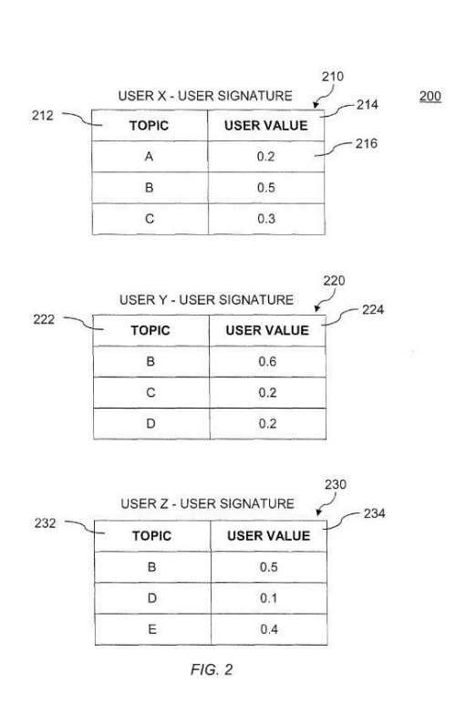
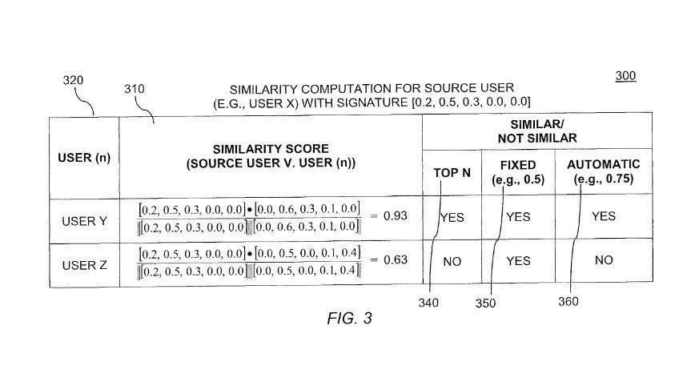
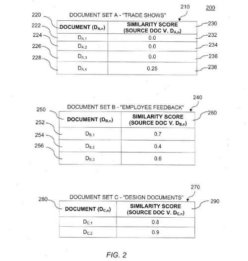
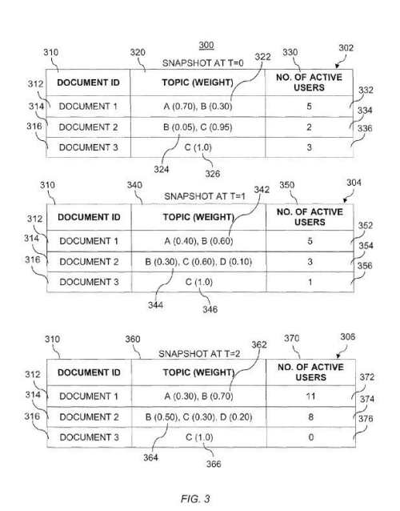
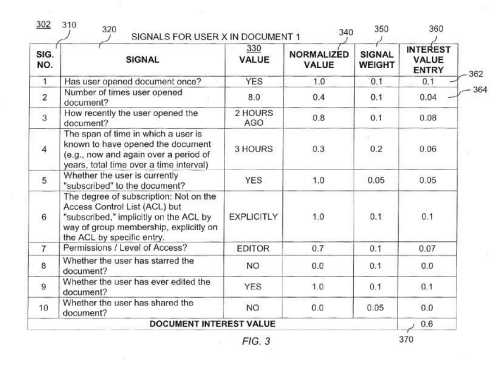
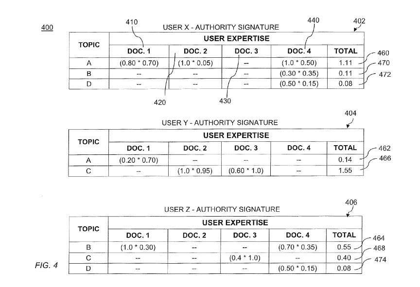

## Is Google Getting Better at Understanding Topic Authority and Author Authority?

Last week, Google was granted patents about ranking pages on the Web based on topics for those documents and expertise and/or authority of authors of those pages. The process also describes how Google may use different methods to determine the authority of multiple authors who may have worked to create the documents.

This sounds similar to statements Matt Cutts made in May in a video about *What should we expect in the next few months in terms of SEO for Google?*

The important statement there is:

> We are doing a better job of detecting when someone is sort of an authority in a specific space. It could be medical, it could be travel, whatever. And trying to makes sure that those rank a little more highly if you are some sort of authority or a site that according to the algorithms we think might be a little bit more appropriate for users.

There’s been a lot of discussion about something that people have been calling “Author Rank,” and I’ve been referring to as Agent Rank back in 2007, in a post on Search Engine Land – [Google’s Agent Rank / Author Rank Patent Application](https://searchengineland.com/googles-agent-rank-patent-application-10487) (someone at Search Engine Land changed the title of the post earlier this year to include “Author Rank” in it).

The patents point at a couple of different aspects of how the processes within them might work.

The first of those involves classifying documents based upon the topics that they cover, and weight for that document on how strongly a document might be associated with those topics.

The second involves receiving “authorship” information for the document, which would identify authors involved in the creation of the document and an authorship percentage for each author.

An “Authority Signature Value” for “a first author of a first topic may be generated based on a product of an authorship percentage for the first author of the first topic and the weight of the first topic in the document, where the first topic is included in the received topic information.”

Google has an “authorship program”, which is somewhat described in an [interview with Google’s Samar Kamdar](https://www.searchenginejournal.com/google-authorship-an-interview-with-googles-sagar-kamdar-part-1/46243/), who appears to be one of the heads of the program. The article tells us:

> Kamdar explained to me that the Authorship program was based on the premise that content associated with a real identity is often of higher quality than content published anonymously.

The authorship program is related to the [authorship markup](https://support.google.com/webmasters/answer/6083347) that you can include on pages that you author. (I’m one of the moderators on Google Plus Community Google Authorship & Author Rank, and if you have questions or need help setting up Google Authorship, it’s a really helpful community).

The patents describe different aspects of how an “Authority Signature Value” might work, with much of the text (but not all) in the description sections of the patent being substantially similar.

Rather than summarize or itemize all of the information in these patents, I’m going to provide some highlights and let people interested in them drill down through the patents, though if you have a question, please bring them up in the comments below. Here are those highlights:

***Social?*** – The patents don’t mention the word “social” or discuss Google Plus as a social network, but the “Authority Signature Value” language in the patents reminds me very much of the “digital signature” language from the Agent Rank patents.

***Authority?*** – Google and other search engines have used the word “Authority” in the past to stand for other things. The [HITS (hyperlink-induced topic search)](http://pi.math.cornell.edu/~mec/Winter2009/RalucaRemus/Lecture4/lecture4.html) algorithm was developed by Jon Kleinberg around the same time that PageRank was being worked on a few blocks away at Stanford. There have been more than a couple of SEO related articles that discuss topics such as [How to Find Authority Websites & Get Links From Them](https://www.searchenginewatch.com/2012/08/28/how-to-find-authority-websites-get-links-from-them/). I’ve seen more than a couple of forum discussions (or arguments) on whether .edu sites and .gov site are “authority” sites on the basis of getting more value from links from those types of sites.

But the idea of having content that is digitally signed, and associated with a real person, and the fact that the content they’ve created on different topics has been analyzed by Google makes it more likely that an “authority value” associated with them is somehow authoritative.

***Topic Authority and Topic Intensity*** – Documents may be broken down into topics, and the authority of those documents would be based upon how authoritative they are on those topics. The authority of authors and their signature scores would be based upon topics as well. So someone might be considered an “authority” on brain surgery or surf fishing or gardening and would have different “authority signature values” based upon topics. There’s some discussion on Topic intensity in the patents as well, and sometimes a topic might ebb and flow in value based upon trends and the burstiness of a topic. It’s good seeing this discussion on Topic Authority though.

Here are the patents:

[System and method for determining similar topics](http://patft.uspto.gov/netacgi/nph-Parser?Sect1=PTO2&Sect2=HITOFF&p=1&u=%2Fnetahtml%2FPTO%2Fsearch-adv.htm&r=1&f=G&l=50&d=PALL&S1=08458197&OS=PN/08458197&RS=PN/08458197)
Invented by Michael Jeffrey Procopio
Assigned to Google
US Patent 8,458,197
Granted June 4, 2013
Filed: January 31, 2012

Abstract

> A method and system for determining similar topics may include receiving user information for one or more users, the information including at least one topic and a user value for each topic, where the user value represents how strongly the user is associated with that topic. Topic information for a source topic may be generated based on the user information, the topic information including at least one user and a topic value for each user, where the topic value represents how strongly the topic is associated with that user.
>
> Similarity scores may be generated based on a topic value for each user for the source topic and a topic value for the same user for each topic in a set of topics, where each topic in the set of topics is associated with a topic value for each user. Similar topics may be selected and output.

[System and method for determining similar users](http://patft.uspto.gov/netacgi/nph-Parser?Sect1=PTO2&Sect2=HITOFF&p=1&u=%2Fnetahtml%2FPTO%2Fsearch-adv.htm&r=1&f=G&l=50&d=PALL&S1=08458195&OS=PN/08458195&RS=PN/08458195)
Invented by Michael Jeffrey Procopio
Assigned to Google
US Patent 8,458,195
Granted June 4, 2013
Filed: January 31, 2012

Abstract

> A method and system for determining similar users may include receiving information for a source user, the information including at least one topic and a user value for each topic, where the value represents how strongly the user is associated with that topic.
>
> Similarity scores may be generated based on a value for each topic for the source user and a value for the same topic for each user in a set of users, where each user in the set of users is associated with a value for each topic. One or more similar users may be selected based on the generated similarity scores, and one or more of the selected users may be output.

[System and method for content-based document organization and filing](http://patft.uspto.gov/netacgi/nph-Parser?Sect1=PTO2&Sect2=HITOFF&p=1&u=%2Fnetahtml%2FPTO%2Fsearch-adv.htm&r=1&f=G&l=50&d=PALL&S1=08458194&OS=PN/08458194&RS=PN/08458194)
Invented by Michael Jeffrey Procopio
Assigned to Google
US Patent 8,458,194
Granted June 4, 2013
Filed: January 31, 2012

Abstract

> A method for categorizing documents may include receiving topic information for a source document, the information including at least one topic and a weight for each topic, where the topic relates to the content of the source document, and the weight represents how strongly the topic is associated with the source document. Similarity scores may be generated based on a weight of each topic in the source document and the weight of the same topic in each document within one or more sets of documents, where each document in the one or more sets of documents comprises topic information.
>
> A confidence score may be generated, based on the similarity scores, for each of the document sets. One or more document sets may be selected based on the confidence scores and may be output to a user.

[System and method for determining active topics](http://patft.uspto.gov/netacgi/nph-Parser?Sect1=PTO2&Sect2=HITOFF&p=1&u=%2Fnetahtml%2FPTO%2Fsearch-adv.htm&r=1&f=G&l=50&d=PALL&S1=08458193&OS=PN/08458193&RS=PN/08458193)
Invented by Michael Jeffrey Procopio
Assigned to Google
US Patent 8,458,193
Granted June 4, 2013
Filed: January 31, 2012

Abstract

> A method for determining active topics may include receiving topic information for a document, the information including at least one topic and a weight for each topic, where the topic relates to the content of the document, and the weight represents how strongly the topic is associated with the document. User activity information for the document, including a user activity value including at least one of a number of viewers and a number of editors of the document may be received.
>
> A topic intensity for each topic may be generated and stored by multiplying the user activity value for the document by the weight of the topic in the document. The topic intensity may be monitored over time. An alert may be generated based on the topic intensity.

[System and method for determining topic interest](http://patft.uspto.gov/netacgi/nph-Parser?Sect1=PTO2&Sect2=HITOFF&p=1&u=%2Fnetahtml%2FPTO%2Fsearch-adv.htm&r=1&f=G&l=50&d=PALL&S1=08458192&OS=PN/08458192&RS=PN/08458192)
Invented by Michael Jeffrey Procopio
Assigned to Google
US Patent 8,458,192
Granted June 4, 2013
Filed: January 31, 2012

Abstract

> A method and system for determining topical interest may include receiving signal information for a user of a document, the information including at least one signal value representing the user’s activity with or relationship to the document. A document interest value based on the signal information for the user may be computed. Topic information for the document may be received, the information including at least one topic and a weight for each topic, where the topic relates to content of the document, and the weight represents how strongly the topic is associated with the document.
>
> An interest signature value of a first topic for the user may be updated by adding the product of the computed document interest value for the user for the document and the weight of the first topic for the document.

[System and method for determining topic authority](http://patft.uspto.gov/netacgi/nph-Parser?Sect1=PTO2&Sect2=HITOFF&p=1&u=%2Fnetahtml%2FPTO%2Fsearch-adv.htm&r=1&f=G&l=50&d=PALL&S1=08458196&OS=PN/08458196&RS=PN/08458196)
Invented by Michael Jeffrey Procopio
Assigned to Google
US Patent 8,458,196
Granted June 4, 2013
Filed: January 31, 2012

Abstract

> A method and system for determining topical authority may include receiving topic information for a document, the information including at least one topic and a weight for each topic, where the topic relates to content of the document, and the weight represents how strongly the topic is associated with the document. Authorship information for the document may be received, the information including, for each topic in the document, at least one author and an authorship percentage for each author.
>
> An update to an authority signature value for a first author of a first topic may be generated based on a product of an authorship percentage for the first author of the first topic and the weight of the first topic in the document, where the first topic is included in the received topic information.
