Google was recently assigned a number of unusual and interesting patents from Outland Research, LLC, from inventor Louis B. Rosenberg, a Stanford PhD, [Cal Polytech Professor](http://web.archive.org/web/20160304075658/http://me.calpoly.edu/faculty/lrosenbe/) on leave, and most recently professional film maker. A number of Rosenberg’s inventions have been developed into commercial products found in BMW automobiles, surgical similators and medical imaging systems, and computer mice from Logitech, as well as a 3D animation tool used on films such as Shrek and Ice Age.

It appears that Louis Rosenberg now spends more time as a screenwriter with his company Outland Pictures than as an inventor, but there are a good number of patents at the US Patent and Trademark Office assigned to Outland Research. A number of those showed up recently in the USPTO’s patent assignment database as having been assigned to Google, with an execution date of August 1, 2011, and an assignment recording date of August 29, 2011.

These patents cover a wide range of inventions, but none of them really involve search. In addition to an alternative game controller or computer input device, there’s another patent that describes controlling electronic devices by looking at them and commanding them. Another watches where you’re looking on a computer or ebook reader to save your place if you look away or switch documents. A pair of the Outland Research patents provide ways to use your cell phone to collaboratively rate or reject songs that might be played in restaurants or nightclubs. A series of other patents add enhancements to cell phones and/or media players such as the ability for a group of people to run their own collaborative radio station, or to shake a media player in a certain way to change songs or playlists.

The oddest patent of the bunch is a way to electronically tune percussion instruments such as drums or cymbals, and I’m not sure how that might fit into Google’s future plays. Actually, most of these patents could be said to be more hardware orientated than software focused. Might Google start creating products to go with search in the future? I’m not sure, but I did find a number of the inventions described in these patents interesting, and would love to try a few of them out.

**Verbo Manual Interface Device**

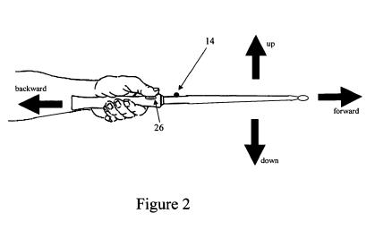

We’ve seen a number of inventive game controller devices come out in the past few years, from the Wii to Microsoft’s Kinect. One of the patents that Google acquired from Outland Research is an interface system that uses the motions of a wand, along with verbal commands to control a computerized system. A focus upon an interface system like this from inventor Louis Rosenberg isn’t surprising given his past work with developing a [Force fell joystick](https://spinoff.nasa.gov/spinoff1997/ch5.html) in conjunction with NASA:

> Rosenberg founded the Immersion Corporation in 1993 to take advantage of his breakthrough. The first products employing his force feedback technology are computer games with joysticks or steering wheels that vibrate, jolt, slip, shimmy, or jump in synch with video displays of tached-out Indy cars and hard-banking fighter jets. The San Jose company of 50, most of them Stanford graduates, provides software to game developers and sells the “I-Force” microprocessor to hardware-peripheral manufacturers.

Keep in mind that Google [hired Johnny Chung Lee](https://www.engadget.com/2011-01-18-the-geek-decision-kinect-developer-johnny-chung-lee-leaves-mi.html), core developer for Kinect and well known Wii hacker, earlier this year as well, as you read through this patent and some of the other patents acquired from Outland Research.

The patent is:

[Method and apparatus for a verbo-manual gesture interface](http://patft.uspto.gov/netacgi/nph-Parser?Sect1=PTO2&Sect2=HITOFF&p=1&u=%2Fnetahtml%2FPTO%2Fsearch-adv.htm&r=1&f=G&l=50&d=PALL&S1=07519537&OS=PN/07519537&RS=PN/07519537)
Invented by Louis B. Rosenberg;
Assigned to Outland Research, LLC
US Patent7,519,537
Granted April 14, 2009
Filed: October 7, 2005
Related U.S. Patent Documents

Abstract

> An interface system including:
>
> - A manipulandum adapted to be moveable according to a manual gesture imparted by the user;
> - A sensor adapted to detect a characteristic of the manual gesture imparted to the manipulandum and to generate a sensor signal representing the detected characteristic of the manual gesture;
> - A microphone adapted to detect a characteristic of an utterance spoken by the user and to generate an audio signal representing the detected characteristic of the spoken utterance; and
> - A control system adapted receive the generated sensor and audio signals and to transmit a command signal to an electronic device via a communication link, the command signal being based on the generated sensor and audio signals and the time synchronization between them.

**Gaze discriminating electronic control apparatus**

Imagine being able to look at your TV or DVD player or CD player and telling it to turn on or off, and it does? That’s the focus of another Outland Research patent assigned to Google.

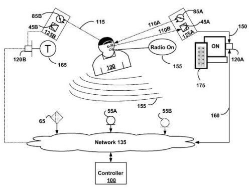

[Gaze discriminating electronic control apparatus, system, method and computer program product](http://patft.uspto.gov/netacgi/nph-Parser?Sect1=PTO2&Sect2=HITOFF&p=1&u=%2Fnetahtml%2FPTO%2Fsearch-adv.htm&r=1&f=G&l=50&d=PALL&S1=07438414&OS=PN/07438414&RS=PN/07438414)
Invented by Louis Barry Rosenberg
Assigned to Outland Research, LLC
US Patent 7,438,414
Granted October 21, 2008
Filed: May 3, 2006

Abstract

> An electronic control apparatus, system, method and computer program product for selecting and controlling an electronic device from among a plurality of available electronic devices based upon the substantially contemporaneous issuance of a verbal command and device-targeting gaze by a user. The system includes a processor driven controller unit programmed to control a selected device in dependence on generally contemporaneous aural and optical signals.
>
> A gaze sensing unit is operatively coupled to the controller unit and is functional to receive the optical signals from a functionally coupled gaze sensor. The optical signals being indicative of a user’s device-targeting gaze falling upon a device to be controlled. An aural recognition unit is operatively coupled to the controller unit and is functional to receive the aural signals from a functionally coupled aural sensor. The aural signals being indicative of verbal commands appropriate for controlling the selected device and a light source configurable to sufficiently reflect off a pair of eyes of a user and be detected by the gaze sensor.

**Webpage or eBook Placeholder based upon Gaze**

Now imagine a device that tracked your gaze while you were looking at the display of a desktop computer or an electronic book when you are reading, that can insert a placeholder for you when you look away from a screen:

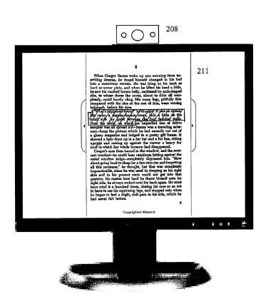
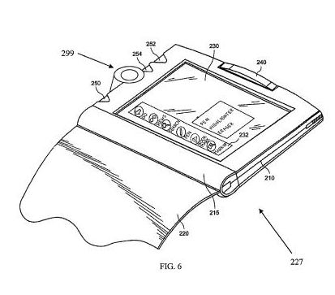

[Gaze-responsive interface to enhance on-screen user reading tasks](http://patft.uspto.gov/netacgi/nph-Parser?Sect1=PTO2&Sect2=HITOFF&p=1&u=%2Fnetahtml%2FPTO%2Fsearch-adv.htm&r=1&f=G&l=50&d=PALL&S1=07429108&OS=PN/07429108&RS=PN/07429108)
Invented by Louis B. Rosenberg
Assigned to Outland Research, LLC
US Patent 7,429,108
Granted September 30, 2008
Filed: August 22, 2006

Abstract

> A system, method, and computer program product for automatically providing reading place-markers to a user reading a textual document upon an electronic display. A gaze-tracking element monitors a user’s gaze while he or she reads the textual document and determines a look-away event.
>
> In response to a look-away event, the system automatically provides a reading place-marker by accentuating an area at or near where the user looked away from the text. In this way the user may more easily return to the location at which he or she ceased reading.
>
> In some embodiments the place-marker is automatically removed upon determination that the user’s gaze has returned to the marked location within the text. In some such embodiments the reading-place marker is removed in response to the user resuming a characteristic reading gaze motion at or near the marked location. In this way the marker is removed when no longer needed.

If you’re interested in how gaze tracking devices work in general, the description in this patent provides a lot of details on eye-tracking technologies that have been developed over time, such as IBM’s MAGIC devices.

We’re told that in addition to desktop computers, a system like this could be created to work with a wide variety of displays for other devices, including ebook readers, PDAs, cell phones, writing watches, portable media players and gaming systems as well.

If you’re switching back and forth between more than one document, this invention could keep track of your place in more than one of those as well.

I have to admit that I wish this would work in conjunction with voice to enable you to do more, like follow a link you find on a web page when you’re looking at it, but it does fulfill a very useful purpose as a placeholder when you’re reading a webpage or a page on an ebook.

**Collaborative Rejection and Rating of Music in Physical Establishments**

Imagine going to a restaurant or bar or gym or some other physical establishment which plays background music in a type of digital jukebox that visitors can access the schedule for, and request that a song scheduled for play be rejected? That’s the subject of another Outland Research, LLC, patent filing.

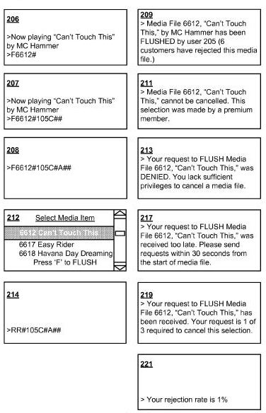

[Collaborative Rejection of Media for Physical Establishments](http://appft.uspto.gov/netacgi/nph-Parser?Sect1=PTO1&Sect2=HITOFF&d=PG01&p=1&u=%2Fnetahtml%2FPTO%2Fsrchnum.html&r=1&f=G&l=50&s1=%2220070220100%22.PGNR.&OS=DN/20070220100&RS=DN/20070220100)
Invented by Louis B. Rosenberg
Assigned to Outland Research, LLC
US Patent Application 20070220100
Published September 20, 2007
Filed: May 6, 2007

Abstract

> A system, computer implemented method, and computer readable storage medium is provided which enables customers of an establishment to collaboratively reject a media file that is currently playing and/or pending to be played within that establishment by entering data into a personal wireless portable computing device on their person, for example a cellular telephone.
>
> Upon entering a rejection request, and where necessary an establishment identifier, a message is sent over a wireless link to a media server which performs a series of logical tests to determine if the media file is actually terminated prior to full completion of play.
>
> In this way, a plurality of separate customers may use their portable computing devices to collaboratively reject specific musical media file selections that are currently playing or currently pending for play within a particular physical establishment.

I’ve read more than one or two articles in the past year or so that suggest that the future of socializing in night clubs and restaurants might involve a room full of people furiously sending messages into their phones to talk to the people around them rather than having direct conversations. I’m not sure if that’s true or not, but after reading this patent, I could see people getting on their phones in those locales to change songs they don’t like or to request new ones, to change the channel on one of the TVs at a sports bar, or to order a drink or food in the absense of a server.

Another Outland Research patent allows you and others to rate the songs that are playing at that location, and for you to see your ratings and the ratings of others.

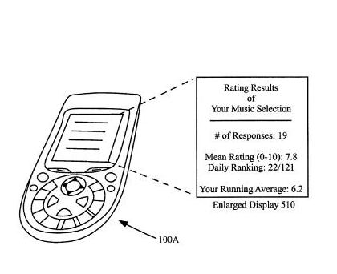

[Social musical media rating system and method for localized establishments](http://patft.uspto.gov/netacgi/nph-Parser?Sect1=PTO2&Sect2=HITOFF&p=1&u=%2Fnetahtml%2FPTO%2Fsearch-adv.htm&r=1&f=G&l=50&d=PALL&S1=07917148&OS=PN/07917148&RS=PN/07917148)
Invented by Louis B. Rosenberg
Assigned to Outland Research, LLC
US Patent 7,917,148
Granted March 29, 2011
Filed: October 12, 2007

Abstract

> A method and system are provided for enabling users in shared physical places to collaboratively rate the music playing within such places by using portable computing devices on their person. In one embodiment, the portable computing devices are mobile phones and each user may independently rate a currently playing musical piece within the physical place by sending an electronic message from their phone, for example in SMS format.
>
> The method and system further enables the receipt of a plurality of such rating messages, the computing of a statistical result, and the providing of the statistical result to each of the plurality of portable computing devices. In this way a group of people may collectively listen to a currently playing musical piece in a physical place, may each provide a subjective rating of the musical piece, and may each receive an indication of the collaborative result of the provided ratings.

**Collaborative Background Music**

Imagine being able to talk with someone electronically realtime and share background music while you do so? That’s the focus of this next patent:

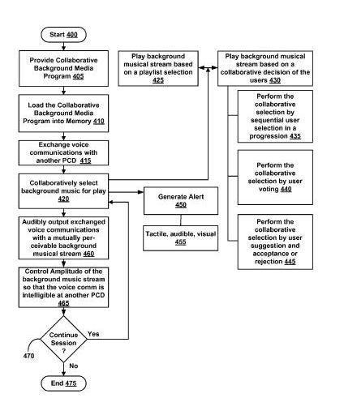

Not all of the Outland Research patents describe fancy new gadgets, but this one seems to take on some Apple functionality and attempt to improve upon it:

> As discussed in Apple Computer, Inc., patent application, US 2004/0224638 A1, Ser. No. 10/423,490 to Fadell, et al., which is herein incorporated by reference in its entirety; an increasing number of consumer products are incorporating circuitry to play music and other electronic media. At the present time, cellular telephones and portable media players have become integrated into a common portable electronic that supports both telephony and media file playing functionality.
>
> In the relevant art, the integrated electronic device may perform both functions but not at the same time; a user may talk on the phone, or listen to music, but generally cannot do both simultaneously for it would be disconcerting for one user to be listening to music while conversing on the phone with another user who was not listening to music.
>
> Even more disconcerting would be if two users were each listening to different pieces of music while they were simultaneously holding a telephony conversation between them. As such, a highly desirable feature would provide a plurality of users who are engaged in a real-time voice communication telephony conversation to be able to simultaneously listen to the same piece of music with substantial synchronization of play. Furthermore it would be highly desirable to provide the plurality of users who are engaged in the real-time voice communication telephony conversation, the electronically moderated ability to jointly select the musical media content that they simultaneously listen to during the voice conversation. This would provide for a shared music-selection and music-listening experience among the participants of the person-to-person remote voice communication conversation.

The patent is:

[System, method and computer program product for collaborative background music among portable communication devices](http://patft.uspto.gov/netacgi/nph-Parser?Sect1=PTO2&Sect2=HITOFF&p=1&u=%2Fnetahtml%2FPTO%2Fsearch-adv.htm&r=1&f=G&l=50&d=PALL&S1=07603414&OS=PN/07603414&RS=PN/07603414)
Invented by Louis B. Rosenberg
Assigned to Outland Research, LLC
US Patent 7,603,414
Granted October 13, 2009
Filed: December 14, 2006

Abstract

> A system, method and computer program product for enabling a plurality of users engaged in real-time voice communications over a wireless communications link to collaboratively select one or more musical media files and to jointly listen to the collaboratively selected musical media in approximate synchronicity as a mutually perceivable background musical stream.
>
> The background musical stream is audibly output to each of the plurality of users in audio combination with the exchanged real-time voice communications such that the exchanged voice communications is intelligible to each user along with the background musical stream. Each user is situated proximal to a portable communication device that enables the real-time voice communications, the collaborative selection of musical media, and the audio combination of voice communications and musical media.

**Predictive Music DJ**

Imagine a portable music player that might contain data about your daily schedule and sensors that allowed it to measure the weather around you, your location, how quickly or slowly you might be walking or running or dancing, if you were upright or seated or laying down, your heartrate, and use that and similar data to recommend songs for you to listen to? Is this the kind of innovation that might compete well against an iPod?

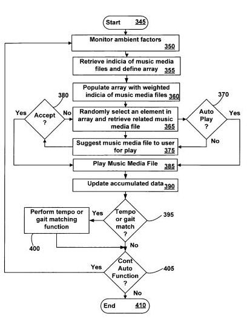

[System, method and computer program product for automatically selecting, suggesting and playing music media files](http://patft.uspto.gov/netacgi/nph-Parser?Sect1=PTO2&Sect2=HITOFF&p=1&u=%2Fnetahtml%2FPTO%2Fsearch-adv.htm&r=1&f=G&l=50&d=PALL&S1=07542816&OS=PN/07542816&RS=PN/07542816)
Invented by Louis B. Rosenberg
Assigned to Outland Research, LLC
US Patent 7,542,816
Granted June 2, 2009
Filed: November 3, 2005

Abstract

> System, method and computer program product to intelligently correlate ambient sensor signals, chronographic information, daily life schedule information, and/or external meteorological information with a user’s previous music media file selection patterns for predicting future music media file play recommendations to a user of a portable media player.
>
> The sensors include but are not limited to a meteorological sensor, a physiological sensor, a geo-spatial sensor, a motion sensor, an inclination sensor, an environmental sensor, and a combination thereof. Music media file selection information includes user spontaneous selections of music media files and/or user acceptances or rejections of software suggested music media files. Various embodiments of the invention provide for gait matching and/or tempo adjustment in dependence on the received sensor signals and the selection, suggestion and/or automatic play of music media files.

The patent lists a wide range of factors that might influence a recommendation for a particular song, such as:

- Current time of day
- Day of week
- Season of the year
- Current air temperature
- Cloud conditions
- Precipitation conditions
- Sun conditions
- Smog conditions
- Pollen count
- UV index
- Barometric pressure
- Current geographic location
- Speed of motion
- Direction of motion
- Elapsed time spent at rest
- Elapsed time spent in motion
- Orientation
- Inclination
- Route of travel
- Current heart rate
- Respiration rate
- Pulse rate
- Skin temperature
- Current activities such as walking the dog, exercising at the gym, working at the office, going out to lunch, relaxing at the beach, or going for a run

I’d be willing to try this out just to see what the media player might suggest.

It’s possible that a suggested song isn’t one that you really want to hear, or at least not at that time. A related patent describes how the prediction system might handle that rejection.

[System, method and computer program product for rejecting or deferring the playing of a media file retrieved by an automated process](http://patft.uspto.gov/netacgi/nph-Parser?Sect1=PTO2&Sect2=HITOFF&p=1&u=%2Fnetahtml%2FPTO%2Fsearch-adv.htm&r=1&f=G&l=50&d=PALL&S1=07489979&OS=PN/07489979&RS=PN/07489979)
Invented by Louis B. Rosenberg
Assigned to Outland Research, LLC
US Patent 7,489,979
Granted February 10, 2009
Filed: November 22, 2005

Abstract

> System, method and computer program product for rejecting or deferring the playing of a media file retrieved by an automated process. Rejection or deferral of an automatically playing media file is accomplished by a simplified user interface which presumes that a currently playing media file is acceptable unless the user signals the media player within a given timeframe. Signaling of the media player is accomplished using one or more sensors. The sensors include but are not limited to a motion sensor, an inclination sensor, a gesture sensor, a video sensor, a push-button switch and any combination thereof.
>
> The rejection or deferral of a media file by the user results in that file not being automatically selected again by the automated processes for at least a predetermined amount of time. The rejection or deferral of a media file by the user may also result in updating a record in a memory that is used by the predictive program to select media files in the future and thereby enable the predictive program to automatically select media files in the future that are more likely to match a users media file preferences at that time.

**We are a DJ, Hear what we play**

Imagine if you and your friends were able to collaboratively create your own “radio” or TV stations through your portable media players, selecting the songs or videos to be played and voting to reject certain media that others might have suggested? That’s the focus of another process described in one of the Outland Research patents assigned to Google.

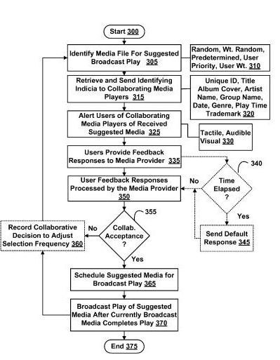

[System, method and computer program product for collaborative broadcast media](http://patft.uspto.gov/netacgi/nph-Parser?Sect1=PTO2&Sect2=HITOFF&p=1&u=%2Fnetahtml%2FPTO%2Fsearch-adv.htm&r=1&f=G&l=50&d=PALL&S1=07562117&OS=PN/07562117&RS=PN/07562117)
Invented by Louis B. Rosenberg;
Assigned to Outland Research, LLC
US Patent 7,562,117
Granted July 14, 2009
Filed: September 19, 2006

Abstract

> A system, method and computer program product for collaborative media selection among a media provider and a collaborative group of media players, where each individual media player is in processing communications with the media provider. Enables a media broadcaster to perform a procedure which involves:
>
> - (a) sending one or more media suggestions to a plurality of media playing devices that are being used by a plurality of participating users,
> - (b) receiving from each of the plurality of participating users via their media playing devices a response indicating acceptances or rejection for the suggested media item,
> - (c) tallying the responses and determining if the media suggestion is collaboratively accepted by the group of collaborating users, and
> - (d) broadcasting media content for real-time play to the plurality of media playing devices if the media suggestion is collaboratively accepted.
>
> Otherwise, sending an alternative suggested media item. The present invention further includes a variety of prioritization methods wherein participating users may have non-equally impact upon in the collaborative decision making process.

**A Media Player with Visual Overlays of the World**

Imagine that as you’re listening to a song, your vision of the world is augmented in some way to accompany the playing of that song. This patent describes the use of a visor or goggles that might provide you with visual stimulation in a manner that doesn’t impede upon your ability to see the real world, but provides a visual experience that synchs in some manner with the audio experience of a song you may be listening to. This could be a change in color tint, or the brightness of light, or in other ways as well. The patent does mention Augmented Reality, but distinquishes this invention from that by noting that the focus here is upon providing an enhanced listening experience in time with music rather than altering a view of reality the way that an augmented reality system would.

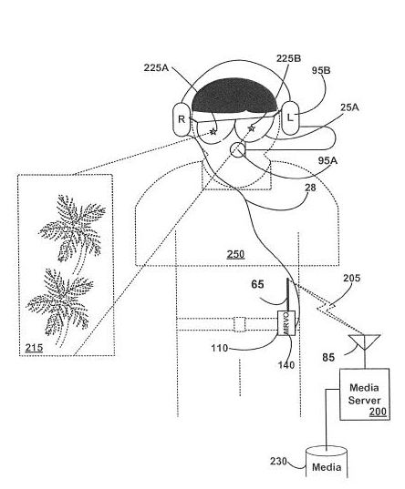

[Portable music player with synchronized transmissive visual overlays](http://patft.uspto.gov/netacgi/nph-Parser?Sect1=PTO2&Sect2=HITOFF&p=1&u=%2Fnetahtml%2FPTO%2Fsearch-adv.htm&r=1&f=G&l=50&d=PALL&S1=07732694&OS=PN/07732694&RS=PN/07732694)

Invented by Louis B. Rosenberg;
Assigned to Outland Research, LLC
US Patent 7,732,694
Granted June 8, 2010
Filed: January 25, 2007

Abstract

> A portable music player apparatus that outputs visual content to a head-worn transmissive display, the visual content being modulated in time with playing musical content and overlaid upon the user’s direct view of his or her physical surroundings. In this way, the user is provided with an enhanced visual view of his or her physical surroundings, the enhanced visual view including transmissive visual content that is generally synchronized in time with the playing music content.
>
> This provides the user with an improved music listening experience in which he or she feels present within a visually enhanced version of the physical world that has changing visual qualities that are perceptually synchronized in time with one or more features of the playing music. The displayed visual content may include time-varying translucency and/or color-tinting such that the user’s direct view of the physical world changes in brightness and/or color tinting in a manner choreographed with the playing music.

**Please Shake Media Player to Change Song**

Another patent that seems to be an attempt to add innovation to today’s media player takes advantage of an accelerometer in a media player for you to change a song that you might be listening to, and the type and duration of gesture involved may influence the song selections involved, for instance with a longer duration shake changing the types of songs being played more drastically than a shorter duration shake.

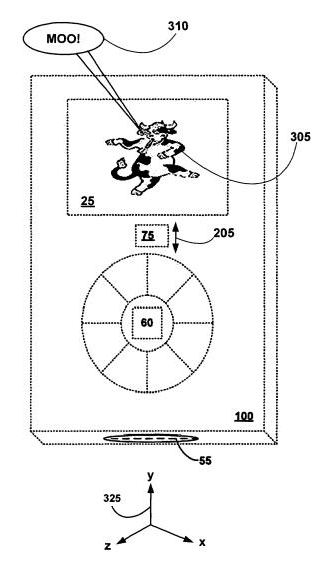

[Shake responsive portable media player](http://patft.uspto.gov/netacgi/nph-Parser?Sect1=PTO2&Sect2=HITOFF&p=1&u=%2Fnetahtml%2FPTO%2Fsearch-adv.htm&r=1&f=G&l=50&d=PALL&S1=07586032&OS=PN/07586032&RS=PN/07586032)
Invented by Louis B. Rosenberg
Assigned to Outland Research, LLC
US Patent 7,586,032
Granted September 8, 2009
Filed: October 6, 2006

Abstract

> An apparatus, method and computer program product are provided which establishes a user interface for portable media players in which a user can mix, shuffle, randomize, or otherwise alter the selection and/or ordering of media items stored within and/or played by the portable media player by simply shaking the portable media player in a characteristic manner. It is a common human metaphor to mix the contents of a physical object, like a bottle of salad dressing or a carton of orange juice, by physically shaking the object.
>
> The various embodiments leverage this common and well known human activity by enabling a user to “mix” media items through a characteristic shaking motion as a type of user interface. This capability enables a user to have a portable media player automatically shuffle the order of songs stored within a play arrangement by shaking the portable media player using a characteristic shaking motion. The portable media player includes a motion sensor coupled to a processor, a control program to monitor signals output from the motion sensor and to interpret characteristic shaking motions for causing one or more changes to be made to a current play arrangement.

**Turning Down Music by Audio Signals**

Imagine that you could turn down the volume of your audio player by the sound of your voice, or by the sound of sirens or alarms, but not by the sound of other people’s voices. That’s the focus of this Outland Research patent.

Again, another possible innovation that might be used to compete against something like the iPod.

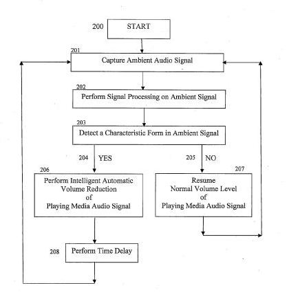

[Ambient Sound Responsive Media Player](http://appft.uspto.gov/netacgi/nph-Parser?Sect1=PTO1&Sect2=HITOFF&d=PG01&p=1&u=%2Fnetahtml%2FPTO%2Fsrchnum.html&r=1&f=G&l=50&s1=%2220070189544%22.PGNR.&OS=DN/20070189544&RS=DN/20070189544)
Invented by Louis B. Rosenberg
Assigned to Outland Research, LLC
US Patent Application 20070189544
Published August 16, 2007
Filed: April 7, 2007

Abstract

> Some embodiments of the present invention provide a method of adjusting an output of a media player comprising capturing an ambient audio signal; processing the ambient audio signal to determine whether one or more characteristic forms are present within the ambient audio signal; and reducing an output of a media player from a first volume to a second volume if the one or more characteristic forms are present within the ambient audio signal. The characteristic forms may be, for example, a name or personal identifier of a user of the media player, the voice of a user of the media player, or an alarm or siren.

**Mobile Reminders Based upon Your Location**

This seems similar in a number of ways to a patent Google acquired from Xybernaut Corporation, which was originally filed back in 2000 and granted in 2002, which I wrote about in the post, [Google Acquires Virtual Post-it Notes Patents](https://www.seobythesea.com/2011/03/google-acquires-virtual-post-it-notes-patents/). That patent was broader in a number of ways, including the ability for others to leave you messages when you physically entered into a certain area or region, but it also included the ability for you to leave yourself notes and to be alerted to them, like this patent does.

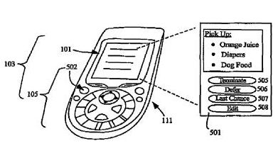

[Spatially associated personal reminder system and method](http://patft.uspto.gov/netacgi/nph-Parser?Sect1=PTO2&Sect2=HITOFF&p=1&u=%2Fnetahtml%2FPTO%2Fsearch-adv.htm&r=1&f=G&l=50&d=PALL&S1=07577522&OS=PN/07577522&RS=PN/07577522)
Invented by Louis B. Rosenberg;
Assigned to Outland Research, LLC
US Patent 7,577,522
Granted August 18, 2009
Filed: June 28, 2006

Abstract

> Spatially associated reminder systems and methods enable users to create reminders and associate those reminders with entering/exiting particular trigger areas. A user’s portable computing device triggers an alert/displays a reminder based upon a user entering and/or exiting a trigger area.
>
> A user interface supported by the portable computing device allows a user to terminate the reminder so it will not trigger again, to defer the reminder so it triggers again after an elapsed time, to reset the reminder so that it triggers again only if a user leaves the area and then returns, to request a last chance, causing the portable computing device to remind the user again upon exiting the area to ensure the user did not forget to act upon the reminder, or to edit the reminder.
>
> The user interface also enables users to graphically define trigger areas within the physical world to be associated with personal digital reminders using geospatial imagery.

**Electronic Drum Tuning Control**

This patent seems like an odd fit. Outland Research has a number of other better matching patent filings that Google didn’t acquire, and I even wrote about a couple of them that deal directly with search back in 2006 on [Search Engine Watch](https://www.searchenginewatch.com/2006/08/08/new-search-patent-applications-august-8-2006-focusing-on-the-searcher/).

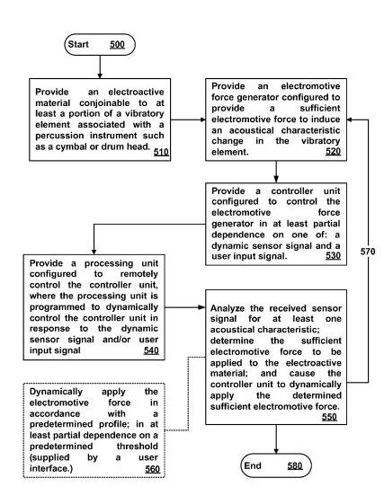

So why would Google acquire this particular patent? I’m not sure. It doesn’t sound closely tied to their mission to organize the world’s knowledge, it likely won’t be helpful in a patent dispute, and it doesn’t sound like a product they might develop. Then again, being able to quickly adjust the sound of a percussion instrument in a recording studio may be something that’s really needed. Maybe we’ll find out some day in the future.

[Apparatus, system, and method for electronically adaptive percussion instruments](http://patft.uspto.gov/netacgi/nph-Parser?Sect1=PTO2&Sect2=HITOFF&p=1&u=%2Fnetahtml%2FPTO%2Fsearch-adv.htm&r=1&f=G&l=50&d=PALL&S1=07394014&OS=PN/07394014&RS=PN/07394014)
Invented by Louis B. Rosenberg
Assigned to Outland Research, LLC
US Patent 7,394,014
Granted July 1, 2008
Filed: May 31, 2006

Abstract

> An apparatus, system and method for electronically controlling the acoustical characteristics of certain percussion musical instruments such as acoustical drums and cymbals are provided. The various embodiments incorporate one or more electroactive materials which are conjoined to the vibratory elements associated with a drumhead or cymbal. A processing unit may be provided to electronically control the electroactive materials in dependence on signals received from the electroactive materials, and/or separate acoustical sensors.
>
> The processing unit may also control the electroactive materials in dependence upon user input signals, pre-programmed profiles, and/or pre-programmed threshold values. In this way the present invention may selectively and dynamically vary the tonal qualities and/or muting characteristics of percussion musical instruments in accordance with the needs and/or desires of a user.
