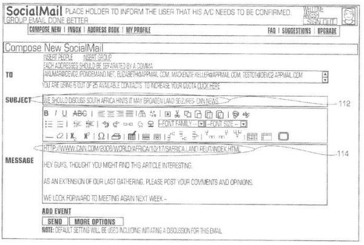
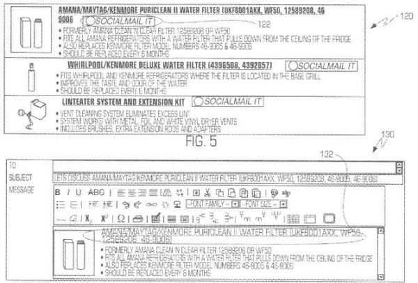

Google has been busy over the past couple of years acquiring a good number of small startups, including some that may help or have helped contribute features to Google Plus, such as Fridge, Tweet counting [SocialGrapple](https://venturebeat.com/2011/10/10/google-acquires-socialgrapple/), people sorting Katango, the team behind [JustSpotted](https://techcrunch.com/2011/07/20/google-justspotted/), social ranking [PostRank](https://web.archive.org/web/20110626084315/http://blog.postrank.com:80/2011/06/postrank-has-been-acquired-by-google), and social movie recommendation service [fflick](https://gigaom.com/2011/01/25/google-fflick-acquisition/).

Google hasn’t publicly announced every acquisition that it has made, and the search engine has also purchased intellectual property such as pending and granted patents from some companies as well, without necessarily buying the companies behind the patents. For example, in August of 2010, Google was assigned a handful of patent filings from Appmail, LLC, recorded at the USPTO in May of 2011. A pending and a granted patent from that group appear to be related to Grouptivity, which was a social service run by Appmail that used a social mail service to enable people to share content they found on the web with others, either privately or publicly. That service allowed for the [creation of groups](https://gigaom.com/2006/12/28/grouptivity-using-the-social-web-to-build-consensus/) to “keep your personal contacts separate from co-workers and other categories.” As a publisher-centric web service, grouptivity was described as a service that:

> …provides content publishers with improved content distribution, increased traffic, and enhanced search engine exposure. By simply replacing existing “sharing tools” (email a friend, social bookmarks, i.e.) with a power set of content sharing and discussion services and by transforming sharing activity into “user-generated” content, Grouptivity enables publishers to build a community around their content. Publishers also become part of a Grouptivity’s growing “content network” where their audience can easily share news and content with others in their social network, and search or browse for similar content based on its popularity or their personal interests.

The Grouptivity website is no longer online, but the website of another company that is or was run by Appmail, [Sharetivity](https://web.archive.org/web/20110228153054/http://www.sharetivity.com/aboutus.html), is still online. There’s a [short video](https://web.archive.org/web/20100816033651/http://www.sharetivity.com/movie.html) linked to on the site that might remind you of Google Plus. That movie pauses at one point, and you need to click on the right-pointing arrow in the top right corner to see the whole video. Sharetivity inserts pages that are socially shared by members of your social network into your search results, ranked algorithmically.

## Grouptivity and Social Mail

Searching for the grouptivity site on the Internet Archive, it is possible to find [some information about Grouptivity](http://web.archive.org/web/20070102220114/http://www.grouptivity.com/help/doku.php?id=faq) if you travel back to 2007. After that, the Grouptivity pages appear to have been 302 redirected to the Sharitivity pages. Here are some of the original features of Grouptivity:

> - Create surveys, voting ballots and feedback forms to collect ideas and information
> - Provide a central location for all of your group to discuss, post, and chat
> - Create questions for your group, helping you to manage the information
> - Communicate, collaborate, and collect information back in a single email
> - Use your regular email address: recipients don’t have to register and login to respond
> - Access all your information and previous messages anytime in our database
> - Create, send, and manage your messages with our simple and powerful application
> - Automate Send dates, reminders and recurrences
> - Draft your messages fast and easy with our pre-designed templates
> - Enhance your collaboration with less work!

Google Plus doesn’t integrate into GMail quite like Grouptivity integrates into email, but there seem to be a good number of similarities in how they enable social sharing in a collaborative manner, as can be seen from the screenshots from one of the assigned patents, [Collaboration system and method](http://patft.uspto.gov/netacgi/nph-Parser?Sect1=PTO2&Sect2=HITOFF&u=%2Fnetahtml%2FPTO%2Fsearch-adv.htm&r=1&p=1&f=G&l=50&d=PTXT&S1=7606865.PN.&OS=pn/7606865&RS=PN/7606865) (US Patent 7606865):

This first one shows a “Compose New Social Mail” interface. Note the ability to add individuals or groups to send a mail to, as well as a link to a public profile page

This next image from the patent shows a third-party webpage at the top, where people can click on a “socialmail it” icon to share that content via their social mail, with an example of sharing the first item from the page at the bottom.

Before Grouptivity seemed to disappear from the Web sometime in 2008, there was a **Share+** widget [for WordPress](https://web.archive.org/web/20091227030118/http://wordpress.org:80/extend/plugins/grouptivity/). The description of the Share+ plugin tells us:

> For Your Readers Empower your readers with a social tool for sharing, saving and discovering new content with the click of a button. Our plugin provides social features for sharing content across all major social bookmarking sites and a clipping feature for adding text, images and personalized messages for friends, family and co-workers.

## Search Rankings Based Upon Sharing

Another pending patent application from the assignment describes something like the social web search rankings in the Sharitivity, which might just remind you a little of Google’s Search Plus Your World. Google may not be following the processes described in this patent application, but it does describe how social sharing might play a role in ranking content shared by people who might be connected to each other within a social network. The patent application is:

[Page Ranking System Employing User Sharing Data](http://appft.uspto.gov/netacgi/nph-Parser?Sect1=PTO2&Sect2=HITOFF&u=%2Fnetahtml%2FPTO%2Fsearch-adv.html&r=1&p=1&f=G&l=50&d=PG01&S1=20090125511.PGNR.&OS=dn/20090125511&RS=DN/20090125511)
Invented by Ankesh Kumar
US Patent Application 20090125511
Published May 14, 2009
Filed: December 31, 2008

Abstract

> Standard web content search result relevance and ranking is improved by considering certain social reference data, such as the number of times an item of content is shared, normalized for the number of times it is viewed. A system and method for improving the relevance and ranking includes a system and method for tracking the social references and a system and method for operating on search engine results to either:
>
> - re-order the results based on social reference data,
> - re-order the search results based on a combination of the social reference data and the web search engine’s ordering, and/or
> - display the social reference data either with the search results reordered or in the order provided by the web search engine.
>
> Many different forms of data constitute social reference, including sharing content or a link thereto by email, SMS, posting to a link-sharing site, blog, and bookmarking in a web browser.

### Social Reference Factors

Search engines might presently be looking at some social factors in ranking pages presently, such as:

- The number of third party comments added to a blog post or article after it’s published
- The number of links pointed to an article or post after it’s published
- A re-written article or post pointing a link back to the original.

Services like Yahoo! Buzz, may also use things like email shares, user ranking and other signals to decide which stories to present on a news web page.

What this patent application adds is the use of social reference factors in the form of content sharing, to help algorithmically determine the relevance and ranking of web content search results.

Content sharing social reference data includes interactions someone has with web content which result in some peer-to-peer, peer-to-group, or group-to-peer sharing of the address of the content, or a portion of the content itself.

A search engine may base its relevance and rank systems exclusively or partially on content-sharing social reference data, and show searchers relevant search results based in part or whole on that data.

Examples of individuals sharing social references can involve someone:

- Sending (via email, instant messenger, etc.) a link or “bookmark” to content to another user
- Posting content (e.g., adding to a blog which becomes visible to others)
- Applying a label to content visible to others
- Making making a purchase or request from a website
- Participating in social bookmarking
- Promting or demoting content in search results
- Creating and up-keeping a directory
- Posting comments on bookmarks, news, images, videos, podcasts and other web pages

Information such as counts of this type of sharing might be used by itself or in conjunction with other ranking signals (such as PageRank) to weight and rank search results.

The weights related to content sharing might be calculated a number of ways, including the use of some amount of normalization such as:

- Number of page shares over number of page views
- Number of shares for a retail page over a number of similar retail pages
- Number of shares for bookmark by email over number of bookmark page shares

Some of the the counts of shared may be weighted differently as well. For example, since it might take more work to share something via an email than through a Facebook share, the email shares may carry more weight than the Facebook shares.

When searchers enter keywords into a search box, the web search results they receive might include content from people within their social networks who may have socially shared that content in some manner.

### Avoiding Manipulation of Search Results

There’s the possibility that people might try to abuse a ranking algorithm like this one, but there are steps that could be taken to try to stop people from gaming this system.

Since this system would have access to collateral data about social shares, such as what the IP address was of the person sharing at the time that they shared something, that data could be used to do things like ignore multiple sending of the same content from the same source. Requiring a sender to have a valid account at a subscription site (Digg, Facebook, etc.), and possibly only using social sharing information to include that kind of content in search results for a recipient or recipients who are also members of that subscription site.

### Other patent filings acquired by Google from Appmail, LLC

[System and method for integrating e-mail into functionality of software application](http://patft.uspto.gov/netacgi/nph-Parser?Sect1=PTO2&Sect2=HITOFF&u=%2Fnetahtml%2FPTO%2Fsearch-adv.htm&r=1&p=1&f=G&l=50&d=PTXT&S1=7219130.PN.&OS=pn/7219130&RS=PN/7219130) (US Patent 7219130)
[E-mail based decision process in a hierarchical organization](http://appft.uspto.gov/netacgi/nph-Parser?Sect1=PTO2&Sect2=HITOFF&u=%2Fnetahtml%2FPTO%2Fsearch-adv.html&r=1&p=1&f=G&l=50&d=PG01&S1=20050021646.PGNR.&OS=dn/20050021646&RS=DN/20050021646) (US Patent Application 20050021646)
[System and method for task management](http://appft.uspto.gov/netacgi/nph-Parser?Sect1=PTO2&Sect2=HITOFF&u=%2Fnetahtml%2FPTO%2Fsearch-adv.html&r=1&p=1&f=G&l=50&d=PG01&S1=20050197999.PGNR.&OS=dn/20050197999&RS=DN/20050197999) (US Patent Application 20050197999)

## Takeaways

Google Plus was originally launched on June 28, 2011, around ten months after the acquisition of the Appmail patent filings, and it’s possible that Google had already charted a strategy for their social network that contained many of the same elements that were found in Grouptivity’s social mail, and social ranking signals. But it’s also possible that Grouptivity influenced the future of Google Plus in a number of ways, and the *Page Ranking System* patent seems tailor-made for use with a search engine like Google.

There were definitely other influences upon what we see in Google Plus today, but the Appmail LLC patents that I’ve written about in this post are probably worth going through by anyone who might be interested in exploring the roots of the social service from Google.

I think there’s a good chance that Google is also incorporating ideas from its [Agent Rank](https://www.seobythesea.com/2011/11/agent-rank-or-google-plus-as-an-identity-service-or-digital-signature/) patents into the scoring and ranking of social signals, which involve the use of digital signatures associated with the creation of content, such as authorship markup. There’s also a very good chance that the [Credential Score](https://www.seobythesea.com/2011/07/how-google-might-rank-user-generated-web-content-in-google-and-other-social-networks/) approach developed for use with code-named Confucius Q&A sites help to measure the quality of interactions on social services and the Web is incorporated in social rankings of content as well.

But looking at Agent Rank and the Confucius credential scores in combination with the Grouptivity patent filings fleshes out more of the background of Google Plus, and Google’s attempts to add social elements to search results.
