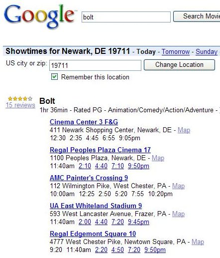
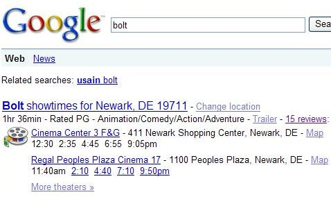
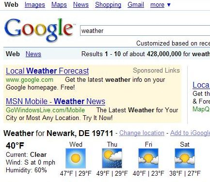
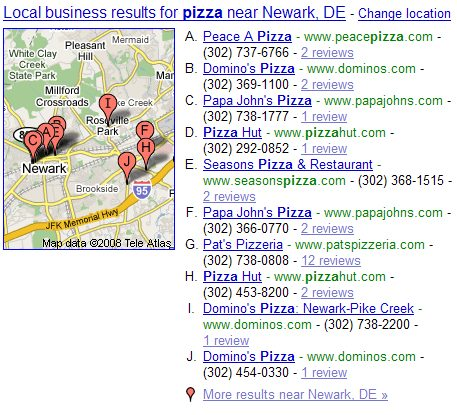

**Preferred Location Gathering**

When you search for where a movie might be showing near you, or what the weather might be like in your neighborhood, or other kinds of information where it might be helpful if the search engine knows your location or a location that you might prefer to see results from, a search engine like Google might try to identify a preferred location from your searches.

For example, if I search for a specific movie that is showing at movie theatres, Google might ask for my zip code to provide me with location information about where it is playing:

The next time that I perform that search, I’m not shown a text box where I can enter my zip code.

And, if I search for the weather, my preferred location information is used to tell me about that as well:

If I then perform a search for [pizza], without indicating a location or zip code, I’m also shown a map with the addresses of ten local pizzerias.

While the pizza locations might be tied to the location of my computer, or my handheld if I’m using a smartphone or web-enabled handheld, I tested it to see if I was getting results based upon my movie or weather searches. I went back to a Google [weather] search, and changed my location to another zip code in a different state. I then searched for [pizza] again, and the local search results shown to me were for that other state.

The preferred location that you enter into Google doesn’t have to be the place you are searching from. It could be the area around where you live, or where you work, or where you might be traveling, or just someplace else that you indicate.

If I don’t state a preferred location, the search engine might try to identify my location if I am using a handheld by GPS or [cell phone tower triangulation](http://googlepress.blogspot.com/2007/11/google-announces-launch-of-google-maps_28.html).

**Location Information, Profiles, and Partner Content Providers**

A recently published patent application from Google explores how location information, and other information associated with a mobile device, or a desktop computer could be collected as “profile information” about a searcher and could be used to present a searcher with search results specifically tailored for them.

The patent also discusses how profile information could be shared with a partner content site to provide additional information to searchers. For example, in the movie listings that Google provided to me was a link to the IMDb page for the movie that I searched for – [Bolt](https://www.imdb.com/title/tt0397892/). Other content partners could also be used, and some of those might be able to provide customized information to a searcher if Google shared profile information with them.

Some examples of potential content providers from the patent filing might be: “MSNBC, Time Warner Inc., CBS Corporation, MTV Networks Company, Guardian Newspapers Limited, NBC Universal, Inc., etc.”

Location or other information sent to the partner content provider might not come from information stored in a profile before a search, but could also be taken from the search query itself. So, If someone typed in [Omaha Nebraska bolt], they may be presented with showing times for that movie, and information about the search might be shared with a content provider.

[Providing Profile Information to Partner Content Providers](http://appft1.uspto.gov/netacgi/nph-Parser?Sect1=PTO2&Sect2=HITOFF&u=%2Fnetahtml%2FPTO%2Fsearch-adv.html&r=1&p=1&f=G&l=50&d=PG01&S1=20080294603.PGNR.&OS=dn/20080294603&RS=DN/20080294603)
Invented by Ritcha G. Ranjan, and James M. Watts
Assigned to Google
US Patent Application 20080294603
Published November 27, 2008
Filed May 25, 2007

**Where do “Content Partners” Come From, and Should there be Disclosure?**

The patent filing tells us that:

> In some implementations, a designated partner content provider can have a particular relationship with the information provider. For example, the designated partner may have a business agreement with the information provider under which both entities work together to enhance users’ browsing experiences and derive mutual benefit as a result (e.g., increased advertising revenue or other product revenue, etc.).
>
> As another example, a designated partner may have a technology-based agreement with the information provider to use a particular protocol or data format to receive profile information provided by the information provider (e.g., through a search result link) and use the profile information to customized content in some manner.

We don’t know if Google has entered into any arrangement with content partners to display specific information from them for a fee or some other consideration. If they were, I would suspect that some kind of disclosure would probably be appropriate. Should links to partner content provider pages be labeled with something indicating that they are advertising? Are they advertising?

When you perform a search such as [london to paris], you see an area at the top of the search results that provide information about “Flights from London, United Kingdon to Paris, France.” There are text boxes under that where you can list a departing date and a returning date.

Under those, I see a list of links to “CheapTickets – Expedia – Hotwire – Kayak – Orbitz – Priceline – Travelocity.” Are these “content partners? Why those sites? Do they pay to be there? If so, should they be considered advertisements? Should there be disclosure?
