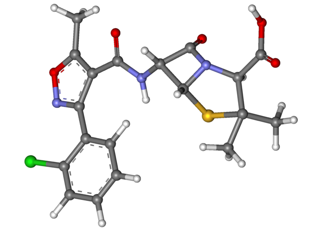
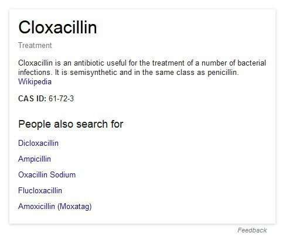

## A Search for Entity Instances can Reveal More Information about those Entities

 &#123;&#123;Information |Description =&#123;&#123;en|1=Ball-and-stick model of oxacillin molecule. The structure is taken from ChemSpider. ID 5873&#125;&#125; |Source =&#123;&#123;own&#125;&#125; |Author =[MarinaVladivostok](https://commons.wikimedia.org/wiki/File:Cloxacillin_ball-and-stick.png) |Date =2013-07-22[/caption]

They copy your spelling from the bottle they got at the pharmacy. Unfortunately, they couldn’t read the handwriting of the doctor who initially prescribed it. Good thing pharmacists are trained in reading doctors’ writing.

Your name is spelled out, and a press of the search box button and knowledge is on its way.

A search engine could look at how you are spelled, and find a page on the Web where you are also spelled the same way, and return that page, especially if it has lots of links pointing at it and a good share of PageRank. But that’s not the only way that a search engine like Google is helping people find out information about entities.

Google might also look through the knowledge it has gathered about the Web to share information from there with searchers. As an entity, you don’t have to rely on commercial websites to share information about you.

Before Google shows off a [knowledge panel](https://www.seobythesea.com/2013/05/google-knowledge-graph-results/) to searchers about you, it decides whether or not you are commercial enough to show advertisements for.

None appear at the top or right side of search results for you, so no one appears to be advertising for cloxacillin. Maybe because you are a prescription drug? When’s the last time you’ve seen an advertisement at Google for a related entity such as the much more popular penicillin, which is in the same class as you?

A patent about you in particular (it includes you as an example) tells us about this visit to Google’s knowledge panel to help find out information about you. It tells us (again mentioning you by name):

> Example
>
> The class “painkillers” includes cloxacillin, Vicodin, and other types of drugs that are typically classified as painkillers.
>
> Each instance, in turn, can have one or more attributes, each of which describes a quality or characteristic of the instance.
>
> Knowing what attributes are associated with the instance described by the search term (e.g., whether “cost” or “side effects” is associated with “cloxacillin”) can help the search engine in the search process.

That patent is:

[Extracting instance attributes from text](http://patft.uspto.gov/netacgi/nph-Parser?Sect1=PTO2&Sect2=HITOFF&p=1&u=%2Fnetahtml%2FPTO%2Fsearch-adv.htm&r=1&f=G&l=50&d=PALL&S1=08538916&OS=PN/08538916&RS=PN/08538916)
Invented by Enrique Alfonseca, Marius Pasca, and Enrique Robledo-Arnuncio
Assigned to Google
US Patent 8,538,916
Granted September 17, 2013
Filed: April 11, 2011

Abstract

> Methods, systems, and apparatus, including computer programs encoded on a computer storage medium, are described for extracting instance attributes from the text. In one aspect, a method exploits weakly-supervised and unsupervised instance relatedness data, available in the form of labeled classes of instances and distributionally similar instances.
>
> The method organizes the data into a graph containing instances, class labels, and attributes. The method propagates attributes among related instances through random walks over the graph.

It’s not quite the way that information tends to be indexed for web search by Google. Still, it could look at information about the entity cloxacillin and understand relationships that the web search approach otherwise might not.

## Take Aways

When you type a query into a search box, you start a journey for information that triggers a series of events and inquiries, which end up resulting in a page full of information uniquely tailored to the words and terms that a searcher wanted to know more about.

Our search was for a single word and one that most people know little about. This post started by calling it an entity, but it’s more than that. It’s also an entity instance or a specific example of something that is part of a larger class of entities. And there are specific facts about both the entity and the class that it belongs to that could help with returning something like the knowledge panel above and possibly the search results that accompany it. As the patent tells us:

> For example, if a significant number of user queries include both the information instance “cloxacillin” and the attribute “pharmacokinetics,” the system can determine that the attribute “pharmacokinetics” describes at least one aspect or characteristic of information instance “cloxacillin,” and store a mapping between “pharmacokinetics” and “cloxacillin” in instance-attribute database.

This connection between the entity cloxacillin and an attribute of pharmacokinetics isn’t based upon links between web pages but rather connections between pieces of data that people are interested in finding out more about.

No Entities were harmed in the production of this blog post.

Last Updated June 6, 2019
