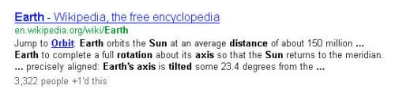
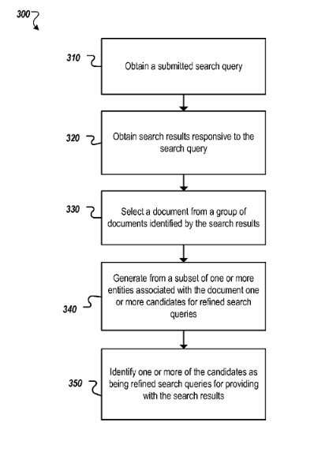

## The Search Engines Battled Over Search Engineers Like Ori Allon

In 2006, Google battled Yahoo! and Microsoft for an algorithm developed by an Israeli Ph.D.student in Australia. The algorithm had a semantic element to it. Winning advanced Google in an algorithm arms race between the search giants. We’ve seen the technology described how it gets displayed in search results, but not how it does what it does until now.

This week, Google got awarded a patent that looks at search results for specific queries and the entities that appear within them for refining search queries. This invention is from Google. The lead inventor behind it was part of a [bidding war](https://www.smh.com.au/national/google-wins-rights-to-aussie-algorithm-20060410-gdnc60.html) between Google, Yahoo!, and Microsoft. In 2009, the breakthrough was public on Google in the form of [Orion](https://searchengineland.com/google-implements-orion-technology-improving-search-refinements-adds-longer-snippets-17038) technology.

## Google Won The Services of Ori Allon and Started Doing Things Using the Orion Approach

The Orion approach involved both extended snippets for queries (three or more lines of the descriptive snippet instead of two for some longer queries) and “more and better query refinements.” How this technology gets displayed gets described in a Google Official Blog post from March 24, 2009, titled [Two new improvements to Google results pages](https://googleblog.blogspot.com/2009/03/two-new-improvements-to-google-results.html).

One of the co-authors of that post is Ori Allon. He developed Orion Technology as a student in Australia. (Ori has been [busy since then](https://gigaom.com/2012/12/17/startup-whiz-ori-allon-launches-mysterious-people-powered-local-startup/), with stints at Google and Twitter, and a new project on his own.)

If you do some of the searches at Google described in that blog post, you’ll see both extended snippets and a good number of suggested query refinements. For example, try a search for [earth’s rotation axis tilt and distance from sun] (without the brackets). Three of the top 10 results from my search have three lines of snippets, and another has 4 lines. Here’s an example of one of those extended snippets:

The refining search queries patent provides us with a better look at how the Orion technology works:

[Refining search queries](http://patft.uspto.gov/netacgi/nph-Parser?Sect1=PTO2&Sect2=HITOFF&p=1&u=%2Fnetahtml%2FPTO%2Fsearch-adv.htm&r=1&f=G&l=50&d=PALL&S1=08392443&OS=PN/08392443&RS=PN/08392443)
Invented by Ori Allon, Ugo Di Girolamo, Tomer Shmiel, Alexandre Petcherski, and Tzvika Hartman
Assigned to Google
US Patent 8,392,443
Granted March 5, 2013
Filed: March 17, 2010

Abstract

> Methods, systems, and apparatus, including computer program products, for refining search queries.
>
> A method includes:
>
> - Obtaining a submitted search query, and in response to obtaining the search query:
> - Obtaining search results responsive to the search query;
> - Selecting a document from a group of documents identified by the search results;
> - Generating from a subset of one or more entities associated with the document candidates for refined search queries, including:- Identifying one or more terms in the search query, where the terms occur in the search query in a particular order relative to each other, and
>  - Combining the one or more terms with the entity to generate a candidate, where the terms occur in the particular order relative to each other; and identifying the candidates become refined search queries for providing the search results.

## Refining Search Queries

The patent itself focuses upon query refinements rather than upon extended snippets. I guess that there’s probably another unpublished patent out there focusing upon those extended snippets. But the query refinement approach is interesting in a few ways.

It refers to entities found in documents that rank for specific queries (a co-occurrence of entities). Those entities might get used to combining words from the original query (or synonyms of those words) to provide query refinements.

The “entities” described in this patent sound like the kinds of [entities](https://www.seobythesea.com/2012/06/search-engines-and-entities/) that we see in Google’s [knowledge base approach](https://www.seobythesea.com/2013/01/knowledge-base-locations-in-web-pages/), though there might be some differences.

## Associating Pages with Entities

Pages returned in a search for a query could get associated with specific entities included in the documents returned for that search.

Entities make up a “meaningful, self-contained concept.”

An entity could be a single word, a phrase, or other character strings. An entity might be a sequence of one or more characters that show up in previously submitted search queries at a greater frequency than a certain threshold of searches over a certain period. A document could become associated with more than one entity.

## Association Example

Someone searches for [Mona Lisa], and Google returns search results pages in response. Several other entities might appear in those search results, such as “Leonardo da Vinci,” “Louvre,” “renaissance,” and others.

These entities might get passed along to a query refinement server as parts of candidate query refinements.

### Scoring Entities Associated with Documents

Refined search queries can get created in real-time because the entities used to generate those queries get associated with documents identified by search results in response to the query.

Entities associated with a document can also be before submitted search queries. Search results identifying the document may get returned more than a certain number of times.

### Inverse Document Frequency (IDF) Score

Part of the process described in this refining search queries patent involves filtering entities as possible query refinements that the search engine might list to get a few refinements.

An entity might have an IDF score based upon counting the number of documents getting searched “containing (or get indexed by) the term in question. The intuition was that a query term that occurs in many documents is not a good discriminator, and should get less weight than one which occurs in few documents.” See Understanding Inverse Document Frequency: On theoretical arguments for IDF (pdf).

The score for the entity may get based on a sum of the IDFs of each word in an entity. The score of the entity “Mona Lisa” might get calculated by taking the sum of the IDF of “Mona” and the IDF of “Lisa.” (The British Rock band from the 80s, “[The The](https://en.wikipedia.org/wiki/The_The)” might not have the greatest IDF score in the world under that approach.)

As the IDF score of an entity increases, the likelihood that the entity is important or relevant to a document responsive to the search query also increases. Therefore, a document with a higher score is also ranked higher than entities with a lower score.

### Co-occurrence Score

If you look through the document, you may see an entity appear more than once. A score for an entity can get created from “determining a co-occurrence relationship between the entity and a search query.”

If an entity appears in a document more than once, its importance to the document is probably higher, and that score might get used with or incorporated into the IDF score.

### Query Click and Dwell Time Score

The score for an entity could also become increased as the number of times the entity gets found in a previously submitted query increases.

Every selection of the document for the previously submitted query within search results gets counted as a click. The amount of time someone views or “dwells” on the document may also get tracked. The more time they spend there (i.e., a long click), the more relevant the document might become seen for that previous click.

If they don’t spend much time there, that might get perceived as a lack of relevance of the document.

The score for an entity can increase based upon long clicks and/or based on an increase of the ratio of long clicks to total clicks for queries that use that entity.

### Candidate Query Refinements used in Titles

The score of an entity can get increased if the entity becomes found in the title of a document.

### Previously Submitted Queries

This score for an entity can increase by an increase in the number of times it gets found in previously submitted queries. Or an increase in the number of documents it has gotten found in presently. An increase in the number of times in which the entity gets included in the titles of documents. Or an increase in the number of terms (or tokens) in the entity increases.

### Other Collected Information

It’s possible that some other information might score an entity that might be part of a candidate query. Some of the information collected may include the:

- Search query
- Frequency of submission over a period of time
- Dates and times of submission
- Language of the search query, and/or
- Other information associated with the search query

### Evaluating Candidate Refinements

The patent describes how these entities might get merged with the original query that refinements are being selected for, and how they might become selected from among all the candidates. Some of this evaluation might involve looking at:

- Many words in the candidate
- An amount of overlap between the candidate and an entity
- An amount of overlap between the candidate and the search query
- Many times the candidate appears in the search logs
- A sum of the IDF of all the terms in the candidate
- An IDF of the most unique term in the candidate

The top 8 or so refinements might get chose to show in search engine results.

### Conclusion

It’s hard to say how much of what Ori Alon developed is still in use in refining search queries that Google shows us today. Ori Allon is no longer with Google, but others may have improved this query refinement approach.

The “entities” described in this patent feel just a little different than the named entities described in Google’s knowledgebase approach to search. I’ve described some of the changes we’ve seen in search from keyword mapping to phrase-based indexing to concept matching in [SEO is Undead Again (Profiles, Phrases, Entities, and Language Models)](https://www.seobythesea.com/2010/11/seo-is-undead-again-profiles-phrases-entities-and-language-models/). If we think of named entities as specific “people, places, and things,” then maybe entities found in documents in refining search queries aren’t so different, though.

If you were to take a set of query refinements suggested for a particular query and start looking through the pages returned for that query, you might start seeing some of the entities used to refine those queries.
