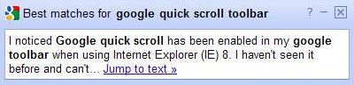

If you have the Google Toolbar installed on your browser, you may soon start seeing some odd behavior at times when you click on a search result.

For some pages, Google might deliver you to a page and may display a popup/information box on the bottom right of the page that covers part of the page. That information box may show one or more excerpts of text from one or more parts of the page that are “relevant to your query,” like in the following image:

If you click on one of the text excerpts, your browser will deliver you to the part of the page where that text appears, and possibly highlight the relevant section.

I wrote about a Google patent filing last November that described behavior like this, in a post entitled [How Google Might Insert Artificial Named Anchors into Web Pages.](https://www.seobythesea.com/2009/11/how-google-might-insert-artificial-named-anchors-into-web-pages/)

When Google announces a new feature on a service like their toolbar, a commonly offered explanation for the addition is that Google is working to “Improve the User Experience” of their service.

But what if improving the user experience for searchers may also act to harm the user experience on websites that the search engine might lead searchers to?

For example, Google’s Quick Scroll started out as a [Google Chrome Plugin](https://chrome.google.com/webstore/detail/google-quick-scroll/okanipcmceoeemlbjnmnbdibhgpbllgc#detail/okanipcmceoeemlbjnmnbdibhgpbllgc), and now seems to be a [feature](https://support.google.com/toolbar/answer/9171?hl=en&rd=1) on some versions of the Google Toolbar. But what if a feature like that is silently introduced, and turned on by default? I didn’t have it listed in my options/tools for Google’s toolbar yesterday, and I do now today. I wasn’t given any notice or information about it. It’s now just there.

The initial announcement of Google Quick Scroll as a Google Chrome plugin last December, [Two new features enhance search beyond the results page](https://googleblog.blogspot.com/2009/12/two-new-features-enhance-search-beyond.html), tells us that:

> With universal search features in Google Suggest and Google Quick Scroll, we hope you save precious seconds for many of the searches you perform. As Amit said on Monday, “seconds matter.”

While Quick Scroll can help searchers find what they are looking for on a page quickly, there are some issues with the new toolbar feature that site owners might not like. Charles, of Wave Shoppe Hawaiian Shirts pointed out the addition of the quick scroll tool to the toolbar to me, and told me about a couple of concerns that he had with the popup/information box.

One problem is that the information box may cover over important real estate where it appears, such as a call to action or an important link or piece of information. Should Google be displaying popups on other people’s sites that may cover important design elements? Another problem is that the feature has the potential to interfere with the use of “heat maps and funnels” on rich ecommerce sites.

Most people are used to clicking through a search result and being delivered at the top of a page.

Most designers and site owners create their pages based upon this kind of behavior – including often trying to put their most important information at the top of a page – an area sometimes referred to as being “above the fold.” Designing that way tends to make sense, and a usability study from Jakob Nielsen this past March, [Scrolling and Attention](https://www.nngroup.com/articles/scrolling-and-attention/) describes how people interact with information both above the fold and below the fold on Web pages. One of the conclusions from the study:

> Web users spend 80% of their time looking at information above the page fold. Although users do scroll, they allocate only 20% of their attention below the fold.

Quick Scroll doesn’t show up on every page – just the pages where Google has determined (probably through an automated means) that it might be helpful to a searcher.

On those pages, visitors arrive at the top of pages, but they are shown the popup that they can choose to follow to quickly find the parts of a page that Google has determined to be relevant to their query. If people click on one of the artificial links in the popup/information box, chances are that they may be delivered below the fold.

If you’re a site owner or designer, that may not be something that you want to see visitors to your pages do.

Quick scroll may help searchers find relevant information related to their searches more quickly, but those searchers may also miss out on some of the most important content found on a page, either above the fold, or obscured by the popup/information box that Google is placing on pages.

Google Quick Scroll – is it helpful, or is it harmful? Should Google Toolbar users be told about additions of features like this when they are installed, so that they can opt into using them instead of learning about them after they are installed and turned on by default?

What do you think?

If you would like to check to see if Quick Scroll is presently installed on your Google Toolbar, click upon the toolbar’s wrench icon, and then choose the “tools” tab. If it has been installed on your browser already, you should see it listed. If you’d like to disable it, you can do so there.
