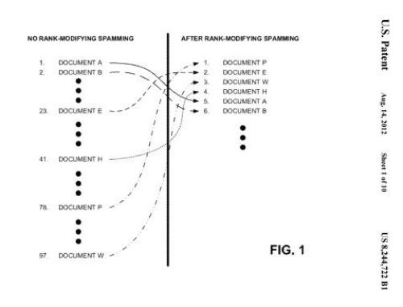

## Will Google Use Social Engineering to Fight Search Engine Spam?

If you change your site using what Google may consider spam, Google may not change the rank of your page in response, according to a patent filed by the search engine. It may increase your rankings, decrease those rankings, or make no changes at all to them.

You can see the kinds of tactics that Google might frown upon. Google’s [Webmaster Guidelines](https://support.google.com/webmasters/answer/35769?hl=en) highlight many search engine spam practices that they warn against, that someone may use if they were to try to boost rankings in the search engine in ways intended to mislead it. The guidelines start with the following warning:

> We strongly encourage you to pay very close attention to the Quality Guidelines below, which outline some of the illicit practices that may lead to a site being removed entirely from the Google index or otherwise affected by an algorithmic or manual spam action. If a site has been affected by a spam action, it may no longer show up in results on Google.com or any of Google’s partner sites

A Google patent granted this week describes how the search engine might respond when there’s a possibility that such search engine spam practices might take place, where they might lead to improved rankings of pages in search results. The following image from the patent shows how search results might be reordered based upon such rank modifying spam:

These search engine spam practices, referred to as “rank-modifying spamming techniques,” may involve:

- Keyword stuffing,
- Invisible text,
- Tiny text,
- Page redirects,
- Meta tags stuffing, and
- Link-based manipulation.

While the patent defines these practices, I’d recommend reading the definitions in the quality guidelines on the Google help pages which provide much more detail. What’s interesting about this patent isn’t that Google is taking steps to try to keep people from manipulating search results, but rather the steps they might take when people may engage in rank-modifying spamming.

The patent is:

[Ranking documents](http://patft.uspto.gov/netacgi/nph-Parser?Sect1=PTO2&Sect2=HITOFF&p=1&u=%2Fnetahtml%2FPTO%2Fsearch-adv.htm&r=1&f=G&l=50&d=PALL&S1=08244722&OS=PN/08244722&RS=PN/08244722)
Invented by Ross Koningstein
Assigned to Google
US Patent 8,244,722
Granted August 14, 2012
Filed: January 5, 2010

Abstract

> A system determines a first rank associated with a document and determines a second rank associated with the document, where the second rank is different from the first rank. The system also changes, during a transition period that occurs during a transition from the first rank to the second rank, a transition rank associated with the document based on a rank transition function that varies the transition rank over time without any change in ranking factors associated with the document.

When Google believes such techniques are applied to a page, it may respond in ways that the person engaging in spamming might not expect. Instead of increasing rankings of pages, or removing them from search results, Google might respond with a time-based “rank transition function.”

> The rank transition function provides confusing indications of the impact on rank in response to rank-modifying spamming activities. The systems and methods may also observe spammers’ reactions to rank changes caused by the rank transition function to identify documents that are actively being manipulated. This assists in the identification of rank-modifying spammers.

Imagine you have a page in Google’s index, and you work to improve the quality of the content on that page and get many links to it. Those activities could cause the page to improve in rankings for certain query terms. The ranking of that page before the changes would be the “old rank,” and the ranking afterward would be the “target rank.” Your changes might be the result of legitimate modifications to your page. A page using techniques like keyword stuffing or hidden text might also climb in rankings as well, with an old rank and a higher target rank.

The rank transition function I referred to above may create a “transition rank” involving the old rank and the target rank for a page.

During the transition from the old rank to the target rank, the transition rank might cause:

- a time-based delay response,
- a negative response,
- a random response, and/or
- an unexpected response

For example, instead of raising the rank of a page when there have been some modifications, and/or to the links pointing to a page, Google might wait for a while and even cause the rankings of a page to decline initially before it rises. Or the page might increase in rankings, but to a much smaller scale than the person making the changes might have expected.

Google may monitor changes to a page and to links pointing to the page to see what type of response there is to that unusual activity. So, if someone stuffs a page full of keywords, instead of the page improving in rankings for certain queries, it might instead drop in rankings. If the person responsible for the page then removes those extra keywords, it indicates that some kind of rank-modifying spamming was going on.

So why use these types of transition functions?

> For example, the initial response to the spammer’s changes may cause the document’s rank to be negatively influenced rather than positively influenced. Unexpected results are bound to elicit a response from a spammer, particularly if their client is upset with the results. In response to negative results, the spammer may remove the changes and, thereby render the long-term impact on the document’s rank zero.
>
> Alternatively or additionally, it may take an unknown (possibly variable) amount of time to see positive (or expected) results in response to the spammer’s changes. In response to delayed results, the spammer may perform extra changes in an attempt to positively (or more positively) influence the document’s rank. In either event, these further spammer-initiated changes may assist in identifying signs of rank-modifying spamming.

The rank transition function could impact one specific document, or it might have a broader impact over:

“the server on which the document is hosted or a set of documents that share a similar trait (e.g., the same author (e.g., a signature in the document), design elements (e.g., layout, images, etc.), etc.)”

If someone sees a small gain based upon keyword stuffing or some other activity that goes against Google’s guidelines, they might engage in some similar extra changes to a site involving things like adding more keywords or hidden text. If they see a decrease, they might make other changes, including reverting a page to its original form.
If there’s a suspicion that spamming might be going on, but not enough to positively identify it, the page involved might be subjected to fluctuations and extreme changes in ranking to try to get a spammer to attempt some kind of corrective action. If that corrective action helps in a spam determination, then the page, “site, domain, and/or contributing links” might be designated as spam.

If those are determined to be search engine spam, Google might investigate further, ignore them, or degrade them in rankings.

Google did come out with a similar patent involving local search, which I wrote about in [How Google May Respond to Reverse Engineering of Spam Detection](https://www.seobythesea.com/2016/07/fake-business-spam-detection/)

What do you think of this approach?

Updated February 7, 2020.
