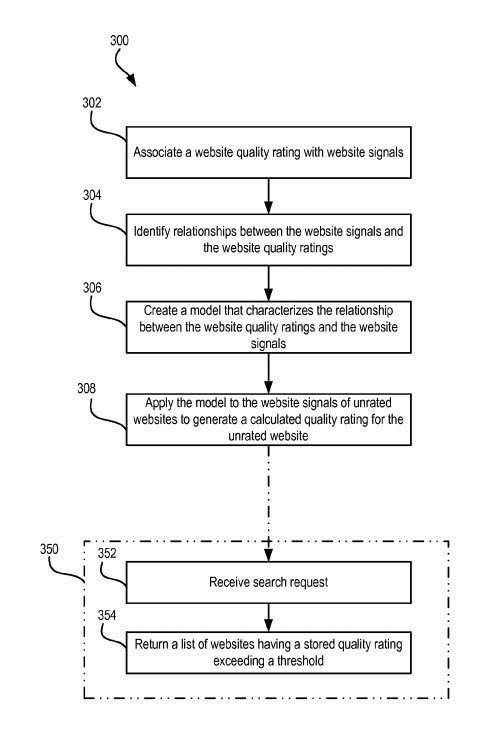

## Might Quality Ratings Influence Web Page Rankings?

Google was granted a patent this week that describes how web sites might be given quality ratings, based upon a model that looks at human ratings for a sample set of sites, and web site signals from those sites.

The patent tells us that the advantage of such a quality ratings approach would be to:

- Provide greater user satisfaction with search engines
- Return sites having a higher quality rating than a certain threshold
- Ranking sites appearing in search results based upon quality ratings
- Identifying quality sites without having a human view the site first

This patent was originally filed in 2008, and the use of quality ratings signals sounds similar to what Google has shared with us regarding the Panda Update. It’s more of a search quality “improvement” than a web spam penalty.

The patent uses blogs as a type of site that it can be applied to within its claims and description section. One of the inventors, Christopher C. Pennock was a Senior Software Engineer on Google Blog Search, according to an early 2009 SMX Session with him which discusses ranking signals in Blog Search.

## Quality Ratings Based On Webpage Factors

One aspect of this quality ratings approach is to have human raters rate the quality of pages of a site (all pages), scoring each on a scale of 1 to 5, with 1 being low and 5 being high quality, and aggregating those together for the site as a whole. Those quality ratings are augmented with factors from the web site such as:

- Originality of the arguments or information on the site
- Amount of original content versus copied content
- Layout of the site
- Correctness of grammar and spelling of the text on the web pages
- Whether obscene or otherwise inappropriate material is presented
- Whether the websites have blank or incomplete pages
- Other factors that would affect the quality of the site

These signals are very similar to ones that were published in the Google Webmaster Central blog post, [More Guidance on Building High-Quality Sites](https://webmasters.googleblog.com/2011/05/more-guidance-on-building-high-quality.html) from May of 2011. The post was aimed at explaining “how Google searches for high-quality sites,” by providing 23 sets of questions that someone at Google might ask themselves as they attempt to “write algorithms that attempt to assess site quality.”

This patent definitely doesn’t explain exactly how Google’s Panda update works, but the concepts behind it are similar in a number of ways. As Google notes in that blog post:

> Of course, we aren’t disclosing the actual ranking signals used in our algorithms because we don’t want folks to game our search results; but if you want to step into Google’s mindset, the questions below provide some guidance on how we’ve been looking at the issue

## Quality Ratings Patent

That might be the best way to approach this patent (and many other patents), enabling people to view the issue of presenting quality pages higher in search results from Google’s perspective. The patent is:

[Website quality signal generation](http://patft.uspto.gov/netacgi/nph-Parser?Sect1=PTO2&Sect2=HITOFF&p=1&u=%2Fnetahtml%2FPTO%2Fsearch-adv.htm&r=1&f=G&l=50&d=PALL&S1=08442984&OS=PN/08442984&RS=PN/08442984)
Invented by Christopher C. Pennock. Jeremy Hylton, Corinna Cortes
Assigned to Google
US Patent 8,442,984
Granted May 14, 2013
Filed March 31, 2008

Abstract

> Systems and methods relating to website quality rating are disclosed. Websites are rated, relationships between ratings and website signals are identified, models are generated and modeled ratings are assigned to unrated websites by applying the models to the website signals of the unrated websites.

## Other Human Rater Actions

When human raters look at pages, they also perform some other actions other than rating pages from 1 – 5.

One of those is to skip over some sites completely when URLs on the site show objectionable content such as spam or pornography or because pages from the site don’t load. These sites might be determined to be “invalid” for rating. In part, this categorization as “invalid” by raters can filter some sites from the rating process because there might be a bias on the part of the rater to negatively rank pages they personally find objectionable.

Another is to select a viewing appeal for the websites.

***Broad appeal*** – if the content of the site appeals to a broad segment of the population such as a website related to high profile national or world news events.

***Niche appeal*** – if the content of the site appeals to a very narrow subset of the population such as a website dedicated to electromagnetism.

The viewing appeal might be used as a factor to rank or filter sites presented in response to a search request. (The patent doesn’t tell us if “viewing appeal” is a positive or negative ranking signal, though.)

## Applying Quality Ratings to Blogs

The patent claims section does call out blogs as the types of sites that would be covered by this patent, but with the removal of a couple of short sentences, those claims could easily be applied to any kind of web site.

It’s quite possible that there’s a very similar patent filed by Google as the USPTO that explores how quality ratings signals may be applied to non-blog sites.

Google specifically points out things like click rate, blog subscription rate, and PageRank scores as web site signals that can be associated with a blog.

***Click Rate***– There might be two different click rates used here – the first involving how often a URL for the site was clicked upon when it appeared in general search engine results, and the second is the number of times a URL from the site was clicked upon in a blog search. The patent tells us:

> The click rate is a blog popularity indicator and therefore a potential quality indicator.

Instead of a raw number of clicks, these click rates might be defined as a ration of the number of clicks a page receives as opposed to the number of times it’s shown in search results. Those may also be normalized based upon the position that the page was at in results since a page at the top of results will probably be clicked upon more than one at the bottoms of results.

**Blog Subscription Rate** – Funny to see Google Reader listed as one possible source of information like this, though the patent tells us that Google might extract information like that from other sources as well. The importance of this information is explained here:

> Blog subscription rate is indicative of the quality of the blog because it is a measure of readership. A higher readership is indicative of a higher quality blog.

***PageRank Score*** – This score is another signal that might be used for blogs, and it would likely play a very similar role in building a quality rating as it may in ranking other types of pages on the Web.

## Quality Ratings Take Aways

The patent provides more details on how human ratings and signals from a website might be used to create a model for quality ratings that can help determine how pages are ranked in search results, using a machine learning approach to generate ratings for pages based upon the sample set of pages actually rated.

One thing I found really interesting was the patent’s description of when pages might be re-rated, or reclassified.

One possibility might be that pages would be re-rated on a periodic basis. That seems to have been what had been happening with Panda updates.

More interestingly though, is a different option, where re-rating a page or site might be triggered by some pre-defined change in web site signals:

> For example, if the PageRank score associated with a website varies by a defined percentage (e.g., 10%) then the process can be triggered to update the model that characterizes the relationships between the website signals and the website quality ratings.

With Panda updates in the past, Google was providing warnings of when data might be “refreshed,” presumably meaning that sites impacted might be re-classified based upon periodic updates. In March, Google stated that Panda updates would [happen in an ongoing process](https://searchengineland.com/google-panda-to-be-integrated-into-the-search-algorithm-panda-everflux-151528) instead.

Does Panda work like the process described in this patent for determining quality ratings for pages? Does this mean that those Panda updates may now be triggered by something like a certain level of improvement in a quality signal, like PageRank, that might set off an update for a site?

If so, a site that’s been negatively impacted from an upgrade such as Panda might have to improve in terms of quality signals such as PageRank above a certain threshold to be rated again in a way that might improve its quality ratings.

I’ve written a few posts about patents involving quality scores for organic SEO:

- 6/14/2011 – [Google’s Quality Score Patent: The Birth of Panda?](https://www.seobythesea.com/2011/06/googles-quality-score-patent-the-birth-of-panda/)
- 12/9/2012 = [How Google May Identify Navigational Queries and Resources](https://www.seobythesea.com/2012/12/navigational-queries-resources/)
- 5/15/2013 – [How Google May Rank Web Pages Based on Quality Ratings](https://www.seobythesea.com/2013/05/google-rank-sites-quality-ratings/)
- 5/12/2015 – [How Google May Calculate a Site Quality Score (from Navneet Panda)](https://www.seobythesea.com/2015/05/google-site-quality-scores/)
- 6/22/2015 – [How Google May Classify Sites as Low Quality Sites](https://www.seobythesea.com/2015/06/how-google-may-classify-sites-as-low-quality-sites/)
- 7/30/2018 – [Quality Scores for Queries: Structured Data, Synthetic Queries and Augmentation Queries](https://www.seobythesea.com/2018/07/quality-scores-for-queries/)
- 9/21/2017 – [Using Ngram Phrase Models to Generate Site Quality Scores](https://www.seobythesea.com/2017/09/site-quality-scores/)
- 6/10/2019 – [How Google May Rank Some Results based on Categorical Quality](https://www.seobythesea.com/2019/06/categorical-quality/)

Last Updated June 27, 2019.
