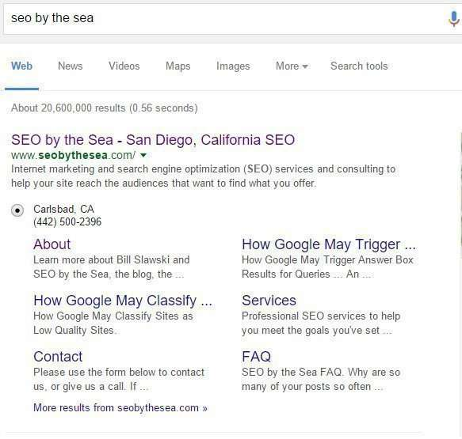
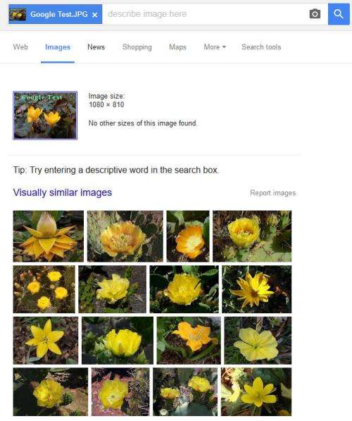
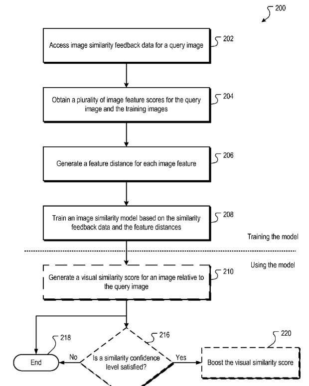

## Googlebot Doesn’t Read Text in Images During Web Crawls Or Does it?

When I was an Administrator at Cre8asiteforums (2002-2007), one of my favorite forums on the site was one called the Website Hospital. People would come with their sites and questions about how they could improve them. One problem that often appeared was people having problems being found in search results for their sites for geographically related queries. One symptom for many sites experiencing that problem was that the only time the address of their business appeared on the site was in pictures of text, rather than actual text. This can be a problem when it comes to Google indexing that information. Google tells us they like text, and can have troubles indexing content found within images:

> Most search engines are text-based. If you use JavaScript, DHTML, images, or rich media such as Silverlight to create navigation and links, Googlebot and other spiders may have trouble crawling your site.

Google’s web crawler couldn’t read pictures of text, and Google wasn’t indexing that location information for their sites’ because of that. Site owners were often happy to find out that they just needed to include the address of their business in text so that Google could crawl and index that information, and make it more likely that they could be found for their location.

Another place that people sometimes use images of text instead of actual text is in navigation links on their pages. Since Googlebot can’t read the text in those navigation links, those pages sometimes don’t have Site links appear for them in search results. Google doesn’t use alt text that might be associated with those images to generate a sitelinks for a site.

The last patent I’ve seen about site links was [How Google May Choose Sitelinks in Search Results Based upon Visual or Functional Significance (Updated)](https://www.seobythesea.com/2015/06/how-google-may-choose-sitelinks-in-search-results-based-upon-visual-or-functional-significance/) I noted in my post that the patent says that it might use OCR to read text in images, but that I had checked many sites, and wasn’t seeing Google do that. Here are the site links that show up on a search for “SEO by the Sea”

_Site Links for SEO by the Sea_

I had some hope over the years that Google might get better at indexing text that appeared within links, watching some things like the following happen:

(1) Google acquired [Facial and object recognition company Nevenvision](https://www.seobythesea.com/2006/08/google-acquires-neven-vision-adding-object-and-facial-recognition-mobile-technology/) in 2006, and a few other companies that can recognize images.

(2) In 2007, [Google was granted a patent that used OCR](https://www.seobythesea.com/2007/06/better-business-location-search-using-ocr-with-street-views/) (Optical Character Recognition) to check upon the postal addresses on business listings, to verify those businesses in Google Maps.

(3) Google was [granted a similar patent in 2012](https://www.seobythesea.com/2012/10/googles-streetviews-cars-learn-to-read/) that read signs in buildings in Street Views images.

(4) In 2011, [Google published a patent application that used a range of recognition features](https://www.seobythesea.com/2011/02/the-future-of-googles-visual-phone-search/) (object, facial, barcodes, landmarks, text, products, named entities) focusing upon searching for and understanding visual queries, which looks like it may have turned into the application for [Google Goggles](https://en.wikipedia.org/wiki/Google_Goggles), which came out in September of 2010 – the visual queries patent was filed by Google in August 2010, the nearness in time with the filing of the patent and the introduction of Google Goggles reinforces the idea that they are related.

But, Googlebot still doesn’t seem to be able to read text in images for purposes of indexing addresses or to read images of text used in navigation. I added the text “Google Test” to the following image and then ran it through a reverse image search at Google. The images returned were similar looking, but none of them had anything to do with the text I added to the image.

_Visually similar images, but for the ‘google test’ text_

We know now that Google had been working upon a [Query Image Search](http://patft.uspto.gov/netacgi/nph-Parser?Sect1=PTO1&Sect2=HITOFF&d=PALL&p=1&u=%2Fnetahtml%2FPTO%2Fsrchnum.htm&r=1&f=G&l=50&s1=9,053,115.PN.&OS=PN/9,053,115&RS=PN/9,053,115) and has offered a Reverse Image Search since the summer of 2011. Here’s a flow chart from that patent:

_Flow Chart from the Visual Query patent_

## The Future of Search is in Visual and Spoken Queries

So I’ve been asking myself when Google might start looking at the text on images, and in navigation, and reading that text and indexing it. Google has taken some other interesting steps involving visual queries and image recognition, and it appears that they have some competition.

A couple of months ago, I read a Fast Company article that shows how important it might be for Google to get better at indexing and retrieving images, in [Inside Baidu’s Plan To Beat Google By Taking Search Out of the Text Era](https://www.fastcompany.com/3035721/baidu-is-taking-search-out-of-text-era-and-taking-on-google-with-deep-learning). I thought about how Google was doing in searches for images.

I found the following patents and thought they were worth sharing:

[Method and apparatus for automatically annotating images](https://patents.google.com/patent/US8065313) – This one searches for similar images, and when it finds them, it may then use text associated with those similar images to create an annotation for the image originally searched upon.

[Clustering Queries For Image Search](https://patents.google.com/patent/US20150169725) – An image search may be performed to find similar images; the results of that search may be pre-grouped or classified based upon visual and semantic similarity and clustered together into clusters. Each of the clusters may be associated with search terms that might be associated with them to use as an annotation.

Even more impressive was this whitepaper from Google, which showed them making gains they had never quite reached before in recognizing different types of faces:

[Building High-level Features Using Large Scale Unsupervised Learning](http://static.googleusercontent.com/media/research.google.com/en//archive/unsupervised_icml2012.pdf) (pdf)

I am hoping for some changes at Google, after seeing a patent that says that Google is aiming at being able to perform searches of images of documents and return matching results, where the text on the document being queried goes through OCR (Optical Character Recognition), and the words from the document are searched for to find matching documents on the Web (images of documents), which would mean that Google would start indexing images of text on the Web.

If it does that, Google might also start using images of addresses as the locations of the businesses that those appear upon as text. It also might start understanding text in images in navigation, and creating site links where it wouldn’t before.

The patent is:

[Identifying matching canonical documents in response to a visual query](http://patft.uspto.gov/netacgi/nph-Parser?Sect1=PTO1&Sect2=HITOFF&d=PALL&p=1&u=%2Fnetahtml%2FPTO%2Fsrchnum.htm&r=1&f=G&l=50&s1=9,183,224.PN.&OS=PN/9,183,224&RS=PN/9,183,224)

Invented by: David Petrou, Ashok C. Popat, and Matthew R. Casey
Assigned to: Google
US Patent 9,183,224
Granted November 10, 2015
Filed: August 6, 2010

Abstract

> A server system receives a visual query from a client system. The visual query is an image containing text such as a picture of a document.
>
> At the receiving server or another server, optical character recognition (OCR) is performed on the visual query to produce text recognition data representing textual characters. Each character in a contiguous region of the visual query is individually scored according to its quality.
>
> The quality score of a respective character is influenced by the quality scores of neighboring or nearby characters.
>
> Using the scores, one or more high-quality strings of characters are identified. Each high-quality string has a plurality of high-quality characters. A canonical document containing one or more high-quality textual strings is retrieved. At least a portion of the canonical document is sent to the client system.

## Take-Aways

The claims section of this patent focuses primarily upon matching text from an image of a document with text on pictures of that document across the web. The description section of the patent provides a broader reading of it, where a document might also contain images of an object, of people’s faces, of entities and other things that it may try to match up between a visual query and a document on the Web.

The description of this visual queries patent shows a search system that might contain a lot of different visual recognition approaches, like the one I mentioned above that was possibly used for Google Goggles.

This patent does tell us how it might use named entity recognition as part of its process:

> In some embodiments, named entity recognition occurs as a post-process of the OCR search system, wherein the text result of the OCR is analyzed for famous people, locations, objects and the like, and then the terms identified as being named entities are searched in the term query server system (118, FIG. 1). In other embodiments, images of famous landmarks, logos, people, album covers, trademarks, etc. are recognized by an image-to-terms search system. In other embodiments, a distinct named entity query-by-image process separate from the image-to-terms search system is utilized.
>
> The object-or-object category recognition system recognizes generic result types like “car.” In some embodiments, this system also recognizes product brands, particular product models, and the like, and provides more specific descriptions, like “Porsche.” Some of the search systems could be special user-specific search systems. For example, particular versions of color recognition and facial recognition could be a special search system used by the blind.

Matching a visual query with a named entity could mean that search results could be returned quicker to searchers since if they are identified, they could be associated with an identifier, where other documents with the same-named entity have already been marked with that identifier See: [Google Gets Smarter With Named Entities: Acquires MetaWeb](https://www.seobythesea.com/2010/07/google-gets-smarter-with-named-entities-acquires-metaweb/).

I’m hoping that Google solves the “text as images” problem for addresses and site navigation. They are problems that have hurt a lot of sites.
