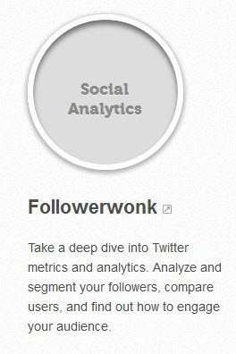
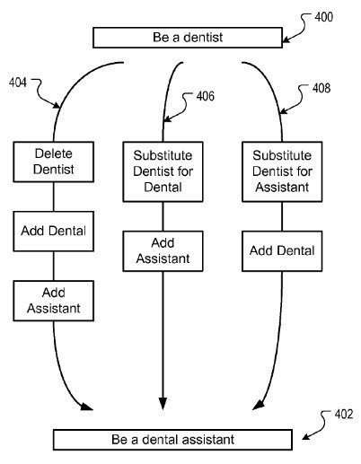

## Can Query Session Co-occurrence Help a Search Engine Rewrite Queries?

When you search, especially for topics that you know little about, chances are that you might not include the most relevant terms in your query, or you might use words that may have ambiguous meanings.

One of the areas where search engines focus a lot of attention upon is in rewriting queries through query suggestions and query expansion to help searchers better meet their situational and informational needs quickly.

!["Google query suggestions on a search for \[find airedale terrier puppies\]"](media/google-edit-distances-6.jpg)

When you search, you might see many query suggestions at the bottom of the results that were first returned, like the ones above on a search for [find airedale terrier puppies]. Or a search engine might include synonyms or [substitute queries](https://www.seobythesea.com/2013/08/google-substitute-query-terms-co-occurrence/) to expand your original query.

Search engines will sometimes also expand the query terms used to return advertisements that might be relevant to your search as well.
Google published a patent application recently that explores how to possibly make it easier to find what you are looking for by offering more when it comes to:

- Generating query suggestions
- Keyword suggestions
- Query expansions
- Keyword expanded matches

Query session co-occurrence is definitely worth looking into in more depth.

## Query Session Co-Occurrence

Query session co-occurrence involves looking at user query sessions to find words that co-occur within query sessions, especially when those queries are consecutive to each other. For example, someone searches for “find airedale terrier puppies,” and then follows up that search with another for “find airedale terrier puppies for sale.” There’s a pretty high confidence level that the two searches are related based upon the co-occurring words within them, and the fact that they are consecutive searches. If a lot of searchers perform similar searches within query sessions, there is a strong relationship between the two queries. This query session co-occurrence provides hints about what people might be looking for during searches.

I’ve written about co-occurrence in the past when it comes to queries that might share co-occurring words [within their sets of search results](https://www.seobythesea.com/2012/11/ranking-webpages-relationships-co-occurrence-patent/). I’ve been seeing several blog posts that equate co-occurrence with co-citation, and they are [not the same thing](http://www.iacquire.com/blog/its-not-co-citation-but-its-still-awesome).

I’ve also seen claims that when certain words tend to appear on pages near brand names and or links to pages, that is considered co-occurrence and it can impact the rankings of those brands and/or URLs. That’s just not how co-occurrence is used in search engine rankings – the observations that led to such a conclusion could easily involve a search engine looking not just at the anchor text in links, but also the words that might appear in a window around the anchor text near a link as well.

## Co-Occurrence Found in Links

For example, in the following screenshot, “Followerwonk” is a link, and the words “Twitter metrics and analytics” appear near the link. Under an incorrect application and analysis of co-occurrence, Google might associate those words with “Followerwonk”. It’s much more likely that Google is associating some of the words around the link itself with the destination page that the link is pointing to, such as a “window” of 25 words around the link.

This patent looks for query session co-occurrence of words within search sessions instead of on web pages or within search results for particular queries.

In many ways, this patent seems similar to a patent I wrote about very recently, which looked at [relationships between search entities](https://www.seobythesea.com/2013/08/relationships-search-entities/), and it shares some similarities, but it also digs a little deeper into relationships and probabilities between query terms that show up in search sessions.

## Benefits of Query Session Co-Occurrence

The patent tells us that the benefit of using the query session co-occurrence process described within the patent can help with the following:

- Query suggestions incorporate information-theoretical interpretations of taxonomic relations such as specification and generalization (how queries might be related to smaller categories and larger categories).
- Query results may be improved though query substitution, and query rewriting.
- Related keywords may be identified.
- The relevance of advertisement delivered to users may be improved.
- Query classification can be improved.
- Query completions may be improved to reflect semantic similarities between entered terms and suggested completions.
- Query suggestions may be adapted to match user intent in terms of generalization or specialization.

## Edit Distances in Query Session Co-Occurrence

> Successful refinements are closely related to the original query. This is not surprising as reformulations involve spelling corrections, morphological variants, and tend to reuse parts of the previous query. More precisely, reformulations are close to the previous query both syntactically, as sequences of characters or terms, and semantically, often involving transparent taxonomic relations. As an example, for the query \becoming a dentist”, the reformulation \becoming an oral surgeon” might have a higher chance of producing relevant results than \becoming a doctor”

~ [Generalized Syntactic and Semantic Models of Query Reformulation](http://static.googleusercontent.com/media/research.google.com/en/us/pubs/archive/36337.pdf)

Query terms that might be similar are selected in part on how closely they might be related semantically. For example, It’s much more likely to see “become a dentist” followed by a query for “become a dental assistant,” instead of being followed by “become a doctor.” in a set of query sessions. We’ll likely see people change their queries in such a manner when they are performing searches in a search session.

In addition to this kind of semantic relationship, we might also look at how queries are physically transformed when searchers make changes to them as well. We can look at how this is done with physical changes to the words within a query or changes to the terms themselves.

For instance, when someone finishes a query for “become a dentist,” they might then keep the first two words the same, and change “dentist” to “dental,”, which means removing “ist” and adding “al” and add the term “assistant. This isn’t a big change in terms of an “edit distance” from one query to the other.

The patent explores the cost of changing one query to another with changes to strings of letters and/or the addition or removal of terms.

This combination of close co-occurrence values found in consecutive (or near consecutive) queries within a query session, and measuring edit distances between query terms to find smaller edit distances provides a framework for terms that might be near in meaning (semantics) and near in edit distance (or syntactically).

The query session co=occurrence patent is:

[Generalized Edit Distance for Queries](http://appft.uspto.gov/netacgi/nph-Parser?Sect1=PTO1&Sect2=HITOFF&d=PG01&p=1&u=%2Fnetahtml%2FPTO%2Fsrchnum.html&r=1&f=G&l=50&s1=%2220130226950%22.PGNR.&OS=DN/20130226950&RS=DN/20130226950)
Invented by Massimiliano Ciaramita, Amac Herdagdelen, and Daniel Mahler
US Patent Application 20130226950
Published August 29, 2013
Filed: April 3, 2013

Abstract

> Methods, systems, and apparatus, including computer programs encoded on a computer storage medium, for determining a generalized edit distance for queries.
>
> In one aspect, a method includes selecting query pairs of consecutive queries, each query pair being a first query and a second query consecutively submitted as separate queries, each first and second query including at least one term. For each query pair, the method includes selecting term pairs from the query pair, each term pair being a first term in the first query and a second term in the second query; and determining a co-occurrence value for each term pair.
>
> The method also includes determining transition costs based on the co-occurrence values for term pairs, each transition cost indicative of a cost of transitioning from the first term in the first query to a second term in a second query consecutive to the first query.

I’ve written a few posts about synonyms in search. Here are some of those:

- 2/19/2006 – [Multi-Stage Query Processing at Google](https://www.seobythesea.com/2006/02/google-looks-at-multi-stage-query-processing/)
- 5/25/2007 – [Refining Queries Using a Local Category Synonym](https://www.seobythesea.com/2007/05/refining-queries-using-category-synonyms-for-local-and-other-searches/)
- 12/29/2008 – [How a Search Engine Might Use Synonyms to Rewrite Search Queries](https://www.seobythesea.com/2008/12/how-a-search-engine-might-find-synonyms-to-use-to-expand-search-queries/)
- 1/23/2009 – [Google to Expand Language Search and Shrink Our World?](https://www.seobythesea.com/2009/01/search-engines-to-expand-language-search-and-shrink-our-world/)
- 6/29/2009 – [Semantic Relations from Query Logs](https://www.seobythesea.com/2009/06/query-logs-and-the-slang-of-the-web/)
- 12/22/2009 – [Google Search Synonyms Are Found in Queries](https://www.seobythesea.com/2009/12/how-google-may-expand-searches-using-synonyms-for-words-in-queries/)
- 1/19/2010 – [Google Synonyms Update](https://www.seobythesea.com/2010/01/google-synonyms-update/)
- 1/27/2010 – [Paid Search Results and Query Expansion using Synonyms and Related Concepts](https://www.seobythesea.com/2010/01/paid-search-results-and-query-exansion-using-synonyms-and-related-concepts/)
- 2/16/2011 – [More Ways Search Engine Synonyms Might be Used to Rewrite Queries](https://www.seobythesea.com/2011/02/more-ways-a-search-engine-might-identify-synonyms-to-expand-queries-with/)
- 8/12/2013 – [How Google May Substitute Query Terms with Co-Occurrence](https://www.seobythesea.com/2013/08/google-substitute-query-terms-co-occurrence/)
- 9/27/2013 – [The Google Hummingbird Patent?](https://www.seobythesea.com/2013/09/google-hummingbird-patent/)
- 12/8/2013 – [How Google May Rewrite Queries](https://www.seobythesea.com/2013/12/rewrite-search-terms/)
- 9/9/2013 – [How Google May Reform Queries Based on Co-Occurrence in Query Sessions](https://www.seobythesea.com/2013/09/google-reform-queries-based-co-occurrence-query-sessions/)
- 10/15/2013 – [Google’s Hummingbird Algorithm Ten Years Ago](https://www.seobythesea.com/2013/10/googles-hummingbird-algorithm-ten-years-ago/)
- 12/21/2015 = [How Google Might Make Better Synonym Substitutions Using Knowledge Base Categories](https://www.seobythesea.com/2015/12/how-google-might-make-better-synonym-substitutions-using-knowledge-base-categories/)

Last Updated July 4, 2019.
