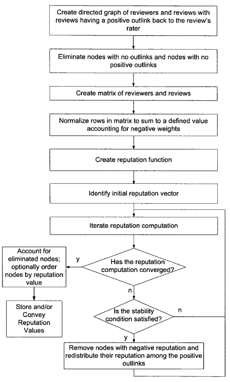

You’ve likely seen reviews of businesses in Google Maps, and Seller Ratings in Froogle for merchants. For a few products listed in Google Reviews, such as MP3 players, you will also see [product reviews](https://www.google.com/search?tbm=shop&q=mp3+players&gws_rd=ssl).

I’ve written previously about the [Growing power of online reviews](https://www.seobythesea.com/2006/09/the-growing-power-of-online-reviews/), and wrote a detailed breakdown of a Google patent application on how they may [find and aggregate online reviews](https://www.seobythesea.com/2006/06/innovating-product-reviews-at-google/).

That patent application left a lot of questions unanswered about topics such as how reviews are ranked and valued. Google has had five new patent applications published which look like they might answer some of those questions, with some interesting insights.

- [Systems and methods for reputation management](http://appft1.uspto.gov/netacgi/nph-Parser?Sect1=PTO1&Sect2=HITOFF&d=PG01&p=1&u=%2Fnetahtml%2FPTO%2Fsrchnum.html&r=1&f=G&l=50&s1=%2220070078699%22.PGNR.&OS=DN/20070078699&RS=DN/20070078699)
- [Selecting high quality reviews for display](http://appft1.uspto.gov/netacgi/nph-Parser?Sect1=PTO1&Sect2=HITOFF&d=PG01&p=1&u=%2Fnetahtml%2FPTO%2Fsrchnum.html&r=1&f=G&l=50&s1=%2220070078670%22.PGNR.&OS=DN/20070078670&RS=DN/20070078670)
- [Selecting representative reviews for display](http://appft1.uspto.gov/netacgi/nph-Parser?Sect1=PTO1&Sect2=HITOFF&d=PG01&p=1&u=%2Fnetahtml%2FPTO%2Fsrchnum.html&r=1&f=G&l=50&s1=%2220070078669%22.PGNR.&OS=DN/20070078669&RS=DN/20070078669)
- [Selecting high quality text within identified reviews for display in review snippets](http://appft1.uspto.gov/netacgi/nph-Parser?Sect1=PTO1&Sect2=HITOFF&d=PG01&p=1&u=%2Fnetahtml%2FPTO%2Fsrchnum.html&r=1&f=G&l=50&s1=%2220070078671%22.PGNR.&OS=DN/20070078671&RS=DN/20070078671)
- [Identifying clusters of similar reviews and displaying representative reviews from multiple clusters](http://appft1.uspto.gov/netacgi/nph-Parser?Sect1=PTO1&Sect2=HITOFF&d=PG01&p=1&u=%2Fnetahtml%2FPTO%2Fsrchnum.html&r=1&f=G&l=50&s1=%2220070078845%22.PGNR.&OS=DN/20070078845&RS=DN/20070078845)

A mix of reputation scores and quality scores may determine which reviews are used to rank products and merchants and businesses and which are shown to people interested in reviews. The patents also describe how snippets are chosen, and how reviews may be clustered together. I’m going to focus upon the quality scores of reviews with this post, which I think are the most accessible and interesting aspects of these patent applications.

**Quality Scores**

Reviews for a subject are identified, but not all of them may be shown. identified reviews are selected based on predefined quality criteria. The selection may also be based on zero or more other predefined criteria. A response that includes content from the selected reviews is generated. The content may include the full content or snippets of at least some of the selected reviews.

Based upon the quality of the content of the review, these scores enable reviews to be compared against each other. A number of pre-defined factors may be looked at to calculate these scores, such as:

- Grammatical quality of the review,
- Length of the review,
- Lengths of sentences in the review,
- Values associated with words in the review,
- Age of review
- Review sources, and;
- Objectionable content.

**Grammatical Quality:**

Reviews using proper grammar and capitalization are favored (they are more readable).

In addition to looking for things like periods in the review, to see if sentences are being used, some additional indications of grammatical quality might be looked for, such as:

- Subject-verb agreement,
- Absence of run-on sentences or fragments, and;
- so forth.

A grammar checker might be used.

*Length of the review*

Too short, and a review is uninformative. Too long, and the review isn’t as readable as a shorter one. Might be measured by looking at:

- Word Count
- Character Count
- Sentence Count

It could be based upon a difference between the length of the review and a predefined “optimal” review length.

*Sentence Length*

A preference for reasonable lengthed sentences rather than extremely long or extremely short sentences. This score could be based upon the difference between the lengths of sentences in a review, and some predefined “optimal” sentence length.

*Values associated with words in a review – frequencies and dictionaries*

If you look through the reviews at Froogle, you’ll notice that you can look at reviews that use “Frequently mentioned terms.” The terms used in reviews are looked at carefully. Reviews with high-value words are favored over reviews with low-value words.

Word values could be based on the inverse document frequency (IDF) values associated with the words, with high IDF values considered to be more “valuable.”

Take the number of reviews, and divide it by the number of reviews where the word occurs at least once, and that will tell you the IDF (Inverse Document Frequency) of the word.

Instead of calculating an IDF based upon all of the collected reviews, the IDF might be based upon the number of reviews in different subject types based upon the thought that “words that are valuable in reviews for one subject type may not be as valuable in reviews for another subject type.” This number may be used along with the number of times a word appears within the individual review (a term frequency) to calculate a score for the review based upon the value of the word.

Word values could also be determined by looking at a predefined dictionary of words that are deemed valuable in the context of a review. There could be different dictionaries for different subject types.

A score could be calculated by the number of times that words from the predefined dictionary are included within the review.

*Age of Review*

The age of a review might be considered in the quality score. Newer reviews might be favored as being reflective of more recent experience with the review subject.

*Review Sources*

The sources of reviews may play a role in which reviews are presented.

While reviews are selected based upon quality scores, they could be chosen from all of the sources or on a per-source basis. Instead of looking at all reviews, a number of the highest-scoring from each source might be chosen instead.

*Objectionable content*

Offensive or objectionable content might be defined beforehand in a dictionary, and reviews that contain profanity or sexually explicit language could be eliminated from consideration for selection.

**Reputation Scores**

Reputation scoring is described in an analogy to PageRank, and a couple of passages in that patent and one of the images provide a glimpse of how this might work:

> Reputations are distributed among raters and their reviews. Preferably, raters in the system who write reviews which are rated highly by several raters should have good reputations, and raters who write reviews that are rated poorly by other raters should have poor reputations.
>
> **Spammers**
>
> However, spammers may attack the system in various ways. Some may flood the system in an attempt to increase their reputations while others may attempt to lower the reputations of their competitors or enemies.
>
> One technique to address this concern provides for the reputation score of a rater who writes well-rated reviews to also depend on the reputation of the raters who rated their reviews highly. Similarly, a rater who writes reviews that are poorly rated should not be penalized as much if the poor reviews come from raters with a low reputation as if they come from those with strong reputations.

I found this flowchart helpful in understanding this reputation scoring process as well:

**Snippets**

The decision-making process of what snippets to show is interesting and makes me wonder how similar it might be to the process of showing snippets in the presentation of search results in Google’s web search.

The whole content of a review or just a snippet may be presented to people looking at reviews.

Quality scores for each sentence of a review may be determined, and that process is similar to the quality scoring for the whole review that I described above. The position of the sentence in the review may also be considered, with sentences at the beginning of the review being favored. More than one sentence may be shown, and the patent discusses how additional consecutive sentences might be added while remaining within the ideal (or maximum) snippet length.

**Conclusion**

The description text in the last four patent applications is pretty much the same from one to the other, but the claims listed and the summaries are different. If you want to go through those carefully, it can help to look around at how reviews are used in Froogle for a while first, so that you have some idea of the kinds of things that they are describing.

The exact processes described in these patent applications may differ from what is being used in Froogle, but the ideas behind some of them may help understand how reviews can be identified and ranked and excluded.

It’s hard to tell if the processes involved in these patent applications are used for reviews in Google Maps, but the ideas of reputation and quality scores might be, as well as how snippets are created for those reviews.
