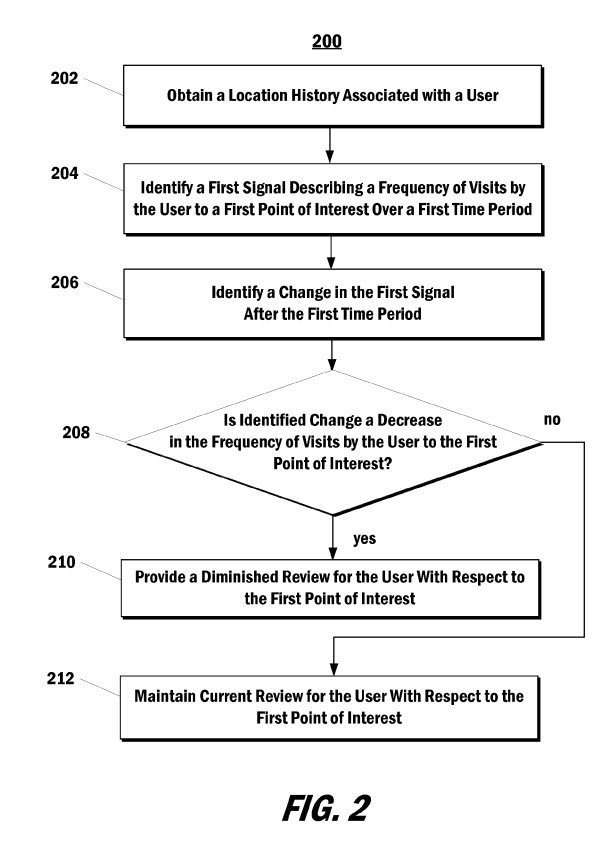

## How Google May Diminish Reviews Based on Location History

I am not paranoid, but after many Google patents, I’ve been thinking of my phone as my Android tracking device. It looks like Google thinks of phones the same way, paying a lot of attention to a person’s location history. So after a recent patent, I’m fine with Google looking at my location history and reviews that I write, even without any financial benefit. When I review a business at Google, it’s because I’ve either liked that place or didn’t and wanted to share my thoughts with others.

A Google patent application filed and published by the search engine, but not yet granted, is about reviews of businesses.

It tells us about how Google might diminish reviews for businesses because of location history.

> Furthermore, once a review platform has accumulated a significant number of reviews, it can be a useful resource for users to identify new entities or locales to visit or experience. For example, a user can visit the review platform to search for a restaurant to eat, a store at which to shop, or a place to have drinks with friends. The review platform can provide search results based on location, quality according to the reviews, pricing, and/or keywords included in textual reviews.

But, there are problems with Google reviews that this patent sets out to address and assist with:

> However, one problem associated with review platforms is collecting a significant number of reviews. For example, many people do not take the time to visit the review platform and contribute a review for each point of interest they visit throughout a day.
>
> Furthermore, even after a user contributes a review, the user’s opinion of the point of interest may change, rendering the contributed review outdated and inaccurate. For example, a restaurant for which the user previously provided a positive review may come under new ownership or experience a change in kitchen staff that causes the restaurant’s quality to decrease. As such, the user may cease visiting the restaurant or otherwise decrease the frequency of visits. However, the user may not take the time to return to the review platform and update their review.

The patent does have a solution to Google reviews that don’t get updated – if a person stops going to a place they have reviewed in the past, Google may diminish reviews for such businesses:

> Thus, a location history associated with a user can provide one or more signals that indicate an implied review of points of interest. Therefore, systems and methods for using user location information to provide reviews are needed. In particular, systems and methods for how Google may diminish reviews for a point of interest when a frequency of visits by one or more users to the point of interest decreases are desirable.

The pending patent application is at:

[User Location History Implies Diminished Review](http://appft.uspto.gov/netacgi/nph-Parser?Sect1=PTO1&Sect2=HITOFF&d=PG01&p=1&u=%2Fnetahtml%2FPTO%2Fsrchnum.html&r=1&f=G&l=50&s1=%2220170358015%22.PGNR.&OS=DN/20170358015&RS=DN/20170358015)
Inventors: Daniel Victor Klein and Dean Kenneth Jackson
US Patent Application 20170358015
Published: December 14, 2017
Filed: April 7, 2014

Abstract

> Systems and methods for providing reviews are provided. One example system includes one or more computing devices. The system includes one or more non-transitory computer-readable media storing instructions that can cause one or more computing devices to perform operations when executed by one or more computing devices. The operations include identifying, based on a location history associated with a user, a first signal. The first signal comprises a frequency of visits by the user to a first point of interest over a first period. The operations include identifying, based on the location history associated with the user, a change in the first signal after the first period. The operations include providing a diminished review for the user concerning the first point of interest when the identified change comprises a decrease in the frequency of visits by the user to the first point of interest.

Some highlights on how Google may diminish Reviews from the patent description:

> 1. Location updates can be received from more than one mobile device associated with a user to create a location history over time.
>
> 2. Points of interest can be tracked and cover an extensive range of place types, or a point of interest such as a shopping mall may be treated as a single point of interest.
>
> 3. A person may control what information is collected about their location and be given a chance to modify or update it.
>
> 4. Not visiting a particular place may lead to an assumption that a “user’s opinion of the point of interest has diminished or otherwise changed.”
>
> 5. Google may diminish reviews by making a review of a negative review or lower a review score.
>
> 6. A reviewer may also be asked to “confirm or edit/elaborate on the previously contributed review” if they don’t return to a place they have reviewed in a while.
>
> 7. User-contributed reviews could be said to have a decay period, in which their influence on search or rating systems wanes.”
>
> 8. Other factors besides a change of opinion about a place may be considered, such as a change of residence or workplace to a new location or an overall change in visitation patterns for all points of interest. These types of changes may not lead to a diminished review.
>
> 9. Aggregated frequencies of visits from many people may be considered, and if many continue to visit a place, then a change by one person may not be used to reduce an overall score for a place. If many people show a decrease, then an assumption that something has changed with the point of interest could affect the overall score.
