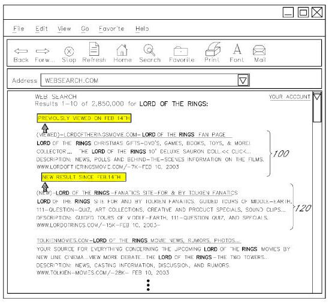

## Search Results Annotations at Google

Google’s web search results have gone through a number of transformations over the years, from the additions of images and maps and videos and other kinds of results from Google’s vertical search repositories to an autocomplete dropdown of query refinement suggestions. Google has shown a link to a cached copy of many pages for years, in case a page you’re trying to visit isn’t presently available. Google introduced thumbnail previews that you can start seeing if you click upon a magnifying glass next to one of the results. Google is also showing other search results annotations.

If you’re logged into your Google Account, you can see other information in Google search results as well. It’s quite likely that Google will continue to experiment with other information that you might be able to see in search results as well.

A patent application published by Google this week explores some additional search results annotations that you might be able to see, such as whether or not you’ve previously visited a specific page and possibly the date of your last visit, how many times you’ve visited the page, and the queries that you used to find the page, if they are different from the query you used to see the page this time in search results. In addition to displaying informative search results annotations, Google might also provide you with some options such as the ability to only see pages that you haven’t visited before during a particular search or only the pages that you have seen.

Google allows you to restrict your searches to specific sites using a special “site” search operator like this [site:www.example.com], and will also sometimes provide links in search results during searches without the use of special site operator where you can see “more results” from the same domain.

Imagine if Google provided options within the search results for that specific domain to restrict the results you see to pages that you’ve previously viewed, or pages that you haven’t see yet, or pages that you’ve viewed within a specific period of time, such as the last 7 days.

So for instance, on an auction site, Google might annotate search results to tell you which of the auctions listed you’ve seen before, when you viewed them, and even if you’ve submitted a bid on one of those auctions. Likewise, for results on a forum site or blog, the search results might tell you when you visited specific forum threads or blog posts.

The search results annotations patent filing is:

[Search Annotation and Personalization Services](http://appft.uspto.gov/netacgi/nph-Parser?Sect1=PTO1&Sect2=HITOFF&d=PG01&p=1&u=%2Fnetahtml%2FPTO%2Fsrchnum.html&r=1&f=G&l=50&s1=%2220110208711%22.PGNR.&OS=DN/20110208711&RS=DN/20110208711)
Invented by Taylor N. Van Vleet, Yu-Shan Fung, Ruben Ortega, Udi Manber
US Patent Application 20110208711
Published August 25, 2011
Filed: April 29, 2011

Abstract

> Various features are disclosed for storing and providing access to event data reflective of user-generated events, including events associated with search query submission of users. One such feature enables users to annotate search results, to later recall and view these annotations, and to publish the annotations to other users.
>
> Another feature involves recording event data reflective of search result viewing events of users, and using this event data to personalize search results pages for particular users.

The patent goes into a great amount of detail on how such a search results annotation system might work, including information about the collection of usage information in search results such as mouse-clicks, mouse-overs, impressions for specific pages, times and queries associated with those actions, and more.

One interesting aspect of this invention is that it provides searchers with the ability to share their annotations with other searchers as well.

**Conclusion**

It’s been an interesting week at SEO by the Sea, with an earthquake centered about 60 miles south of here shaking things up earlier in the week, and a possible visit from Hurricane Irene this weekend. This is one time when I’m actually happy that SEO by the Sea isn’t as close to the sea as it has been in the past.

We’re likely to see Google continue to experiment with many different additions to search results in the future, and different capabilities that searchers might be able to take advantage of.

I think it would be great to be able to see annotations about pages and sites that I’ve visited previously in search results. We’re seeing Google add some features to search results as part of Google Plus, such as the ability to share pages that you plus with others and post about them on Google Plus – see [Doing more with the +1 button, more than 4 billion times a day](https://googleblog.blogspot.com/2011/08/doing-more-with-1-button-more-than-4.html).

Google has also created some new HTML markup that you can add to pages on your site that might be used when people share content from your pages, which they describe on the Google Webmaster Central blog in [Making the most of improvements to the +1 button](https://webmasters.googleblog.com/2011/08/making-most-of-improvements-to-1-button.html).

These new additions make it clear that Google is interested not only in annotations on search results but also in social annotations for pages that potentially may become visible within search results as well as on their social network.
