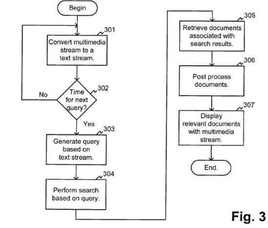

Google was granted a patent last week that looks like it might have been among the company’s earliest patents filed. It involves showing television programs (News Programs to be more exact) and showing web pages relevant to the transcripts of the shows being presented to viewers in a second screen set.

The details of this recently granted version of the patent filed are:

[Finding web pages relevant to multimedia streams](http://patft.uspto.gov/netacgi/nph-Parser?Sect1=PTO2&Sect2=HITOFF&p=1&u=%2Fnetahtml%2FPTO%2Fsearch-adv.htm&r=1&f=G&l=50&d=PALL&S1=08868543&OS=PN/08868543&RS=PN/08868543)
Invented by Monika H. Henzinger, Bay-Wei Chang, and Sergey Brin
Assigned to Google Inc.
The Board of Trustees of the Leland Stanford Junior University
United States Patent 8,868,543
Granted October 21, 2014
Filed: April 8, 2003

Abstract

> A media stream, such as a news broadcast, is supplemented with relevant documents to the media stream. The documents may be web pages returned from a search engine. A search query generation component generates search queries for the search engine based on the media stream. A post-processing component may re-rank and/or filter the documents to enhance the viewing experience for the user.

Note that the patent is assigned to both Google and Stanford University, which means that the patent may have been worked upon while Brin and Page were still students at Stanford.

The original provisional version of the patent was named after a paper that Google submitted to the WWW 2003 Conference, and the document submitted by Google was a copy of that paper, which I searched for on the Web, and was unable to find another copy of other than the copy that was submitted to the patent office, which I am sharing here as [Finding Webpages Relevant to TV News](https://www.seobythesea.com/finding-web-pages-relevant-to-tv-news.pdf)

The patent tells us of the creation of a transcript of the television show and an analysis of the content of that show based upon algorithms that look at words that are less frequently used on the Web, which means that they are rarer words that aren’t commonly used on a large number of pages on the Web.

The idea behind the patent is in creating a [second screen experience](https://www.clickz.com/why-second-screen-media-experiences-need-to-be-social/32716/) much like many people experience watching TV while also using their smartphones or tablet computers to learn more about the shows they are watching. The paper from the 2003 WWW conference does a good job explaining the algorithms that a system like this might use.

It took a long time for Google to be granted this patent, but it wouldn’t be surprising if Google used it somehow. – It seems like the idea of a second screen experience is more popular than ever.
