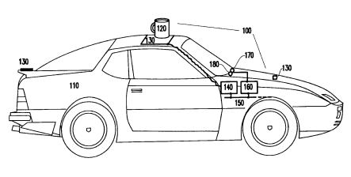
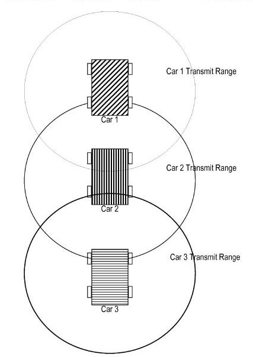
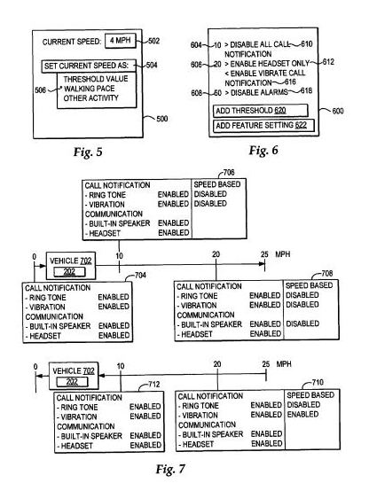
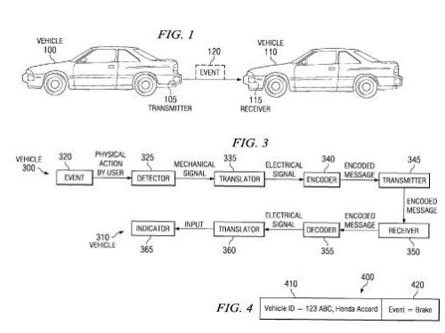
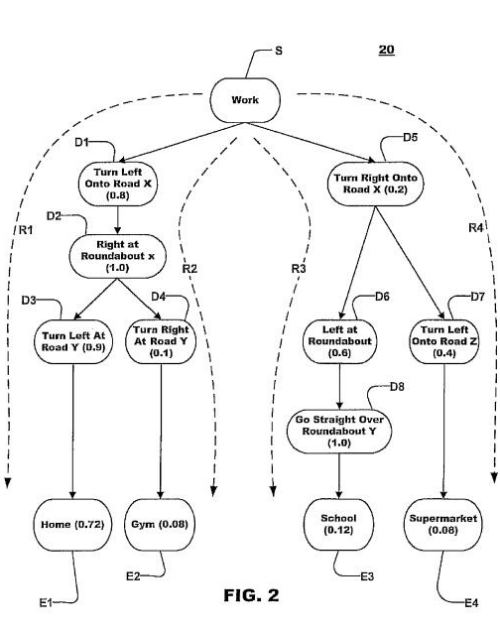
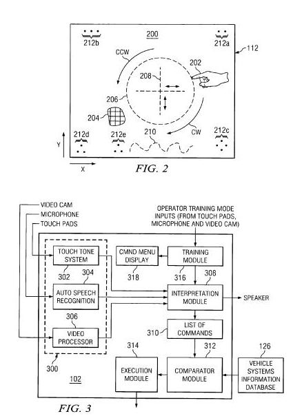
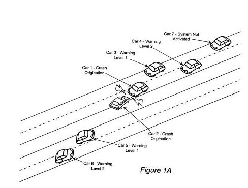

This past October, an Official Google Blog post, [What we’re driving at](https://googleblog.blogspot.com/2010/10/what-were-driving-at.html), introduced Google’s efforts to bring self-driving cars to the world. The post told us:

> So we have developed technology for cars that can drive themselves. Our automated cars, manned by trained operators, just drove from our Mountain View campus to our Santa Monica office and on to Hollywood Boulevard.
>
> They’ve driven down Lombard Street, crossed the Golden Gate bridge, navigated the Pacific Coast Highway, and even made it around Lake Tahoe.
>
> All in all, our self-driving cars have logged over 140,000 miles. We think this is a first in robotics research.

We were told about some of the technology and the technicians behind these cars, and the safety considerations involved in the efforts, as well as the potential of this effort to reduce accidents significantly as well as increasing car-sharing.

Last October and again last week, the US patent office recorded the assignment of a good number of granted and pending patents from IBM on a wide range of topics, and I’m making my way through them.

Many of those involved making automobiles smarter and safer and may have addressed a number of the issues that need to be solved before self-driving cars may progress from Google research project to consumer use.

I thought they were interesting enough to share, and have provided links to the patents themselves if you want to take a deeper look at the technologies involved.

**Warning Sensors for Objects on Vehicles**

Ok, I’m going to start with what seems to be the silliest of the patents and get it out of the way first.

Ever place a drink on top of your car so that you can unlock a door? Ever forget about that drink, and drive off with it still on top of your car? This patent aims at solving that problem.

[System and method for sensing objects on surface of vehicle](http://patft.uspto.gov/netacgi/nph-Parser?Sect1=PTO2&Sect2=HITOFF&u=%2Fnetahtml%2FPTO%2Fsearch-adv.htm&r=1&p=1&f=G&l=50&d=PTXT&S1=6163250.PN.&OS=pn/6163250&RS=PN/6163250)
Filed August 31, 1999
Granted December 19, 2000

**Pre-Configured Routes**

A user of this navigation system can enter information about the first few navigation points on a journey, and if the navigation system recognizes those as part of a known route, it will automatically determine the destination, and the rest of the route to follow.

[Autonomous destination determination](http://patft1.uspto.gov/netacgi/nph-Parser?patentnumber=7418342)
Filed December 3, 2007
Granted August 26, 2008

**Driver Safety**

A system that determines information about the state of a driver, such as whether or not the driver might be sleepy or distracted, and make take steps to make things safer.

For instance, if the driver is determined to be somewhat distracted, it might block an incoming phone call when it recognizes that the driver is braking. If the driver is drowsy, it might ask questions of the driver or play a word game to help keep the driver awake and alert.

[Driver safety manager](http://patft1.uspto.gov/netacgi/nph-Parser?patentnumber=7349782)
Filed February 29, 2004
Granted March 25, 2008

**Driver Warning Grid**

Cars would include an array of sensors and wireless systems so that information about them could be shared with other vehicles’ drivers. For instance, if a car ahead starts braking hard, a car behind it would be warned. Warnings about vehicles traveling very slowly ahead could also be transmitted.

[Dynamic vehicle grid infrastructure to allow vehicles to sense and respond to traffic conditions](http://patft1.uspto.gov/netacgi/nph-Parser?patentnumber=7425903)
Filed April 28, 2006
Granted September 16, 2008
[Dynamic vehicle grid infrastructure to allow vehicles to sense and respond to traffic conditions](http://patft1.uspto.gov/netacgi/nph-Parser?patentnumber=7782227)
Filed June 24, 2008
Granted August 24, 2010

**Remote Vehicle Control**

A monitor inside of a vehicle can detect events related to the vehicle, such as speeding, operating in a prohibited area, or during a specific time frame. It could send a message wirelessly, and an action might be taken in response via an in-vehicle controller.

Those actions might include turning off the engine, limiting the speed of the vehicle speed, and possibly locking the vehicle doors for purposes such as terminating a pursuit or enforcing legal sentences and operator restrictions, or controlling fleet vehicle operations.

[Location-based intelligent remote vehicle function control](http://patft1.uspto.gov/netacgi/nph-Parser?patentnumber=7346439)
Filed November 7, 2002
Granted March 18, 2008

**Controlling Access and Use of Vehicles**

A certain limitation could be set upon the use of vehicles involving when and under what circumstances they might be driven. For example, a manager of a fleet of trucks would want to ensure how and when and by whom those trucks are driven.

There may be limitations on when young drivers can drive (daylight hours only, for instance), or other restrictions or limitations for other drivers. This system would also work to keep unauthorized drivers from driving the vehicle.

[Limiting and controlling motor vehicle operation functions enabled for each of a group of drivers of the vehicle](https://patents.google.com/patent/US7327242B2/en)
Filed September 16, 2004
Granted February 5, 2008

**Limiting Wireless Communications Based upon Speed of Travel**

Imagine your phone not letting you make or receive calls or text messages or check emails when it’s traveling at a certain speed. All three patents below address this problem. In the first two, if you stop for a traffic light or stop sign or pullover, those features may be enabled. Once a certain speed is met, those features may become unavailable.

[Managing features available on a portable communication device based on a travel speed detected by the portable communication device](http://patft1.uspto.gov/netacgi/nph-Parser?patentnumber=7369845)
Filed July 28, 2005
Granted May 6, 2008
[Managing features available on a portable communication device based on a travel speed detected by the portable communication device](https://patents.google.com/patent/US7881710B2/en)
Filed February 18, 2008
Granted February 1, 2011

[System for controlling wireless communications from a moving vehicle](http://patft1.uspto.gov/netacgi/nph-Parser?patentnumber=7187953)
Filed November 1, 2004
Granted March 6, 2007

**Limiting Wireless Communications Based Upon Unsafe Conditions**

Communication devices might be disabled in response to vehicle conditions such as sudden changes in velocity or acceleration, and rapid changes in direction. Or by laws of certain locations regarding the usage of mobile devices in vehicles. Other conditions might include weather, available light, and traffic density.

[Method and system for preventing unsafe communication device usage in a vehicle](http://patft1.uspto.gov/netacgi/nph-Parser?patentnumber=6502022)
Filed November 16, 2000
Granted December 31, 2002

**Using Real Time Traffic Data**

Real-time traffic information could be used to identify the best or fastest route to travel.

[Method and apparatus for end-to-end travel time estimation using dynamic traffic data](http://patft1.uspto.gov/netacgi/nph-Parser?patentnumber=7236881)
Filed February 7, 2005
Granted June 26, 2007

**Displaying Navigation Information**

A system for displaying navigation information that takes into account how distracted a driver might be. That navigation information might not be displayed if a certain “driver attention threshold” is exceeded.

[Method and apparatus for displaying information in a vehicle](http://patft.uspto.gov/netacgi/nph-Parser?Sect1=PTO2&Sect2=HITOFF&u=%2Fnetahtml%2FPTO%2Fsearch-adv.htm&r=1&p=1&f=G&l=50&d=PTXT&S1=6356812.PN.&OS=pn/6356812&RS=PN/6356812)
Filed September 14, 2000
Granted March 12, 2002

**Displaying Traffic Signal Information**

An in-car display might show information about traffic signals and stop signs ahead, which could be useful on a foggy day or when the signals might be around a curve or hidden by a rise and fall in a roadway ahead.

[Method and apparatus for presenting traffic information in a vehicle](https://patents.google.com/patent/US6442473)
Filed January 28, 1999
Granted August 27, 2002

**Information via GPS about the Legality of Devices in Cars**

In some places, the in-car operation of things like radar detectors, cellular telephones, and DVD players may be legal, and it others they may not be. The system described in the following patent would help provide local law information about whether or not it’s legal to operate those devices.

[Method and system to alert user of local law via the Global Positioning System (GPS)](http://patft1.uspto.gov/netacgi/nph-Parser?patentnumber=7515101)
Filed June 6, 2008
Granted April 7, 2009

**Detecting Brake Lights**

Photosensors on the front of your car might detect when brake lights are illuminated in front of them, and calculate their distance. Within a certain distance, the brake lights of the car with the photosensors might have their brake light illuminate, without actually activating the brakes, to give a warning to the car behind.

[Method and system for enhanced system automotive brake light control](http://patft1.uspto.gov/netacgi/nph-Parser?patentnumber=6335682)
Filed July 5, 2000
Granted January 1, 2002

**Sending Information between Vehicles**

Lane changes and turns aren’t always communicated well by drivers using turn signals or brake lights. Sensors that can determine things like whether a car’s steering wheel is being turned for a lane change might be communicated to cars behind it directly or in adjacent lanes to provide a warning.

[Method and system for sending events between vehicles](https://patents.google.com/patent/US7443284B2/en)
Filed May 9, 2006
Granted October 28, 2008

[System for sending events between vehicles](http://patft1.uspto.gov/netacgi/nph-Parser?patentnumber=7821381)
Filed July 15, 2008
Granted October 26, 2010

**Safe Following Distances and Recording Potential Accidents**

The system in the following patent calculates a safe following distance based upon things like speed, weight, and/or safe braking range values, and turns on a recorder if the distance becomes unsafe.

[Method, system, and computer program product for determining and reporting tailgating incidents](http://patft1.uspto.gov/netacgi/nph-Parser?patentnumber=7327238)
Filed June 6, 2005
Granted February 5, 2008
[Method, system, and computer program product for determining and reporting tailgating incidents](http://patft1.uspto.gov/netacgi/nph-Parser?patentnumber=7446649)
Filed May 2, 2007
Granted November 4, 2008
[Method, system, and computer program product for determining and reporting tailgating incidents](http://patft1.uspto.gov/netacgi/nph-Parser?patentnumber=7486176)
Filed November 19, 2007
Granted February 3, 2009

**Distance Tracking**

Light beams might be projected to calculate distances to objects in front of or behind a vehicle. These objects could include things like parking lot walls.

[Proximity indicating system](http://patft1.uspto.gov/netacgi/nph-Parser?patentnumber=6204754)
Filed June 17, 1999
Granted March 20, 2001

**Making Wireless Devices Work Through Onboard Computers**

A phone or other device that uses a wireless transceiver may be set up to be used through an onboard system on a vehicle so that its use could be limited or disabled in certain situations.

[Safe use of electronic devices in an automobile](http://patft1.uspto.gov/netacgi/nph-Parser?patentnumber=7006793)
Filed January 16, 2002
Granted February 28, 2006

**Communicating Automotive Safety Information**

Like a number of the other patents included in this post, this patent aims at considering unsafe conditions concerning the surrounding environment, a vehicle and its driver, and communicating that information to surrounding vehicles to enable them to take action, such as slowing down. This one includes information about safety features on other cars and possible problems with those vehicles themselves.

[System and method for performing interventions in cars using communicated automotive information](http://patft1.uspto.gov/netacgi/nph-Parser?patentnumber=7486177)
Filed January 6, 2006
Granted February 3, 2009

**Predicting Destinations Based upon Travel Patterns and Behavior**

The following patents describe how a navigation system might be used to predict a destination based upon past journeys. A system like this might be used with real-time route information to help find alternative routes to a projected destination, though the patents don’t spell that out.

[Systems and Methods for Generating Pattern Keys for Use in Navigation Systems to Predict User Destinations](http://appft.uspto.gov/netacgi/nph-Parser?Sect1=PTO2&Sect2=HITOFF&u=%2Fnetahtml%2FPTO%2Fsearch-adv.html&r=1&f=G&l=50&d=PG01&p=1&S1=20090248288.PGNR.&OS=dn/20090248288&RS=DN/20090248288)
Filed January 19, 2009
Granted October 1, 2009
[Systems and methods for generating pattern keys for use in navigation systems to predict user destinations](https://patents.google.com/patent/US7487017)
Filed March 31, 2008
Published February 3, 2009

**Avoiding Wireless Phone Distractions**

This system tracks whether or not a wireless phone communication is taking place in a vehicle. If the vehicle exceeds a certain speed when such communication is going on, information about the communication might be sent to the telecommunication service provider about circumstances surrounding the call, such as the time it started and ended, and possibly the position of the vehicle.

The idea is to provide evidence about whether or not a wireless call might have been taking place at the time of an accident.

[System for transmitting to a wireless service provider physical information related to a moving vehicle during a wireless communication](http://patft1.uspto.gov/netacgi/nph-Parser?patentnumber=7155259)
Filed November 1, 2004
Granted December 26, 2006

**Distant Monitoring System**

This monitoring system might enable someone to track a vehicle’s location and speed. The location could be used to find speed limits at that location and other relevant information.

If the vehicle exceeds the speed limit, a warning could be sent to the driver by a visual or audio signal, inform “an authority agency” about the speed, and log information about the “excessive speeding condition.” Speed could be monitored by the use of GPS or by the vehicle’s speedometer or by both.

[Telematic parametric speed metering system](http://patft1.uspto.gov/netacgi/nph-Parser?patentnumber=7375624)
Filed March 30, 2006
Granted May 20, 2008
[Telematic parametric speed metering system](http://patft1.uspto.gov/netacgi/nph-Parser?patentnumber=7656280)
Filed February 19, 2008
Granted February 2, 2010
[Telematic parametric speed metering system](http://patft1.uspto.gov/netacgi/nph-Parser?patentnumber=7782181)
Filed February 27, 2008
Granted August 24, 2010

**An Updated Driver Interface**

A touch-based system for controlling things like windows, heating and airconditioning, door locks, and more, might use a touch gesture-based system that might also include controls based upon speech and upon facial gesture recognition.

[Touch gesture based interface for motor vehicle](http://patft1.uspto.gov/netacgi/nph-Parser?patentnumber=7295904)
Filed August 31, 2004
Granted November 13, 2007

**Collision Avoidance Based Upon Communications between Cars**

The following describes a collision-avoidance system using “underutilized processors” found in airbag deployment systems. This system would avoid using a radar or GPS to become alert of the possibility of a collision, and would instead depend upon local information involving communications from sensors in one vehicle to sensors in another.

[Vehicle collision avoidance system enhancement using in-car air bag deployment system](http://patft1.uspto.gov/netacgi/nph-Parser?patentnumber=7330103)
Filed July 21, 2005
Granted February 12, 2008

**Drawbrige Opening Timing**

Not sure that I remember the last time that I was on a road with a drawbridge, but the following patent tracks things like the movements of ships and the opening and closing of drawbridges so that the operator of a drawbridge can track both the movements of ships and of cars that might cross the bridge and know the optimal time to open the bridge.

[Vehicle scheduling and collision avoidance system using time multiplexed global positioning system](http://patft1.uspto.gov/netacgi/nph-Parser?patentnumber=6185504)
Filed January 28, 1999
Granted February 6, 2001

**Keeping Safe Distances**

Keeping a safe distance from the cars in front of you and behind you is one of the challenges of driving. Tracking the cars that might be in lanes adjacent to yours is important as well. The following describes a process to track the speed of vehicles in the driving environment around you, provide warnings, and possibly change the speed of your car.

[Vehicle warning system and method based on speed differential](http://patft1.uspto.gov/netacgi/nph-Parser?patentnumber=6337638)
Filed April 25, 2000
Granted January 8, 2002

**Unattended Children**

If a child is left unattended in a safety seat of a vehicle, the sensor system described in the following three patents activates an alarm and will unlock doors and roll down windows.

[Wireless system to detect presence of child in a baby car seat](http://patft1.uspto.gov/netacgi/nph-Parser?patentnumber=7321306)
Filed August 1, 2005
Granted January 22, 2008
[Wireless system provided in a vehicle to detect presence of child in a baby car seat](http://patft1.uspto.gov/netacgi/nph-Parser?patentnumber=7489247)
Filed August 7, 2007
Granted February 10, 2009
[Wireless system to detect presence of child in a baby car seat](http://patft1.uspto.gov/netacgi/nph-Parser?patentnumber=7733228)
Filed August 26, 2008
Granted June 8, 2010
