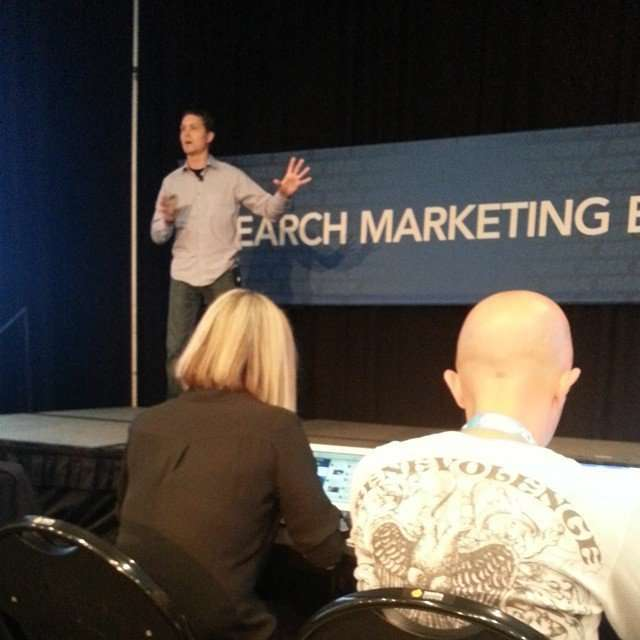

The Semantic Web is making an even stronger appearance recently at Google than it has in the past. With knowledge panels, carousels listing all kinds of things (and people and places), structured snippets merging query answers with question answers into a single snippet, OneBoxes of many different kinds, and even Hummingbird responding better to longer and more complex queries, it’s the future of Google.

I’m presenting on it this morning at the [Javit’s Center](https://www.javitscenter.com/) in Manhattan at SMX (Search Marketing Expo) East, in a session titled “Hummingbird and the Entity Revolution”

I drove up here from Virginia and spent the weekend visiting my family. I visited Princeton Campus early Sunday Morning and noticed tours of campus going on at 7:30-8:00. Since one of the stories in my presentation starts with the tale of Sergey and Larry meeting when Larry visited Stanford and Sergey was his tour guide, and they ended up arguing the whole tour, I took a picture of the tour and added it to the presentation.

I had to update the presentation. I had it turned in on September 9th, according to schedule. And then Google was granted a patent on September 16th that shows the first time I’ve ever seen a patent describe how they store user behavior data using tuples or triples in an RDF format. I’ve never seen that before

Larry did file Google’s first patent (in Stanford’s name), and then Sergey may have filed their second patent – it’s hard to tell because it was a provisional patent, and those are stored by serial number in a database that makes it hard to find them if you don’t know they exist and you don’t have the serial number.

I also call out former Googler Andrew Hogue and his Annotations Framework team for their work on the Semantic Web while at Google. I rarely take advice on patents from anyone, but Barbara Starr, who was extremely helpful about the Semantic Web, suggested that I look at Andrew Hogue’s patents. He has left Google to become the head of search for FourSquare, and he has written some interesting patents. A look at his resume (he did leave Google) showed that he was responsible for a team of people who were involved in creating several patents, and he was involved in the Metaweb acquisition and their teams’ transition to Google. I’ve blogged about a number of those, some back in 2007, and a number in the past month or so.

Thank you for your help, Barbara. [Follow her on Twitter](https://twitter.com/BarbaraStarr) and wherever else you can (she also writes once a month or so for Search Engine Land on Semantic Web issues, and those posts are usually epic, filled with great information and advice and resources).

Here’s my presentation:

**[Hummingbird & the entity revolution](https://www.slideshare.net/billslawski/hummingbird-the-entity-revolution)** from **[Bill Slawski](https://www.slideshare.net/billslawski)**
