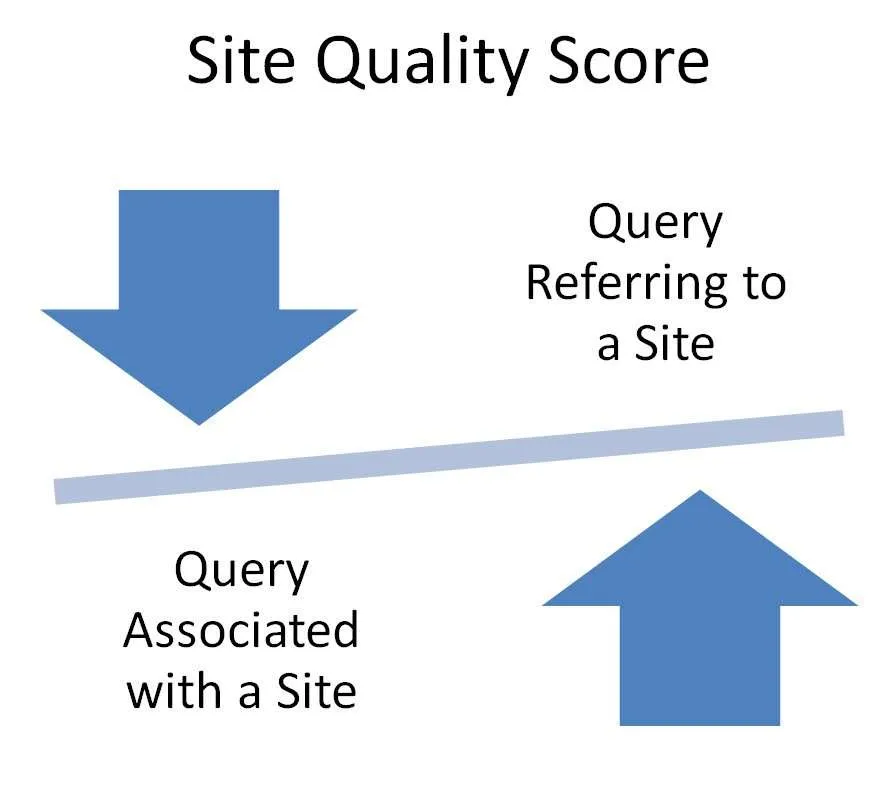

This post is about a Google patent from a well-known Google Engineer, that describes ranking search query results at an internet search engine, such as Google.

Google aims at identifying resources, of different types such as web pages, images, text documents, multimedia content, that may be relevant to a searchers situational and information needs and does so in a manner that they hope is as useful as possible to a searcher. They do this while responding to queries submitted by searchers.

One of the inventors from this patent carries one of the most well-known names at Google, the surname, “Panda.” which became well-known because of a [Google update](https://www.wired.com/2011/03/the-panda-that-hates-farms/) that was named after him in February 2011.

A focus of that update was upon improving the quality of sites that it targeted, and Navneet Panda specializes in site quality at Google. When I saw that a patent was granted this week that listed his name as an inventor, I looked forward to reading it, and seeing how it might attempt to define a site quality score, and how that definition might be used to rank search query results.

This recently granted patent did provide a way to measure the quality of a web site, and that measure could influence how well or poorly a site might rank in search results for a particular query.

The patent tells us explicitly what features it was looking for in a site that might seem to indicate that the site was a quality site. It tells us:

> The score is determined from quantities indicating user actions of seeking out and preferring particular sites and the resources found in particular sites. A site quality score for a particular site can be determined by computing a ratio of a numerator that represents user interest in the site as reflected in user queries directed to the site and a denominator that represents user interest in the resources found in the site as responses to queries of all kinds The site quality score for a site can be used as a signal to rank resources or to rank search results that identify resources, that are found in one site relative to resources found in another site.

That site quality score patent is:

[Site quality score](http://patft.uspto.gov/netacgi/nph-Parser?Sect1=PTO1&Sect2=HITOFF&d=PALL&p=1&u=%2Fnetahtml%2FPTO%2Fsrchnum.htm&r=1&f=G&l=50&s1=9,031,929.PN.&OS=PN/9,031,929&RS=PN/9,031,929)
Inventors: April R. Lehman and Navneet Panda
Assigned to Google
US Patent 9,031,929
Granted May 12, 2015
Filed: June 27, 2012

Abstract

> Methods, systems, and apparatus, including computer programs encoded on computer storage media, for determining a first count of unique queries, received by a search engine, that are categorized as referring to a particular site; determining a second count of unique queries, received by the search engine, that is associated with the particular site, wherein a query is associated with the particular site when the query is followed by a user selection of a search result that (a) was presented, by the search engine, in response to the query and (b) identifies a resource in the particular site; and determining, based on the first and second counts, a site quality score for the particular site.

## Site Queries

This patent is about a search system that includes a site scoring engine that generates site quality scores for sites.

The site quality score looks at queries submitted to the system by users. One type of query that it seems to favor is a query that includes a reference to a particular site. These queries are referred to in the patent as “site queries.”

Queries can be categorized as ones that refer to a particular site in many ways. It can be categorized as referring to a particular site if it includes a site label that identifies the particular site.

(1) One site label identifying a particular site can be specified using an operator, e.g., a “site:” operator, followed by a name, e.g., a domain name, for the particular site.

Queries that refer to a particular site can be used to request resources that are on a particular site. For example, a query “named entities site:www.seobythesea.com” can be used to request resources responsive to the query “named entities” that are on the site www.seobythesea.com.

(2) A query can also be categorized as referring to a particular site if it includes a term that has been determined to be a term that refers to the particular site.

> For example, if the search system has data indicating that the terms “example sf” and “esf” are commonly used by users to refer to a site “sf.example.com,” queries that contain the terms “example sf” or “esf”, e.g., the queries “example sf news” and “esf restaurant reviews,” can be counted as queries that refer to the site “sf.example.com.”

(3) a query can be categorized as referring to a particular site when the query has been determined to be a [navigational query](https://www.seobythesea.com/2012/12/navigational-queries-resources/) to the particular site. To site users, a navigational query is a query submitted aiming at getting to a single, particular web site or web page of a particular entity. For example, I usually type the four letters ESPN into the search box to visit the ESPN website. The patent tells us that a search system may determine that a query is a navigational query to a particular site “when a search result linked to the particular site has received at least a threshold percentage of the user selections that were received for all search results that are responsive to the query.”

## Determining a site quality score

These are the steps outlined in the patent to determine a site quality score.

1. Unique queries that are categorized as referring to a particular site are counted: Such as all queries received by the system in the preceding day, two days, week, or month, for example, or overall query data available to the system.

2. In some approaches, all queries containing the same query terms, regardless of their order, are counted as a single unique query. So, multiple queries of “san francisco site:example.com” and “francisco san site:example.com” are counted as one unique query.

3. In some other approaches, the patent tells us, the order does matter. Multiple queries for “San Francisco site:example.com” would be counted as one unique query while multiple queries for “Francisco san site:example.com” are counted as a different unique query. They may ignore the placement of the site label within the query itself.

4. Additionally, the system may include user information or user device information when counting these unique queries. The same query might be counted as two unique queries if it could be identified as having been submitted by two different people. In this context, whether a query is the same query can be determined with or without regard to the order of the query terms, as described above. Different users can be identified based upon users being logged into a user account, different Internet protocol addresses associated with the user device being used by the user, or by using the information provided by the user device, such as an Internet cookie.

5. Different from queries that refer to a site are ones that are just associated with that site. The system may associate a particular query with a particular site when a search result that was presented in response to the particular query identifies a resource in the particular site, where the search result has received a user selection. For instance, a particular query “example restaurant reviews” can be associated with a particular site “example.com” when a user selects a search result that was presented in response to the particular query, where the search result identifies a resource in the particular site, e.g., “http://example.com/resource”.

6. The system can determine a site quality score for the particular site, and that site quality score might be determined by computing a ratio of a numerator and a denominator, where the numerator is based on the count of unique queries that are categorized as ones that refer to the particular site, and where the denominator is based on the count of unique queries that are just associated with the particular site, just don’t refer to it in the same kind of way.

The patent provides some examples of other ways it can calculate that site quality score using those two different counts.

It may also treat a site that is a “collection of resources” as a site, under this site quality Score Approach. These collections can include multiple domains that exist on the same domain or a site that is broken down into subdomains or subdirectories.

I’ve written a few posts about patents involving quality scores for organic SEO:

- 6/14/2011 – [Google’s Quality Score Patent: The Birth of Panda?](https://www.seobythesea.com/2011/06/googles-quality-score-patent-the-birth-of-panda/)
- 12/9/2012 = [How Google May Identify Navigational Queries and Resources](https://www.seobythesea.com/2012/12/navigational-queries-resources/)
- 5/15/2013 – [How Google May Rank Web Pages Based on Quality Ratings](https://www.seobythesea.com/2013/05/google-rank-sites-quality-ratings/)
- 5/12/2015 – [How Google May Calculate a Site Quality Score (from Navneet Panda)](https://www.seobythesea.com/2015/05/google-site-quality-scores/)
- 6/22/2015 – [How Google May Classify Sites as Low Quality Sites](https://www.seobythesea.com/2015/06/how-google-may-classify-sites-as-low-quality-sites/)
- 7/30/2018 – [Quality Scores for Queries: Structured Data, Synthetic Queries and Augmentation Queries](https://www.seobythesea.com/2018/07/quality-scores-for-queries/)
- 9/21/2017 – [Using Ngram Phrase Models to Generate Site Quality Scores](https://www.seobythesea.com/2017/09/site-quality-scores/)
- 6/10/2019 – [How Google May Rank Some Results based on Categorical Quality](https://www.seobythesea.com/2019/06/categorical-quality/)

Last Updated June 26, 2019

.
