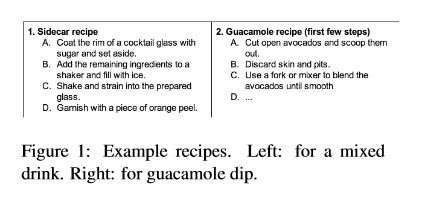
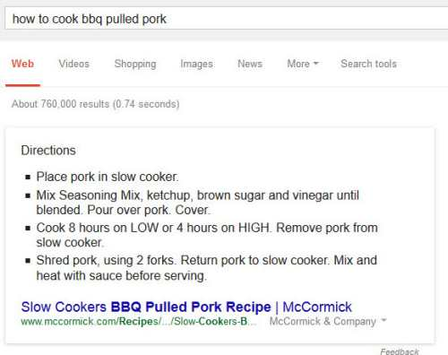
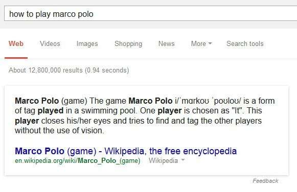
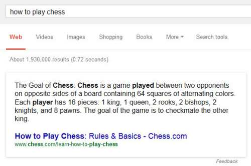
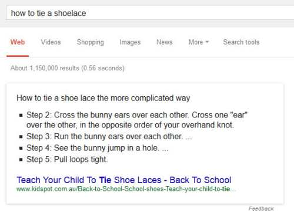
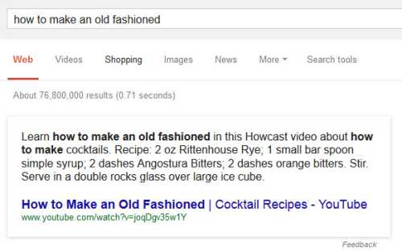
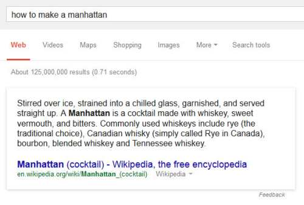

Google recently started showing “Howto snippets” in search results, which tend to show the first few steps of some task, and then let you click through to a page to see more. Like the recipes above for things like guacamole:

![By Nikodem Nijaki (Own work) \[CC-BY-SA-3.0\], via Wikimedia Commons](media/640px-Guacamole_IMGP1265.jpg)

_By Nikodem Nijaki (Own work) [[CC-BY-SA-3.0](https://creativecommons.org/licenses/by-sa/3.0/)], [via Wikimedia Commons](https://commons.wikimedia.org/wiki/File%3AGuacamole_IMGP1265.jpg)_

They have also published an interesting paper that describes some of the steps that need to take place for one of these snippets to be created, which is titled [Cooking with Semantics](https://www.cs.ubc.ca/~murphyk/Papers/acl2014.pdf) (pdf).

Like in yesterday’s post on [Rich Snippets and Patterned Queries](https://www.seobythesea.com/2014/10/rich-snippets-patterned-queries/), I’m interested in the queries used to find these unique results, and if there is a specialized shape or format or pattern that a query needs to be in to return “How To” results (much like a definition result tends to be returned when you start a query off with “define:xxxxxxxxxx” or “what is xxxxxxxxx”.

I tried several queries to see if I could get a “HowTo snippet” in response and did for a number.

Some quick conclusions:

(1) Interestingly, not all of the pages being returned are from nonprofit sites like Wikipedia. Still, some are from more commercial sites such as pep boys and chess.com, and Mccormicks, which shows a possibility that results like these could be taken from most types of websites instead of a limited number of sites considered to be a knowledge base like Wikipedia.

(2) The results’ formats vary from one result to another, with some being lists and others being paragraphs.

(3) In the list format results, the words in the HowTo snippets matching query terms aren’t bolded, but words within the queries in the paragraph descriptions are. So lists on pages may be treated differently than textual passages.

(4) On one of the Wikipedia results, part of the “howto snippets” is taken from an infobox on the page, and part of it is taken from prose on the page. In the other one, the whole “howto snippet” is taken from prose.

I’ve made each “HowTo snippet” below clickable to go to the page where the result is from so that you can look to see where the text in the snippet appears on each page. Next, we’re probably going to do some investigation to see if we can identify some patterns in queries used, besides most of the ones that I’ve listed starting with “How To” and some patterns in how that text on search results pages is presented.

If you see any other patterns worth mentioning in queries or in how search results are presented , let me know. 
