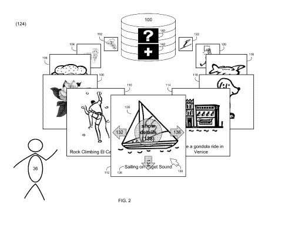
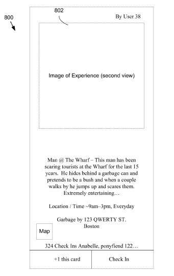
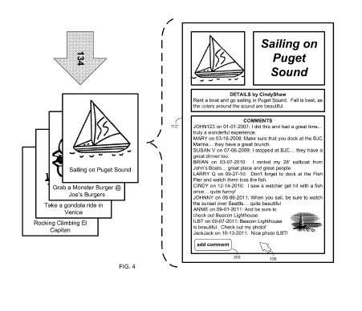
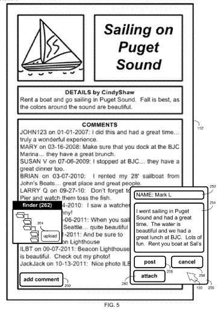
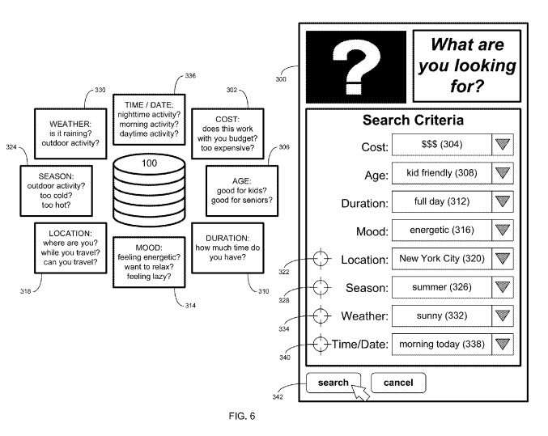

Google published a patent application this week that details the user card interface Google is using for applications such as Google Now. The “invention” described in the patent enables people to share the things they want to experience, or experiences that they have gone through. The patent filing is a detailed walkthrough of how a data card interface might work, but it also details a set of social features that are unique and may be engaging enough to be adopted by a wide range of people.

See someone behaving abnormally at a nearby wharf? Share it on an experience card with others who might be within your circles, with an even broader audience, or even the public. Have a desire to eat a gourmet meal and imbibe a bottle of wine in a cafe in Paris? Post the experience, and share it with others.

Part bucket list, and part neighborhood gossip board, there are lots of ways to share your experiences, or the things that you want to experience. You can take photos, scrape an adventure from a web URL, or even monitor other people’s experiences through a feed.

You can add graphics to your experience to make them stand out, such as a:

- Bag of money for expensive experiences.
- Martini glass for an experience involving alcohol/adult beverages.
- Runner for an experience athletic in nature.
- Laughing face for a funny/enjoyable/entertaining experience.
- Knife and fork for an experience involving food.

This experience database system allows you to check in on your experiences, or other peoples. Someone wants to eat lobster at a certain waterfront San Francisco seafood restaurant, they can check in on the experience and post a photo from the restaurant and a review. Or someone else who the card was shared with could as well.

Experience cards can be searched based upon a number of criteria. These can include; cost, preferred ages of typical participants, duration of an experience, mood of participants from energetic to relaxed, location, season (skiing in Winter, surfing in summer, etc.), weather, and time/date.

Access to experience cards may be:

- Publically available to all users,
- Only shared with users within a circle of the card’s creator,
- Only shared with users that are friends with the card’s creator, or
- Only accessible to users that are proximate a certain location (within a geo-fence or a predefined distance of the experience defined within the card).

User commentary on experience cards can include:

- Text comments and/or feedback
- Photo related to the experience
- Videos about the experience)
- Audio-based information (e.g. audio recordings related to the experience)
- Ratings (e.g., 0-10)
- Symbols (e.g., thumbs up/thumbs down)
- Colors (e.g., red, green, blue), and
- Mood indicators (e.g. happy, sad, fun, boring)

This experience database is part todo list, where you can itemize things that you want to do or experience. While you can create an experience, and add it, you can also search through and be involved with other people’s experience cards. You can comment on them, review them, offer suggestions, or share your own experiences.

A “generate itinerary” button would allow you to string together a series of experiences, such as on a trip to Washington DC, where you can add a tour of the Whitehouse with a visit to the Washington Memorial, followed by a swing through the National Archives building.

This system enables you to schedule events in advance, with discrete dates and locations and activities, such as watching the ball drop on New Year’s Eve in Times Square. You can check in on those events, add details to them over time.

The events database might attempt to avoid duplication of events, and may group similar events together.

It could also be used as an experience suggestion repository.

The patent application is:
[Experience Sharing System and Method](http://appft.uspto.gov/netacgi/nph-Parser?Sect1=PTO1&Sect2=HITOFF&d=PG01&p=1&u=%2Fnetahtml%2FPTO%2Fsrchnum.html&r=1&f=G&l=50&s1=%2220130198277%22.PGNR.&OS=DN/20130198277&RS=DN/20130198277)
Invented by Christopher Pedregal, Mathew Cowan, Michael J. LeBeau, and Gabor Cselle
Assigned to Google
US Patent Application 20130198277
Published August 1, 2013
Filed: January 31, 2012

Abstract

> User commentary concerning a user experience is received and a user experience data card is generated for the user experience based, at least in part, upon the user commentary. The user experience data card is stored, wherein the stored user experience data card corresponds to a first view of the user experience data card and receiving a request for an experience data card from a second user.
>
> The user experience data card is provided to the second user at least in part based on the request received from the second user and receiving feedback from the second user concerning the user experience data card.
>
> A second view of the user experience data card is generated based, at least in part, upon the feedback from the second user, wherein the second view of the user experience data card is distinct from the first view of the experience data card.

Would you share your todo list of things you would like to experience? Or information about things that you’ve experienced?
