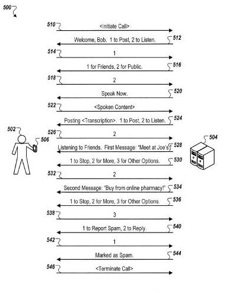

## Out of a Crisis comes Voice Posting to Social Networks

Egypt in late January 2011, was a place of protests where people wanted and needed to be able to communicate as effectively as possible, and the use of social networks like Twitter had been filling that role. But what if there was no access to the Web to do so? Or internet access into or out of the country?

A blog post on the Official Google blog told us of [Some weekend work that will (hopefully) enable more Egyptians to be heard](https://googleblog.blogspot.com/2011/01/some-weekend-work-that-will-hopefully.html). In the press on February 1st, 2011, we learned that [Google and Twitter launch service enabling Egyptians to do voice posting by phone](https://www.theguardian.com/technology/2011/feb/01/google-twitter-egypt).

One of the co-authors of that Google blog post was Ujjwal Singh. He was the founder of Saynow, a company we learned a week or so before [had been acquired by Google](https://mashable.com/2011/01/25/google-acquires-telephony-startup-saynow/#RkKE.ZkTD8qh). He’s listed as the co-author of a patent application published this week that describes a way do voice posting to social networks. The patent filing is:

[Posting to Social Networks by Voice](http://appft.uspto.gov/netacgi/nph-Parser?Sect1=PTO1&Sect2=HITOFF&d=PG01&p=1&u=%2Fnetahtml%2FPTO%2Fsrchnum.html&r=1&f=G&l=50&s1=%2220120201362%22.PGNR.&OS=DN/20120201362&RS=DN/20120201362)
Invented by Steve Crossan, and Ujjwal Singh
Assigned to Google
US Patent Application 20120201362
Published August 9, 2012
Filed: February 3, 2012

Abstract

> Methods, systems, and computer program products are provided for generating and posting messages to social networks based on voice input. One example method includes receiving an audio signal that corresponds to spoken content, generating one or more representations of the spoken content, and causing the one or more representations of the spoken content to be posted to a social network.

The method described goes beyond just tweets to posting other kinds of social networks, with a conversion of the spoken message to text. It involves connecting to the service through pre-designated phone numbers, and it allows someone to create a message, edit it, choose a place to post it, and associate it with a specific user and account. It also enables someone to find other content related that that message, select recipients, listen to other messages on the social network, rate and mark messages as important or as spam.

While this voice posting patent filing and the circumstances that lead to the creation of the method behind it sprung out of a crisis of communication in Egypt, it’s possible that it could be useful to a broader audience:

- When there is no access to a computer or computer network
- When authors don’t have the computer literacy to post directly to a social network
- When it’s impractical or inconvenient to post because of a small screen or keyboard or a complex language system makes typing difficult
- Where the person posting is more comfortable using a phone than a computer
- Where network access or access to the social network is interrupted by being blocked or blacked out

The spoken content that is converted to text to be posted to a social network through speech recognition might be filtered is some ways, such as for duplicate or blacklisted content. The message posted to such content on a social network might also be or include a link to an audio message.

The patent filing provides a fair amount of detail over how such a system might work, and how someone might be able to make posts by voice and interact with other content on a social network.

Will we see something like this spring up on Google Plus sometime in the near future?
