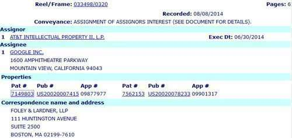

On August 6th, Google [announced that https was becoming a ranking signal](https://webmasters.googleblog.com/2014/08/https-as-ranking-signal.html) for Google Search.

I’m not completely sure of the implications of a discovery I made earlier today yet, but I noticed at the USPTO assignment database that Google had been assigned a patent from AT&T in June, which was officially recorded on August 8th, 2014.

The patent is:

[Method for content distribution in a network supporting a security protocol](http://patft.uspto.gov/netacgi/nph-Parser?Sect1=PTO2&Sect2=HITOFF&p=1&u=%2Fnetahtml%2FPTO%2Fsearch-adv.htm&r=1&f=G&l=50&d=PALL&S1=07149803&OS=PN/07149803&RS=PN/07149803)

Abstract

Invented by Frederick Douglis, Michael Rabinovich, Aviel D. Rubin, Oliver Spatscheck
Assigned to: AT&T Corp.
US Patent 7,149,803
Granted December 12, 2006
Filed: June 8, 2001

The abstract from the patent is fairly simple, and tells us:

> The present invention is directed to a method of providing content distribution services while minimizing the processing time required for security protocols such as the Secure Sockets Layer.

In short, it appears that there has been a cost in speed-related to the use of Secure Socket Layers security that the process described in this patent helps to speed up.

Is Google’s acquisition of this patent a matter of dotting all i’s and crossing all t’s?

I don’t suspect a profit motive in the purchase of the patent, but the nearness of the acquisition and the announcement of https becoming a ranking signal is interesting.

It is a sign of how careful Google has become when they consider whether or not something should play a role in the ranking of pages on the Web.
