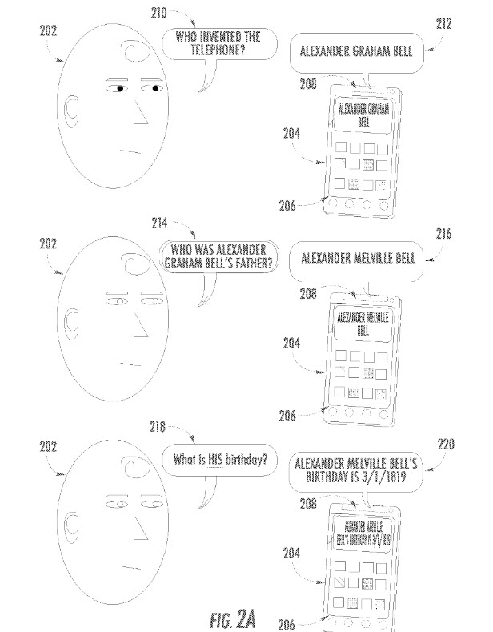

## Spoken Queries and Stressed Pronouns

The future of searches on the Web will likely involve spoken searches, as more and more people are connecting to the web with phones, and Google has added voice search interfaces to its search on desktop computers.

I thought it was interesting when I ran across a patent that focused on a problem that might arise with those spoken queries and thought it was worth writing about because it’s something that we will need to become acquainted with as it becomes more commonplace.

When Amit Singhal showed off Google’s Hummingbird update, he gave a presentation that showed Google handling searches involving pronouns. It’s worth watching for the information about Hummingbird and how Google is becoming more conversational and can handle things like stressed pronouns. The video is at:

I remembered the presentation about hummingbird and a more conversational Google when I saw this spoken queries patent come out from Google, which explains some of the technology behind aspects of conversational search:

[Resolving pronoun ambiguity in voice queries](http://patft.uspto.gov/netacgi/nph-Parser?Sect1=PTO1&Sect2=HITOFF&d=PALL&p=1&u=%2Fnetahtml%2FPTO%2Fsrchnum.htm&r=1&f=G&l=50&s1=9,529,793.PN.&OS=PN/9,529,793&RS=PN/9,529,793)
Inventors: Gabriel Taubman and John J. Lee;
Assignee: Google
US Patent 9,529,793
Granted: December 27, 2016
Filed: February 22, 2013

Abstract

> Methods, systems, and apparatus, including computer programs encoded on computer storage media, resolve ambiguity in received voice queries. An original voice query is received following one or earlier voice queries, wherein the original voice query includes a pronoun or phrase. A plurality of acoustic parameters is identified for one or more words in the original voice query in one implementation. A concept represented by the pronoun is identified based on the plurality of acoustic parameters, wherein the concept is associated with a particular query of one or earlier queries. The concept is associated with the pronoun. Alternatively, a concept may be associated with a phrase using the query’s grammatical analysis to relate the phrase to a concept derived from a prior query.

I did write about some papers that Google researchers had written about pronouns in the post [Searching with Pronouns: What are they? Coreferences in Followup Queries](https://www.seobythesea.com/2014/10/pronouns-coreferences-followup-queries/)

But, the granted patent from this week had an example worth sharing about an aspect of conversational search that wasn’t covered in one of those papers involving stressed pronouns. Here is an example:

A voice query asks: “Who was Alexander Graham Bell’s father?”
The answer: “Alexander Melville Bell”
A follow-up voice query: “What is HIS birthday?”
The answer to the follow-up query: “Alexander Melville Bell’s birthday is 3/1/1819”

The point behind this spoken queries patent is that the search engine decided that it should tell the searcher the birthdate of the inventor’s father. This was done based upon the fact that the “HIS” in that second query was stressed to indicate that it was about the father and not the son mentioned in that first query.

The patent tells us of a “stress score” for spoken queries that could include “volume, pitch, frequency, duration between each spoken word, and spoken duration of words or phrases.” It tells us that “By comparing the stress score for the pronoun to a threshold, an implementation may determine that the stress score indicates that the pronoun is stressed or not.”

The impact of a stressed query? The spoken queries patent says, “For example, if a pronoun is stressed, it may indicate that it refers to a concept from an immediately preceding query, while a pronoun that is not stressed may refer to a concept from a query that occurred earlier in a series of received queries.” It’s an interesting assumption that does sound like it uses how people actually convey information during inquiries when they are having conversations. The patent does tell us about some of the science behind this determination about stressed pronouns:

> For example, if the absolute measure for the volume of the pronoun is 80 dB and the average volume for the other words in voice query is 60 db, the ratio of the volumes is 1.33. This relative volume measure for the pronoun indicates that the volume of the pronoun is 33% greater than the volume of the rest of the voice query. Alternatively, the relative measures can be different between the acoustic parameters for the pronoun and the acoustic parameters for the other words in voice query. For example, if the absolute measure for the time duration of the pronoun is 80 ms and the average time duration of the other words in voice query is 50 ms, the difference in the time duration is 30 ms. This relative time duration measure for the pronoun indicates that the time duration of the pronoun is 30 ms more than the average time duration for the words in voice query. Alternatively, the relative measures of the acoustic parameters for the pronoun can be relative to the acoustic parameters for only the words that immediately precede and follow the pronoun.

The spoken queries patent provides some other examples of how stresses might be understood, including how grammatical differences may play a role.

Interestingly, these types of things may influence spoken queries. For example, if you’ve been wondering about how Google might understand pronouns, now you have an idea of how it could understand stressed pronouns.
