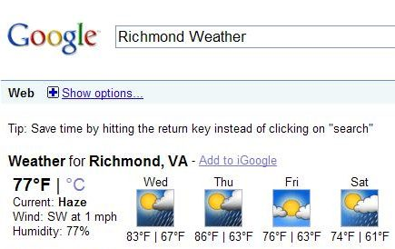
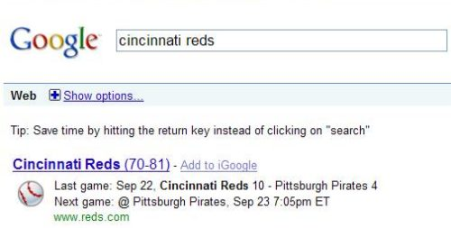

The Google Onebox is a search result that sometimes appears below sponsored advertisements and above organic search results when you perform a search at Google. An example is when you perform a search such as a city name and the word “weather”. Google also offers specialized Google OneBox for Enterprise results for customers who use the Google Search Appliance or Google Mini.

It’s possible for you to create OneBox results for your own website, using a feature that appears to have originated with Google Coop. Google has a fair amount of [documentation](http://web.archive.org/web/20110903070355/http://www.google.com:80/coop/docs/guide_subscribed_links.html) on the use of subscribed links, though it appears that the discussion group about subscribed links from that page has been removed from Google Groups for violations of “Google’s Terms Of Service.”

If you go to the [Google Search Preferences](https://www.google.com/preferences) page, it’s possible to sign in, and subscribe to a number of different offerings from people who have created specialized queries that will return special OneBox results, such as movie reviews from Rotten Tomatoes, dictionary and synonym results from Merriam-Webster Online, and a number of others.

Unfortunately, it looks like Google Subscribed Links really haven’t attracted much attention, from developers or potential subscribers. It would be interesting to find out how many people have subscribed to the offerings from these companies, and the documentation about subscribed links seems pretty informative. Google appears to offer subscribed links for OneBox results from about 50 providers, or at least, that’s the number of providers that they list in their directory.

Google also offers a number of other specialized OneBox results, which they describe on their [search features](https://support.google.com/websearch/#topic=3378866) page. These don’t look and feel like they were developed through the subscribed links program, including specialized searches at different locations for time, earthquake news, movie showtimes, as well as sports scores, stock quotes, and others.

What is interesting about this patent filing isn’t so much the subscribed links program, where site owners can provide specialized results based upon data they provide, but rather that some of these specialized results are available to all searchers, regardless of whether they are signed into their Google Account or not, and regardless of whether they subscribed to Subscribed Links from a particular provider. The patent hints at some of the reasons why some specialized OneBox results are available to everyone.

[Generating specialized search results in response to patterned queries](http://patft.uspto.gov/netacgi/nph-Parser?Sect1=PTO2&Sect2=HITOFF&u=%2Fnetahtml%2FPTO%2Fsearch-adv.htm&r=1&p=1&f=G&l=50&d=PTXT&S1=7,593,939.PN.&OS=pn/7,593,939&RS=PN/7,593,939)
Invented by Nicholas Brock Weininger and Ramanathan V. Guha
Assigned to Google
US Patent 7,593,939
Granted September 22, 2009
Filed: March 30, 2007

Abstract

> Third party content providers can specify parameters for generating specialized search results in response to queries matching specific patterns. In this way, a generic search website can be enhanced to provide specialized search results to subscribed users. In one embodiment, these specialized results appear on a given user’s result pages only when the user has subscribed to the enhancements from that particular content provider, so that users can tailor their search experience and see results that are more likely to be of interest to them. In other embodiments the specialized results are available to all users.

The patent provides some details about how developers can set up specialized queries and participate in the Subscribed Links program, and the subscribed links documentation pages that I linked to above covers a lot of the same ground, but in much friendlier language. But, the patent also tells us that:

> In one embodiment, however, the search results category can be provided to all users. Alternatively, the search results category can be provided to some users based on some criteria (such as browser platform, OS platform, geographical location, search history, demographics, website visitation history, or the like). In effect, then, those users for which the criteria apply can be auto-subscribed to certain links. In one embodiment, users are free to opt out after they have been auto-subscribed; in other embodiments, they may not have the freedom to do so.

An example of a OneBox result available to all searchers is this search for [cincinnati reds], which shows the teams record, the score of their last game, and the date of their next game, from the Reds MLB site:

The search result also offers a link, for people to subscribe link also offers browers the opportunity to Add Sports Scores to their iGoogle page. Rather than a subscribed link, as described in this patent, Google looks like they are offering a Google Gadget that shows customized sports scores.

The patent does have a couple of short sections on that tell us that some users might be auto-subscribed to some OneBox type results:

> In one embodiment, users can be automatically subscribed to a search results category based on some criteria (such as browser platform, OS platform, geographical location, search history, demographics, website visitation history, or the like). In effect, then, those users for which the criteria apply can be auto-subscribed to certain links. For example, a user who tends to search for information at automotive sites can be automatically subscribed to a search results category related to automobiles.
>
> In one embodiment, users are free to opt out after they have been auto-subscribed; in other embodiments, they may not have the freedom to do so.

But that section makes it sound like this kind of auto-subscription only takes place for people who are signed in to their Google Accounts, rather than all browsers.

In another section of the patent, we are told about security considerations, and that section contains some information that provides some possible hints about specialized OneBox results that might be shown to all viewers:

> In one embodiment, a sharding policy is put into place as described above, to ensure that specialized results which have been promoted to show all users, or which come from more highly trusted providers, are on separate shards from those carrying completely untrusted providers’ data. In this manner, their processing times for trusted providers are not affected by possible bad behavior of untrusted providers. Also, in one embodiment, if queries to a provider’s data time out too often, that provider is deactivated for at least some period of time so as to allow other providers’ data to trigger. Also, in one embodiment, fairness policies are enforced on the feed crawler end so that no one provider can take up too much update traffic.
>
> …
>
> A further line of defense against all issues above is that all untrusted content provider search results can be set up as opt-in. Users take positive action to subscribe to them, i.e. trust their providers, before they can be displayed. Furthermore, users can easily unsubscribe from content providers they find give them bad results, and can report spam, deception, copyright violations, and the like.

The patent, and the Subscribed Links documentation don’t provide details on how one becomes a trusted provider, and when these specialized OneBox results might be shown to all viewers, regardless of whether or not they are signed in to their Google Accounts. It looks as though the number of specialized OneBox results might be limited to those shown on Google’s Search Features page.

How does one become a “trusted provider?”

Is it worth setting up subscribed links?

Will Google expand the number of specialized OneBox results that it shows to all searchers in the future?
