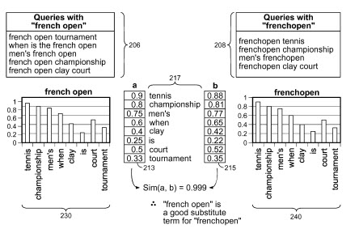
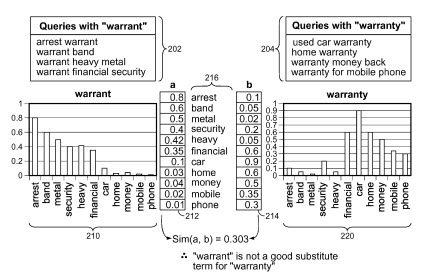
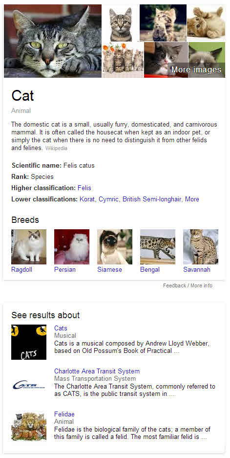

*But I’m a substitute for another guy I look pretty tall but my heels are high The simple things you see are all complicated I look pretty young, but I’m just backdated, yeah*

– Peter Townsend

When you search at Google, how easy is it to find what you’re looking for? Do you search again, but try different but related words if your first attempt doesn’t uncover pages that you find useful?

If I search for “car repair” and follow it up on a search for “auto repair,” I would suspect that I would see a lot of the same pages, but perhaps not in the same order. I would also expect to see local search results for both, and I do. The local search results aren’t in the same order either. Some words or phrases do make good substitutes for others though, as can be seen in the image below:

When I do the “car repair” search, I see some pages that have the word “auto” instead of car, and it’s **bolded**, as described in a Google Official Blog post from 2010, [Helping computers understand language](https://googleblog.blogspot.com/2010/01/helping-computers-understand-language.html). Google has been expanding queries by using synonyms instead of the original search term you may have used for a while.

## Is Keyword Matching Dying?

As a site owner, or designer, or developer, when you create a webpage, you may try to optimize the page for a specific term or phrase, and hope that it ranks in search results that people interested in what you offer might use in a search, and might expect to see on your page. But what if Google finds a way to match the concepts and the things, or entities, that your page is about without relying exactly upon matching those words, to better enable searchers to find what they are looking for?

We’ve seen Google attempt this with the use of [synonyms](https://www.seobythesea.com/2011/02/more-ways-a-search-engine-might-identify-synonyms-to-expand-queries-with/) to expand queries people are searching with. Synonyms for [categories](https://www.seobythesea.com/2007/05/refining-queries-using-category-synonyms-for-local-and-other-searches/) that different businesses might be found for, may also help expand the results returned in local search results.

One of the tricky aspects of a search engine using synonyms is that sometimes words change meanings in different contexts. For example, a car and an automobile might be synonyms when you see them about car or auto “mechanics,” or car or auto “repair,” but not when you’re discussing a Ford auto and a railroad car. They are just not the same thing anymore, in that [context](https://www.seobythesea.com/2009/12/how-google-may-expand-searches-using-synonyms-for-words-in-queries/).

One of my favorite approaches that Google uses to finding synonyms within context is a statistical language translation approach where a term or phrase might be [translated into a different language](https://www.seobythesea.com/2008/12/how-a-search-engine-might-find-synonyms-to-use-to-expand-search-queries/) and then translated back into the first language. For example, “car mechanic” might be translated from English into French, and upon translating it back into English, two options might be returned – “car mechanic” and “auto mechanic.” If there’s enough confidence that they mean the same thing, they might be considered synonyms of each other.

## Substitute Query Terms Rather than Synonym Query Terms

A patent granted to Google this past week also explores the idea of finding terms or phrases to use to expand queries but calls those terms “substitute terms” rather than “synonyms.” The image above displaying comparing co-occurring words in search results for “french open” and “frenchopen” involves a process that can be used to explore other words as well, though sometimes they aren’t good substitutes for each other, such as “warrant” and “warranty,” as seen in the screenshot from the patent below:

In an example from the patent, two words that might potentially be substituted for each other are “felines” and “cats”.

The process used to find substitute terms focuses upon the use of the co-occurrence of words found on pages returned in response to a query, and a potential substitute query. These candidate substitute terms might originally show up in documents ranking for the first query term, or in metadata associated with those documents.

For example, to find a potential substitute query term for “cats,” terms that appear in documents ranking for “cats” may be explored. One of those might be “feline.” If we perform a search for “cats”, and look through the top 10 (or top 20, or even top 100) results for words that tend to co-occur on those pages, we might see words such as “furry”, “domesticated”, “carnivorous” and ” mammal” appear on a lot of the top pages returned for that query. If those are terms that tend to co-occur often in the results on a search for “cats,” they are considered co-occurring terms.

If we perform a search for “felines,” we might see a lot of the same terms or phrases co-occurring on the top results for that search that we see for “cats.” The patent tells us that:

> One particular indicator of how good a particular candidate substitute term is for an original query term is to compare co-occurrence frequencies for terms that co-occur with the original term and with the candidate substitute term in search queries.

## Building Substitute Rules

On a search for “cats”, some of the terms that might show up frequently on some top pages in results might be terms like “Broadway,” and “Acting” and “T.S. Eliot”. Those pages aren’t about cats themselves, but rather a play about cats. When Google analyzes terms that co-occur in search results, it may come up with rules that it will follow to determine which pages to use and to not use.

Some pages might be included in an analysis looking for terms that might be reliable substitutes for each other because they share many search results that contain many of the same co-occurring terms. The pages that appear to have other contexts completely might be ruled out from those computations.

The Google patent is:

[Evaluation of substitute terms](http://patft.uspto.gov/netacgi/nph-Parser?Sect1=PTO2&Sect2=HITOFF&p=1&u=%2Fnetahtml%2FPTO%2Fsearch-adv.htm&r=1&f=G&l=50&d=PALL&S1=08504562&OS=PN/08504562&RS=PN/08504562)
Invented by Daisuke Ikeda and Ke Yang
Assigned to Google
US Patent 8,504,562
Granted August 6, 2013
Filed: April 3, 2012

Abstract

> Methods, systems, and apparatus, including computer programs encoded on computer storage media, for evaluating substitute terms. One of the methods includes selecting a first term and a candidate substitute term for the first term.
>
> A first vector is generated for the first term using co-occurrence frequencies of terms that occur in search queries that include the first term.
>
> A second vector is generated for the candidate substitute term using co-occurrence frequencies of terms that occur in search queries that include the candidate substitute term.
>
> The first vector and the second vector are compared to score an association between the first term and the candidate substitute term.

## Knowledge Base Substitutes

Google’s efforts to build a knowledge base will likely explore similarities between different entities that might share similar names or concepts. For example, the knowledge panel that shows up on a search for “cats” includes the Broadway Play “Cats”, the Charlotte Area Transit System (CATS), and “Felidae” – the biological family of the cats.

When I search for “cats”, I’m as likely looking for the domesticated variety as I am for all kinds of cats. Google’s knowledge base provides alternative results that let me decide on what I want to substitute for my original search.

Some posts that I have written about co-occurrence:

- [How Google May Substitute Query Terms with Co-Occurrence](https://www.seobythesea.com/2013/08/google-substitute-query-terms-co-occurrence/)
- [Ranking Webpages Based upon Relationships Between Words (Google’s Co-Occurrence Patent)](https://www.seobythesea.com/2012/11/ranking-webpages-relationships-co-occurrence-patent/)
- [Yahoo Phrase Based Indexing in a Nutshell](https://www.seobythesea.com/2008/02/yahoo-phrase-based-indexing-in-a-nutshell/)
- [Phrase Based Information Retrieval and Spam Detection](https://www.seobythesea.com/2006/12/phrase-based-information-retrieval-and-spam-detection/)

I’ve written a few posts about synonyms in search. Here are some of those:

- 2/19/2006 – [Multi-Stage Query Processing at Google](https://www.seobythesea.com/2006/02/google-looks-at-multi-stage-query-processing/)
- 5/25/2007 – [Refining Queries Using a Local Category Synonym](https://www.seobythesea.com/2007/05/refining-queries-using-category-synonyms-for-local-and-other-searches/)
- 12/29/2008 – [How a Search Engine Might Use Synonyms to Rewrite Search Queries](https://www.seobythesea.com/2008/12/how-a-search-engine-might-find-synonyms-to-use-to-expand-search-queries/)
- 1/23/2009 – [Google to Expand Language Search and Shrink Our World?](https://www.seobythesea.com/2009/01/search-engines-to-expand-language-search-and-shrink-our-world/)
- 6/29/2009 – [Semantic Relations from Query Logs](https://www.seobythesea.com/2009/06/query-logs-and-the-slang-of-the-web/)
- 12/22/2009 – [Google Search Synonyms Are Found in Queries](https://www.seobythesea.com/2009/12/how-google-may-expand-searches-using-synonyms-for-words-in-queries/)
- 1/19/2010 – [Google Synonyms Update](https://www.seobythesea.com/2010/01/google-synonyms-update/)
- 1/27/2010 – [Paid Search Results and Query Expansion using Synonyms and Related Concepts](https://www.seobythesea.com/2010/01/paid-search-results-and-query-exansion-using-synonyms-and-related-concepts/)
- 2/16/2011 – [More Ways Search Engine Synonyms Might be Used to Rewrite Queries](https://www.seobythesea.com/2011/02/more-ways-a-search-engine-might-identify-synonyms-to-expand-queries-with/)
- 8/12/2013 – [How Google May Substitute Query Terms with Co-Occurrence](https://www.seobythesea.com/2013/08/google-substitute-query-terms-co-occurrence/)
- 9/27/2013 – [The Google Hummingbird Patent?](https://www.seobythesea.com/2013/09/google-hummingbird-patent/)
- 12/8/2013 – [How Google May Rewrite Queries](https://www.seobythesea.com/2013/12/rewrite-search-terms/)
- 9/9/2013 – [How Google May Reform Queries Based on Co-Occurrence in Query Sessions](https://www.seobythesea.com/2013/09/google-reform-queries-based-co-occurrence-query-sessions/)
- 10/15/2013 – [Google’s Hummingbird Algorithm Ten Years Ago](https://www.seobythesea.com/2013/10/googles-hummingbird-algorithm-ten-years-ago/)
- 12/21/2015 = [How Google Might Make Better Synonym Substitutions Using Knowledge Base Categories](https://www.seobythesea.com/2015/12/how-google-might-make-better-synonym-substitutions-using-knowledge-base-categories/)

Last Updated July 4, 2019.
