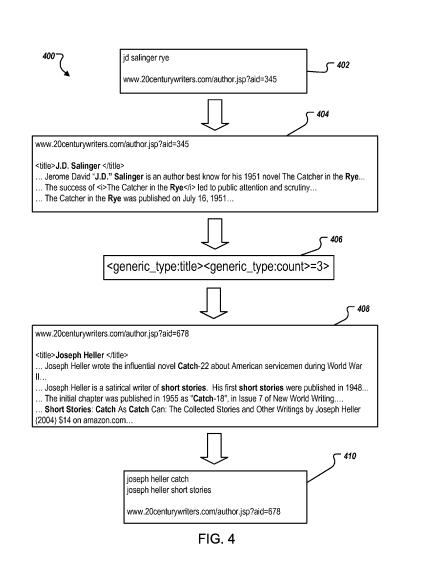
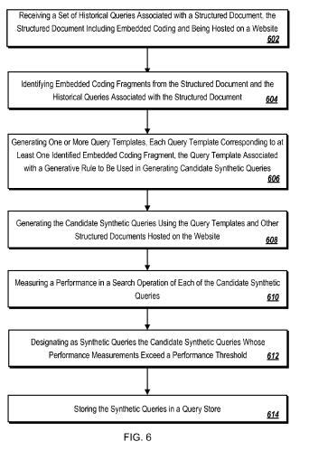

When someone searches at Google, their query might not express the informational or situational need that they have. It might be too broad, too ambiguous, or vague in some other manner. A well-formulated query instead might contain terms returning resources addressing the searcher’s intent, which might be measured by performance metrics. For vague queries, search results that satisfy a searcher’s need for information might not be highly ranked, and may not be presented on the first page of search results.

## Well Performing Queries as Search Suggestions

A search engine may identify well-performing queries from queries entered by users. This is especially true in cases where many searchers have selected results from those queries. These well-performing queries may be suggested to searchers when similar queries are presented to a search engine.

Such suggestions might not work so well when there aren’t similar queries from searchers that have been performed. A patent recently granted to Google describes a way for the search engine to identify synthetic queries, check upon how well they perform, and if they perform well, and to use them:

- As query suggestions in similar searches
- To augment (add to) results for very similar searches
- To identify keywords or phrases for bidding in auctions
- To show advertisements for related synthetic queries when there aren’t many for the searcher’s original query
- To generate even more synthetic queries.

## Generating Synthetic Queries from Seed Queries

Many queries performed by searchers are unique, and there might not be “similar” queries to many of them already performed by searchers. A search engine might look for a way to understand what it finds on the web better by performing several searches on its own, in a way that might tend to produce positive and relevant sets of results, much like the well-performing queries identified by searchers. These would start as seed queries.

Seed queries can be machine-generated synthetic queries or they can be searcher queries provided by searchers anonymously. Queries provided by searchers might have their performance determined from anonymous user interactions. If the query performs well, it may be selected as a seed query. That is, if many searchers that enter the same query often select one or more of the search results relevant to the query, that query is can be designated as a seed query. In this case, documents referenced by the “often-selected” search results are also designated as documents corresponding to the seed query.

This process might start by a search engine receiving the set of seed queries that could be associated with structured pages on the sites mentioned above. The search engine might pay attention to the HTML structure and embedded coding of those documents, and the words that appear within that structure on different pages of the site.

From the multiple pages of the site, the search engine might create “query templates” that might correspond to embedded coding fragments, along with a rule associated with these fragments that could be used to create one or more candidate synthetic queries, from that web site.

These candidate synthetic queries might be measured based on the quality of search results they return, and if those results exceed a certain performance threshold, the synthetic queries might advance beyond the “candidate” stage, and be stored in a query store.

## Creating Query Templates

The “query templates” created could potentially use any of the following:

1. The embedding coding of structured documents might include HTML elements.
2. Embedded coding fragments from pages may include identifying HTML tag pairs.
3. Identifying embedded coding fragments from pages may include identifying some portion of content enclosed by an HTML tag pair; identifying a query term in seed queries; and when a portion of content matches the query term, within the embedded coding fragments.

The query templates would look to see if there are other documents on a site that includes the embedded coding fragment and generating that template to satisfy a template qualification value.

This query template may include a literal and a wildcard – the literal would be a literal phrase found in the structured page, and the wildcard including a type and at least one constraint.

A “type” may indicate a category of terms.

A “constraint” may indicate a context within which the terms appear in the structured page.

The context within which the terms appear in the structured page may be based on various parameters, such as a count of a number of times the terms appear in the structured page, surrounding:

- HTML tags
- Words or phrases that are close to one another
- Inverse document frequency (IDF) of the terms, among others

Generating candidate synthetic queries can include:

- Applying the query templates to the other structured pages hosted on the web site or a collection of sites
- Identifying other embedded coding fragments of the other structured pages that match the embedded coding fragments identified in the query templates; and
- Designating content in the other embedded coding fragments as the candidate synthetic queries

This match might be an exact match, an approximate match, or both.

How good a candidate synthetic query might be is a matter of calculating an IR (information retrieval score) for that query about the page.

The synthetic queries patent is:

[Query generation using structural similarity between documents](http://patft.uspto.gov/netacgi/nph-Parser?Sect1=PTO2&Sect2=HITOFF&p=1&u=%2Fnetahtml%2FPTO%2Fsearch-adv.htm&r=1&f=G&l=50&d=PALL&S1=08346792&OS=PN/08346792&RS=PN/08346792)
Invented by Steven D. Baker, Michael Flaster, Nitin Gupta, Paul Haahr, Srinivasan Venkatachary, and Yonghui Wu
Assigned to Google
US Patent 8,346,792
Granted January 1, 2013
Filed: November 9, 2010

Abstract

> Methods, systems, and apparatus, including computer program products, for generating synthetic queries using seed queries and structural similarity between documents are described. In one aspect, a method includes:
>
> - Identifying embedded coding fragments (e.g., HTML tag) from a structured document and a seed query;
> - Generating one or more query templates, each query template corresponding to at least one coding fragment, the query template including a generative rule to be used in generating candidate synthetic queries;
> - Generating the candidate synthetic queries by applying the query templates to other documents that are hosted on the same web site as the document;
> - Identifying terms that match the structure of the query templates as candidate synthetic queries;
> - Measuring performance for each of the candidate synthetic queries; and
> - Designating as synthetic queries the candidate synthetic queries that have performance measurements exceeding a performance threshold.

## How Synthetic Queries and Query Templates Might Work

When documents are selected as potential sources of information about synthetic queries, there may be a particular subset of pages chosen that have certain common traits. These might be documents that are:

- Hosted on one or more servers that share a domain name or IP address (they are hosted on the same web site)
- Referred to or linked from the same web site

These pages might be structurally similar to one another, and they might include pages relevant to stored seed queries within the documents.

Example:

A seed query contains the query terms [Dorothy Parker], and it is associated with a particular web page. The page contains an embedded coding fragment of “<h1>Dorothy Parker–Biography</h1>.”

This includes an HTML tag pair <h1> and </h1> and text fragments from within the text pair – <h1> [ . . . ]–Biography</h1>. This structure is an “embedded coding fragment,” and it can be used by itself, or in conjunction with others on the same page to create a query template.

Another embedded coding fragment on a different page of the same site might be “<h1> Sylvia Plath–Biography</h1>,” and because of the similarity, “Sylvia Plath” might be considered as a candidate synthetic query.

There are additional methods for creating different types of query templates described in the patent as well, that could look to see what words appear in specific types of HTML tags (like the opening and closing tags of a title element), and appear several additional times within the body of a document.

In addition to looking at documents from the same web site, other features might be used for selecting documents as well, such as:

- From a same author
- Included in a same journal, or
- From a same time period

## Synthetic Queries Take Aways

I’ll be spending more time going through this patent and exploring the different ways that it describes the creation and evaluation of synthetic queries.

Given synthetic queries’ potential uses with both query suggestions, search results augmentation, content targeting for advertisements, and generation of more synthetic queries, it’s an area worth spending more than a single blog post upon.

It seems that Google does search Google, to find well-performing queries, even when people aren’t quite searching for those queries yet.

And the use of HTML fragments within web pages, such as heading elements and others, is a part of how these synthetic queries might be found.
