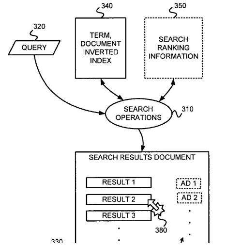

One of the inventors of the newly granted patent I am writing about was behind one of the most visited Google patents I’ve written about, from Ross Koningstein, which I posted about under the title, [The Google Rank-Modifying Spammers Patent](https://www.seobythesea.com/2012/08/google-rank-modifying-spammers-patent/) It described a social engineering approach to stop site owners from using spammy tactics to raise the ranking of pages.

This new patent is about targeted advertising at Google in paid search, which I haven’t written too much about here. I did write one post about paid search, which I called [Google’s Second Most Important Algorithm? Before Google’s Panda, there was Phil](https://www.seobythesea.com/2011/07/googles-second-most-important-algorithm-before-googles-panda-there-was-phil/) I started that post with a quote from Steven Levy, the author of the book [In the Plex](https://stevenlevy.com/), which goes like this:

> They named the project Phil because it sounded friendly. (For those who required an acronym, they had one handy: Probabilistic Hierarchical Inferential Learner.) That was bad news for a Google Engineer named Phil, who kept getting emails about the system. He begged Harik to change the name, but Phil it was.

This showed us that Google did not use the AdSense algorithm from the company they acquired in 2003 named Applied Semantics to build paid search. But, it’s been interesting seeing Google achieve so much based on a business model that relies upon advertising because they seemed so dead set against advertising when they first started the search engine. For instance, there is a passage in an early paper about the search engine they developed that has an appendix about advertising.

If you read through [The Anatomy of a Large-Scale Hypertextual Web Search Engine](http://infolab.stanford.edu/~backrub/google.html), you learn a lot about how the search engine was intended to work. But the section about advertising is fascinating. There, they tell us:

> Currently, the predominant business model for commercial search engines is advertising. The goals of the advertising business model do not always correspond to providing quality search to users. For example, in our prototype search engine, one of the top results for cellular phones is “The Effect of Cellular Phone Use Upon Driver Attention,” a study that explains in great detail the distractions and risks associated with conversing on a cell phone while driving. This search result came up first because of its high importance as judged by the PageRank algorithm, which approximates citation importance on the web [Page, 98]. A search engine that was taking money for showing cellular phone ads would have difficulty justifying the page that our system returned to its paying advertisers. For this type of reason and historical experience with other media [Bagdikian 83], we expect that advertising-funded search engines will be inherently biased towards the advertisers and away from the needs of the consumers.

So, when Google was granted a patent on December 26, 2017, that provides more depth on how targeted advertising might work at Google, it made interesting reading. This is a continuation patent, which means the description ideally should be approximately the same as the original patent. Still, the claims should be updated to reflect how the search engine might be using the processes described in a newer manner. The older version of the patent was filed on December 30, 2004, but it wasn’t granted under the earlier claims. It may be possible to dig up those earlier claims, but it is interesting looking at the description that accompanies the newest version of the patent to get a sense of how it works. Here is a link to the newest version of the patent with claims that were updated in 2015:

[Associating features with entities, such as categories of web page documents, and/or weighting such features](http://patft.uspto.gov/netacgi/nph-Parser?Sect1=PTO1&Sect2=HITOFF&d=PALL&p=1&u=%2Fnetahtml%2FPTO%2Fsrchnum.htm&r=1&f=G&l=50&s1=9,852,225.PN.&OS=PN/9,852,225&RS=PN/9,852,225)
Inventors: Ross Koningstein, Stephen Lawrence, and Valentin Spitkovsky
Assignee: Google Inc.
US Patent: 9,852,225
Granted: December 26, 2017
Filed: April 23, 2015

Abstract

> Features that may be used to represent relevant information (e.g., properties, characteristics, etc.) of an entity, such as a document or concept, for example, may be associated with the document by accepting an identifier that identifies a document; obtaining search query information (and/or other serving parameter information) related to the document using the document identifier, determining features using the obtained query information (and/or other serving parameter information), and associating the features determined with the document. Weights of such features may be similarly determined. The weights may be determined using scores. The scores may be a function of one or more of whether the document was selected, a user dwell time on a selected document, whether or not a conversion occurred concerning the document, etc. The document may be a Web page. The features may be n-grams. The relevant information of the document may be used to target the serving of advertisements with the document.

I will continue with details about how this patent describes how they might target advertising at Google in part 2 of this post.
