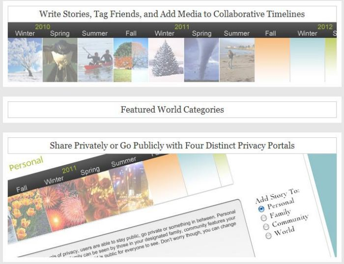
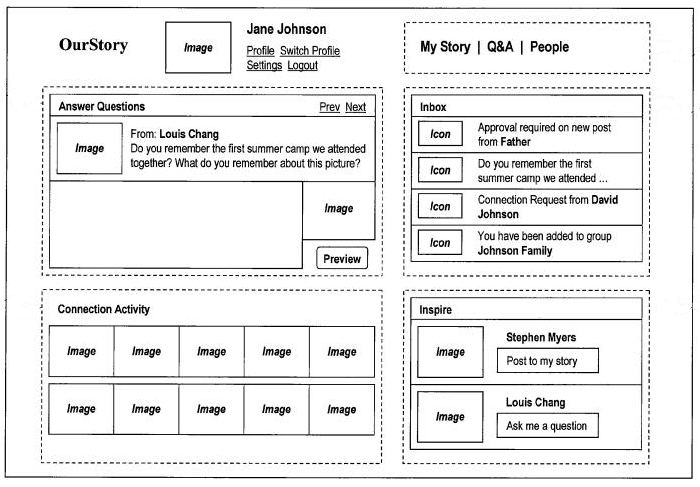

Will Google offer a life story styled timeline similar to the [Facebook Timeline](https://about.fb.com/company-info/)? It’s possible.

Google acquired three pending patents and a granted patent that were originally assigned to WisdomArk, Inc., were transferred to Lifescape LLC, and then to Timecove Corporation. The patent assignment to Google was executed on May 12th, and recorded on June 1, 2012. The organization appears to have started a couple of websites, including Our Story and MyTimeCove.

Here’s a preview of ourstory from the front page of the web site:

Here’s a peek at part of the ourstory interface from one of the patent filings:

In what seems to be somewhat of a coincidence, connected people within a social system like the ones described in these patent filings might be sorted into private “circles.”

The patent filings are pretty self explanatory, so I’m not going to parse through them. I would guess that if Google adopts the processes involved in these, they might become part of what we see in Google Plus, but that isn’t necessarily clear.

Here are the patent filings that were assigned to Google:

[Collaborative system and method for generating biographical accounts](http://patft.uspto.gov/netacgi/nph-Parser?Sect1=PTO1&Sect2=HITOFF&d=PALL&p=1&u=%2Fnetahtml%2FPTO%2Fsrchnum.htm&r=1&f=G&l=50&s1=8103947.PN.&OS=PN/8103947&RS=PN/8103947)
Invented by Andrew Halliday and Christopher Lunt
Assigned to Timecove Corporation
US Patent 8,103,947
Published January 24, 2012
Filed: May 2, 2006

Abstract

> A collaborative system and method are used to capture, organize, share and preserve life stories. Life stories can be expressed in first person or third person. In either case, the process of developing the life stories is carried out with collaboration with and contributions from other users.
>
> The collaboration among the users is desirable because it serves to encourage and prompt users to record their life stories and also increases the relevance of the recorded life stories, so that an online community of users containing highly relevant and meaningful content, that is also relatively permanent in nature, about the users can be created.

[System and Method for Facilitating Collaborative Generation of Life Stories](http://appft.uspto.gov/netacgi/nph-Parser?Sect1=PTO1&Sect2=HITOFF&d=PG01&p=1&u=%2Fnetahtml%2FPTO%2Fsrchnum.html&r=1&f=G&l=50&s1=%2220070250791%22.PGNR.&OS=DN/20070250791&RS=DN/20070250791)
Invented by Andrew Halliday and Christopher Lunt
US Patent Application 20070250791
Published October 25, 2007
Filed: May 12, 2006

Abstract

> Graphical user interfaces (GUIs) support the collaborative generation of life stories by helping the user view the development of the life stories of other users and facilitating interaction with them through these GUIs.
>
> A GUI according to a first type helps the user keep track of recent life stories and comments posted by other users of the collaborative system, and a GUI according to a second type helps the user view life stories of any user in a chronological manner.

[System and Method For Organizing Recorded Events Using Character Tags](http://appft.uspto.gov/netacgi/nph-Parser?Sect1=PTO1&Sect2=HITOFF&d=PG01&p=1&u=%2Fnetahtml%2FPTO%2Fsrchnum.html&r=1&f=G&l=50&s1=%2220070250496%22.PGNR.&OS=DN/20070250496&RS=DN/20070250496)
Invented by Andrew Halliday, Christopher Lunt, and Dean Pfutzenreuter
US Patent Application 20070250496
Published October 25, 2007
Filed: May 12, 2006

Abstract

> A computer system organizes text narratives and images about events using character tags, which are tags that are defined by users with respect to those persons that are depicted in the text narratives and images. Each character tag is associated with either a user profile or a pseudo-profile.
>
> A pseudo-profile for a person is created by a user when the user does not know if the person has a user profile in the computer system. An invitation e-mail that is sent to a prospective user may include content stored in the computer system, or a hyperlink to such content, that has been tagged with the character tag of the prospective user.

[System and Method For Facilitating Collaborative Generation of Life Stories](http://appft.uspto.gov/netacgi/nph-Parser?Sect1=PTO1&Sect2=HITOFF&d=PG01&p=1&u=%2Fnetahtml%2FPTO%2Fsrchnum.html&r=1&f=G&l=50&s1=%2220070250479%22.PGNR.&OS=DN/20070250479&RS=DN/20070250479)
Invented by Andrew Halliday, Christopher Lunt, Dean Pfutzenreuter and Tim Correia
US Patent Application 20070250479
Published October 25, 2007
Filed: May 12, 2006

Abstract

> Content that has been entered by a user for one purpose is used to generate new content for the user’s life story collection. This facilitates the generation of relevant content in a life story collection system. In one example, a user enters a text narrative of a life story and that text narrative is used to generate one or more images that can be added to the life story.
>
> In another example, e-mail communication between two users is parsed and transformed into content that can be added to the life stories of the users. In still another example, a comment made by a user to life stories of another user is parsed and transformed into content that can be added to the life story of the user.
